**BAB III**

**METODE PENELITIAN**

---

**3.1 Tinjauan Umum**

Kantor Desa Widodaren merupakan salah satu instansi pemerintahan tingkat desa yang menyelenggarakan pelayanan administratif kepada warga, salah satunya berupa penerbitan surat keterangan yang meliputi Surat Keterangan Domisili, Surat Keterangan Kelahiran/Kematian, dan Surat Keterangan Tidak Mampu. Volume pengajuan surat keterangan pada Kantor Desa Widodaren tergolong tinggi, yaitu mencapai kurang lebih 100 pengajuan setiap bulan, dengan Surat Keterangan Domisili sebagai jenis surat yang paling banyak diajukan, disusul Surat Keterangan Kelahiran/Kematian dan Surat Keterangan Tidak Mampu.

Berdasarkan hasil observasi dan wawancara yang telah diuraikan pada Bab I, proses pengajuan surat keterangan pada Kantor Desa Widodaren hingga saat ini masih dilaksanakan secara konvensional. Warga diharuskan datang langsung ke kantor desa untuk mengisi formulir secara manual, sementara pencatatan pengajuan masih menggunakan buku register sehingga data pengajuan rentan hilang, sulit direkapitulasi, dan tidak dapat ditelusuri secara cepat apabila dibutuhkan sewaktu-waktu untuk keperluan pelaporan desa.

Permasalahan utama yang melatarbelakangi penelitian ini bukan terletak pada lamanya waktu pemrosesan surat, melainkan pada ketiadaan media yang dapat menginformasikan persyaratan dokumen secara jelas kepada warga sebelum mengajukan, serta belum tersedianya sistem pencatatan digital yang dapat menggantikan pencatatan manual berbasis buku. Oleh karena itu, penelitian ini difokuskan pada perancangan dan pembangunan Sistem Informasi Pelayanan Surat Keterangan berbasis web dengan memanfaatkan framework Laravel sebagai kerangka kerja utama pengembangan perangkat lunak dan metode Prototyping sebagai pendekatan pengembangan sistem.

---

**3.2 Objek Penelitian**

Objek penelitian ini adalah proses pelayanan administrasi surat keterangan pada Kantor Desa Widodaren, yang meliputi tahapan pengajuan oleh warga, verifikasi kelengkapan dokumen oleh petugas (Kasi Pelayanan), hingga penerbitan surat oleh pihak berwenang di desa. Pihak-pihak yang berkepentingan (stakeholder) dalam penelitian ini diuraikan pada Tabel 3.1 berikut.

**Tabel 3.1 Stakeholder Penelitian**

| **Stakeholder**                     | **Peran/Kepentingan**                                                         |
| ----------------------------------- | ----------------------------------------------------------------------------- |
| Warga Desa Widodaren                | Pengguna akhir yang mengajukan surat keterangan secara online.                |
| Petugas/Admin Desa (Kasi Pelayanan) | Mengelola data jenis surat, memverifikasi pengajuan, dan menerbitkan surat.   |
| Kepala Desa                         | Penanggung jawab pelayanan publik desa.                                       |
| Peneliti/Pengembang                 | Merancang, membangun, dan menguji sistem yang diusulkan.                      |

**_3.2.1 Sejarah Singkat_**

_Isi dengan sejarah singkat Desa Widodaren (tahun berdiri, asal-usul nama, perkembangan pemerintahan desa) - dapat diperoleh dari profil desa/monografi desa atau wawancara dengan perangkat desa._

**_3.2.2 Visi dan Misi_**

_Isi dengan visi dan misi resmi Desa Widodaren, dapat diperoleh dari dokumen RPJMDes (Rencana Pembangunan Jangka Menengah Desa) atau papan profil di kantor desa._

**_3.2.3 Struktur Organisasi_**

Struktur organisasi Kantor Desa Widodaren terdiri atas Kepala Desa sebagai penanggung jawab pelayanan publik desa, Sekretaris Desa, serta beberapa Kepala Seksi (Kasi) dan Kepala Urusan (Kaur), salah satunya Kasi Pelayanan yang secara langsung menangani proses pengajuan dan verifikasi surat keterangan warga.

_Sisipkan Gambar 3.1 Struktur Organisasi Kantor Desa Widodaren._

---

**3.3 Metode Pengumpulan Data**

Data yang digunakan dalam penelitian ini diperoleh melalui empat teknik pengumpulan data, dengan uraian sebagai berikut.

1\. **Observasi**, yaitu pengamatan secara langsung terhadap alur pelayanan surat keterangan di Kantor Desa Widodaren, mulai dari kedatangan warga, pengisian formulir manual, pemeriksaan kelengkapan dokumen oleh petugas, hingga penerbitan surat, guna memahami kondisi proses bisnis yang sedang berjalan.

2\. **Wawancara**, yaitu tanya jawab yang dilakukan dengan Kasi Pelayanan Kantor Desa Widodaren untuk menggali kebutuhan fungsional dan non-fungsional sistem, termasuk jumlah rata-rata pengajuan surat per bulan, jenis surat yang paling banyak diajukan, persyaratan dokumen tiap jenis surat, serta kendala yang dihadapi petugas dalam proses pelayanan.

3\. **Studi Pustaka**, yaitu pengumpulan referensi dari buku, jurnal ilmiah, serta hasil penelitian terdahulu yang relevan dengan topik sistem informasi pelayanan berbasis web, metode Prototyping, framework Laravel, dan perancangan basis data, sebagaimana telah diuraikan pada Bab II.

4\. **Studi Dokumentasi**, yaitu pengumpulan data pendukung berupa contoh format surat keterangan, buku register pengajuan, serta data jumlah pengajuan surat yang digunakan sebagai bahan analisis kebutuhan sistem.

---

**3.4 Metode Pengembangan Sistem**

Sistem dikembangkan menggunakan **metode Prototyping**, yaitu pendekatan pengembangan perangkat lunak yang memungkinkan pengembang dan pengguna terlibat secara aktif melalui siklus evaluasi dan perbaikan rancangan secara berulang sebelum sistem dianggap selesai secara final. Berbeda dengan metode Waterfall yang mengharuskan seluruh kebutuhan ditetapkan di awal, Prototyping memungkinkan perubahan dan penambahan fitur dilakukan bertahap berdasarkan umpan balik dari pengguna nyata di lapangan.

Pada penelitian ini, metode Prototyping diterapkan secara konkret melalui sembilan fase pengembangan (Phase 01 s.d. Phase 09) yang masing-masing merepresentasikan satu siklus _build–evaluate–refine_. Setiap fase menghasilkan prototipe fungsional yang dapat diuji dan dievaluasi bersama petugas desa, sehingga rancangan sistem terus disempurnakan hingga menghasilkan produk akhir yang sesuai dengan kebutuhan riil pelayanan. Tahapan metode Prototyping yang diterapkan pada penelitian ini diuraikan pada Tabel 3.2 berikut.

**Tabel 3.2 Tahapan Metode Prototyping pada Penelitian**

| **Tahap** | **Aktivitas dalam Penelitian** |
| --------- | ------------------------------ |
| 1. Pengumpulan Kebutuhan | Observasi alur layanan surat dan wawancara dengan Kasi Pelayanan untuk menggali kebutuhan fungsional dan non-fungsional awal sistem. |
| 2. Membangun Prototipe | Merancang alur awal sistem (Use Case Diagram, ERD, arsitektur, rancangan antarmuka) berdasarkan kebutuhan yang telah dikumpulkan, kemudian mengimplementasikannya ke dalam kode program secara bertahap per fase. |
| 3. Evaluasi Prototipe oleh Pengguna | Setiap prototipe per fase didiskusikan dengan petugas desa untuk memastikan kesesuaian dengan kebutuhan lapangan dan mengidentifikasi kekurangan. |
| 4. Perbaikan Prototipe | Penyesuaian fitur, alur, dan tampilan dilakukan berdasarkan hasil evaluasi; siklus tahap 3-4 berulang per fase hingga prototipe dinyatakan memenuhi kebutuhan. |
| 5. Pengkodean Sistem | Implementasi rancangan ke dalam kode program menggunakan Laravel 13, Livewire 4, Flux UI, dan basis data SQLite, mengikuti konvensi arsitektur _flat Livewire component_. |
| 6. Pengujian Sistem | Pengujian dengan metode Black Box Testing terhadap seluruh fitur utama sesuai skenario pengujian sebagaimana disajikan pada Bab IV. |
| 7. Implementasi | Penerapan sistem yang telah diuji pada lingkungan Kantor Desa Widodaren, atau simulasi pada lingkungan pengembangan lokal untuk kebutuhan penelitian. |

Siklus evaluasi dan perbaikan pada tahap 3 dan 4 merupakan ciri khas metode Prototyping yang membedakannya dari Waterfall. Pada penelitian ini, siklus tersebut berjalan sebanyak sembilan kali sesuai jumlah fase pengembangan — mulai dari fitur autentikasi dasar (Phase 01) hingga persyaratan terstruktur dan aturan unggah (Phase 09). Hasil akhir dari seluruh siklus tersebut adalah sistem yang terdokumentasi pada Bab IV.

---

**3.5 Analisis Sistem**

Tahap analisis dilakukan untuk memahami permasalahan pada sistem yang sedang berjalan sekaligus merumuskan kebutuhan sistem baru yang diusulkan.

**_3.5.1 Analisis Kelemahan Sistem_**

Analisis kelemahan sistem yang sedang berjalan dilakukan menggunakan kerangka berpikir **PIECES** (Performance, Information, Economics, Control, Efficiency, Service) untuk mengidentifikasi permasalahan secara terstruktur pada setiap aspek sistem.

**_1. Performance (Kinerja)_**

Proses verifikasi dan pencatatan pengajuan surat yang seluruhnya dilakukan secara manual menambah beban kerja petugas, terutama pada tahap pemeriksaan kelengkapan dokumen warga, sehingga kinerja pelayanan bergantung penuh pada kecepatan petugas dalam memeriksa berkas satu per satu tanpa bantuan sistem pencatatan digital.

**_2. Information (Informasi)_**

Warga belum memperoleh informasi yang jelas mengenai persyaratan dokumen untuk masing-masing jenis surat keterangan sebelum mengajukan, sehingga tidak sedikit pengajuan yang tertunda karena berkas belum lengkap. Selain itu, belum tersedia media yang menyampaikan status pengajuan secara transparan kepada warga, sehingga warga tidak mengetahui perkembangan permohonannya tanpa datang langsung ke kantor desa.

**_3. Economics (Ekonomi)_**

Kunjungan berulang warga akibat dokumen yang kurang lengkap menimbulkan pemborosan waktu dan biaya, baik bagi warga maupun petugas, yang sebenarnya dapat dihindari apabila persyaratan dokumen sudah diketahui warga sejak awal sebelum berangkat ke kantor desa.

**_4. Control (Pengendalian)_**

Pencatatan pengajuan surat yang masih menggunakan buku register menyebabkan lemahnya kontrol terhadap data, sehingga berpotensi menimbulkan risiko kehilangan data, kerusakan arsip, serta kesulitan penelusuran kembali saat dibutuhkan untuk pelaporan desa maupun audit internal.

**_5. Efficiency (Efisiensi)_**

Proses pengajuan yang mengharuskan warga datang langsung ke kantor desa untuk mengisi formulir dan menyerahkan dokumen secara manual dinilai tidak efisien, terlebih jika warga harus kembali lagi karena dokumen belum lengkap.

**_6. Service (Pelayanan)_**

Tidak adanya informasi status pengajuan membuat warga tidak memperoleh kepastian atas proses pengajuannya, yang berpotensi menimbulkan keluhan berulang ke kantor desa dan menurunkan kualitas layanan secara keseluruhan di mata masyarakat. Selain itu, tidak ada mekanisme digital untuk memverifikasi keaslian surat yang telah diterbitkan oleh desa.

Berdasarkan analisis PIECES di atas, ringkasan kelemahan sistem berjalan beserta solusi yang diusulkan disajikan pada Tabel 3.3 berikut.

**Tabel 3.3 Analisis Kelemahan Sistem dan Solusi yang Diusulkan**

| **Kelemahan Sistem Berjalan** | **Solusi yang Diusulkan** |
| ----------------------------- | ------------------------- |
| Warga tidak mengetahui persyaratan dokumen sebelum datang ke kantor desa sehingga harus kembali lagi. | Sistem menyediakan halaman persyaratan dokumen terstruktur untuk setiap jenis surat, dapat diakses tanpa login, dilengkapi keterangan cara pemenuhan setiap dokumen (diunggah, bawa ke kantor, atau informasi). |
| Pencatatan pengajuan surat masih menggunakan buku register sehingga rentan hilang, rusak, dan sulit direkapitulasi. | Sistem menyediakan pencatatan digital yang tersimpan pada basis data, dengan fitur rekap multi-filter dan ekspor CSV untuk kebutuhan pelaporan. |
| Warga tidak memperoleh informasi mengenai status pengajuan surat yang telah diajukan. | Sistem menyediakan dashboard warga dengan tampilan status real-time, dilengkapi notifikasi in-app yang dikirim otomatis setiap kali status pengajuan berubah. |
| Proses verifikasi dan pencatatan yang seluruhnya manual meningkatkan beban kerja petugas. | Sistem menyediakan halaman verifikasi digital; saat pengajuan disetujui, sistem otomatis menerbitkan PDF surat keterangan bernomor resmi tanpa campur tangan manual petugas. |
| Tidak ada mekanisme konfirmasi pengambilan surat yang dapat diaudit. | Sistem menyediakan QR code sekali pakai pada setiap surat PDF; petugas memindai QR saat warga mengambil surat, dan setiap pengambilan tercatat secara digital. |

**_3.5.2 Analisis Kebutuhan Sistem_**

**_3.5.2.1 Kebutuhan Perangkat Keras_**

**Tabel 3.4 Kebutuhan Perangkat Keras**

| **Perangkat** | **Spesifikasi Minimal** |
| ------------- | ----------------------- |
| Processor | Setara Intel Core i3 atau AMD Ryzen 3 |
| RAM | 4 GB |
| Penyimpanan | 128 GB (SSD/HDD) |
| Koneksi Internet | Koneksi stabil untuk mengakses aplikasi berbasis web |
| Perangkat Akses | Komputer/laptop atau smartphone dengan peramban (browser) yang mendukung HTML5 |

**_3.5.2.2 Kebutuhan Perangkat Lunak_**

**Tabel 3.5 Kebutuhan Perangkat Lunak**

| **Layer** | **Teknologi** | **Keterangan** |
| --------- | ------------- | -------------- |
| Backend Framework | Laravel 13 (PHP 8.3+) | Routing, Eloquent ORM, validasi, middleware, migrasi basis data |
| Reactive UI | Livewire 4 | Komponen UI reaktif berbasis PHP server; setiap halaman adalah satu Livewire component |
| UI Component Library | Flux UI v2 | Pustaka komponen antarmuka resmi Livewire (input, button, modal, badge, tabel, dll.) |
| Templating | Blade Templating Engine | Merender tampilan HTML dari server |
| Styling | Tailwind CSS v4 | Utility-first CSS untuk antarmuka responsif |
| Interaktivitas Klien | Alpine.js (bundled bersama Flux) | Toggle, dropdown, dan interaksi UI ringan tanpa penulisan JavaScript manual |
| Basis Data | SQLite (pengembangan) / MySQL (produksi) | SQLite untuk kemudahan lokal; MySQL kompatibel untuk lingkungan produksi |
| Autentikasi | Laravel Fortify v1 | Login, registrasi, reset password, verifikasi email, 2FA, dan passkey |
| Manajemen Berkas | Laravel Filesystem (disk `local`) | Penyimpanan privat berkas KTP/KK dan PDF surat; tidak dapat diakses langsung oleh publik |
| Pembuatan PDF | DomPDF (barryvdh/laravel-dompdf v3) | Generasi dokumen surat keterangan dalam format PDF dari template Blade |
| QR Code | BaconQrCode (dependensi transitif DomPDF) | Generasi gambar QR code yang disisipkan ke dalam PDF surat |
| Notifikasi In-App | Tabel `notifikasi` (custom) | Notifikasi tersimpan di database dan ditampilkan melalui bell panel di header |
| Kontrol Versi | Git dan GitHub | Pengelolaan versi kode program |
| Lingkungan Lokal | Laravel Herd / Laragon / Laravel Sail | Web server lokal dengan PHP dan SQLite untuk pengembangan |

Pemilihan Laravel sebagai framework utama didasarkan pada: (1) Eloquent ORM mempermudah implementasi relasi antartabel tanpa banyak penulisan SQL manual; (2) Livewire 4 yang terintegrasi erat dengan Laravel memungkinkan pembangunan antarmuka dinamis berbasis PHP tanpa framework JavaScript terpisah; (3) tersedianya fitur bawaan (migration, validation, storage) yang mempercepat pengembangan; serta (4) DomPDF sebagai solusi generasi PDF langsung dari template Blade yang sudah digunakan untuk tampilan antarmuka, sehingga konsistensi desain terjaga.

**_3.5.2.3 Kebutuhan Informasi_**

Keluaran (output) yang disediakan oleh sistem yang diusulkan meliputi:

- Informasi persyaratan dokumen terstruktur untuk setiap jenis surat keterangan — mencantumkan nama persyaratan beserta cara pemenuhan (diunggah / dibawa ke kantor / informasi) — yang dapat diakses oleh warga maupun pengunjung tanpa login.
- Informasi status pengajuan secara bertahap: **diajukan → diproses → siap diambil → selesai** (atau **ditolak**), yang dapat dipantau warga melalui dashboard dengan tampilan status berbasis kartu hero.
- Riwayat seluruh pengajuan milik warga beserta timeline kronologis setiap perubahan status.
- Dokumen surat keterangan dalam format PDF, dilengkapi nomor surat resmi (format: `470/{urut}/DS-WDN/{romawi}/{tahun}`) dan QR code sekali pakai, yang dapat diunduh maupun dicetak oleh warga.
- Informasi jadwal pengambilan surat beserta label jam kerja yang ditetapkan oleh admin.
- Rekapitulasi data pengajuan bagi admin dengan filter multi-kriteria (jenis surat, status, rentang tanggal) dan ekspor ke format CSV.
- Notifikasi in-app yang dikirim otomatis ke warga setiap kali status pengajuan berubah.

**_3.5.2.4 Kebutuhan Pengguna (User)_**

Sistem melibatkan tiga peran sebagaimana disajikan pada Tabel 3.6 berikut.

**Tabel 3.6 Kebutuhan Pengguna**

| **Peran** | **Hak Akses** |
| --------- | ------------- |
| Publik / Tamu | Mengakses halaman beranda, melihat persyaratan dokumen untuk setiap jenis surat tanpa login, serta mendaftarkan akun baru sebagai warga. |
| Warga | Login, kelola profil, reset password, lihat persyaratan dokumen, ajukan surat keterangan, unggah dokumen persyaratan, pantau status pengajuan melalui dashboard, terima notifikasi in-app, unduh/cetak surat PDF, dan ajukan ulang pengajuan yang ditolak. |
| Admin / Petugas Desa | Login, kelola profil, kelola master data jenis surat beserta persyaratan terstrukturnya, verifikasi atau tolak pengajuan masuk, pantau surat diproses, tetapkan jadwal pengambilan, pindai QR saat warga mengambil surat, lihat rekap dan ekspor CSV, lihat timeline detail pengajuan, serta kelola pengaturan identitas desa. |

**_3.5.3 Analisis Kelayakan Sistem_**

**_3.5.3.1 Kelayakan Teknologi_**

Seluruh perangkat lunak yang digunakan — Laravel, Livewire, Flux UI, DomPDF, SQLite/MySQL — bersifat open-source dan telah digunakan secara luas pada penelitian rekayasa perangkat lunak sejenis. Kebutuhan perangkat keras tergolong spesifikasi standar yang umum tersedia.

**_3.5.3.2 Kelayakan Hukum_**

Seluruh perangkat lunak yang digunakan berlisensi open-source bebas pakai. Data pribadi warga (KTP, KK) disimpan pada disk privat dan hanya dapat diakses admin melalui route yang dilindungi middleware, sesuai kewenangan Kantor Desa Widodaren.

**_3.5.3.3 Kelayakan Operasional_**

Warga dan petugas telah terbiasa menggunakan peramban dalam keseharian sehingga tidak memerlukan pelatihan intensif. Antarmuka Flux UI yang bersih dan responsif dapat diakses dari komputer maupun smartphone. Fitur scan QR dapat dijalankan melalui kamera perangkat yang ada di kantor desa.

**_3.5.3.4 Kelayakan Ekonomi_**

**Tabel 3.7 Estimasi Biaya Implementasi**

| **Komponen** | **Estimasi Biaya** |
| ------------ | ------------------ |
| Perangkat lunak (Laravel, PHP, SQLite, Livewire, Flux UI, DomPDF, dll.) | Rp0 (open-source) |
| Hosting dan domain (per tahun, opsional) | \[isi sesuai penyedia hosting yang dipilih\] |
| Biaya pengembang | Tidak ada, dikerjakan mandiri oleh peneliti |

---

**3.6 Perancangan Sistem**

**_3.6.1 Arsitektur Sistem_**

Sistem dibangun menggunakan arsitektur berbasis **Livewire 4 full-page component**, di mana setiap rute URL dipetakan langsung ke satu kelas Livewire yang menggabungkan logika bisnis dan tampilan dalam satu unit kohesif. Pendekatan ini merupakan _flat architecture_ yang menghindari abstraksi berlebihan: tidak ada kelas Service, Repository, maupun Form Request yang terpisah — semua logika ditulis langsung di dalam method Livewire component. Arsitektur sistem secara keseluruhan ditunjukkan pada Gambar 3.2 berikut.

**Gambar 3.2 Arsitektur Sistem**

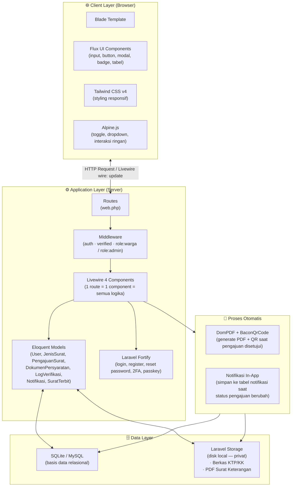
```mermaid
flowchart TD
    subgraph CLIENT["🌐 Client Layer (Browser)"]
        direction LR
        B1["Blade Template"]
        B2["Flux UI Components\n(input, button, modal, badge, tabel)"]
        B3["Tailwind CSS v4\n(styling responsif)"]
        B4["Alpine.js\n(toggle, dropdown, interaksi ringan)"]
    end

    subgraph APP["⚙️ Application Layer (Server)"]
        direction TB
        R["Routes\n(web.php)"]
        MW["Middleware\n(auth · verified · role:warga / role:admin)"]
        LW["Livewire 4 Components\n(1 route = 1 component = semua logika)"]
        EL["Eloquent Models\n(User, JenisSurat, PengajuanSurat,\nDokumenPersyaratan, LogVerifikasi,\nNotifikasi, SuratTerbit)"]
        FORT["Laravel Fortify\n(login, register, reset password, 2FA, passkey)"]
    end

    subgraph DATA["🗄️ Data Layer"]
        direction LR
        DB["SQLite / MySQL\n(basis data relasional)"]
        STOR["Laravel Storage\n(disk local — privat)\n· Berkas KTP/KK\n· PDF Surat Keterangan"]
    end

    subgraph AUTO["🤖 Proses Otomatis"]
        PDF["DomPDF + BaconQrCode\n(generate PDF + QR saat pengajuan disetujui)"]
        NOTIF["Notifikasi In-App\n(simpan ke tabel notifikasi saat\nstatus pengajuan berubah)"]
    end

    CLIENT <-->|"HTTP Request / Livewire wire: update"| R
    R --> MW
    MW --> LW
    LW --> EL
    LW --> FORT
    EL <--> DB
    EL <--> STOR
    LW --> AUTO
    AUTO --> DB
    AUTO --> STOR
```

**Penjelasan Lapisan Arsitektur:**

| **Layer** | **Komponen** | **Keterangan** |
| --------- | ------------ | -------------- |
| Client Layer | Blade Template, Flux UI, Tailwind CSS v4, Alpine.js | Antarmuka yang dirender oleh server dan diterima browser; Livewire menjaga reaktivitas via WebSocket/AJAX |
| Application Layer | Routes, Middleware, Livewire Components, Eloquent, Fortify | Titik masuk HTTP, pengecekan izin akses, logika bisnis, dan operasi basis data |
| Data Layer | SQLite/MySQL, Laravel Storage (disk `local`) | Persistensi data relasional dan berkas privat |
| Proses Otomatis | DomPDF, BaconQrCode, Notifikasi | Generasi PDF+QR dan pengiriman notifikasi yang dipicu saat status pengajuan berubah |

**Alur permintaan (request flow):**

1. Warga, admin, atau pengunjung mengakses sistem melalui peramban; permintaan HTTP diterima oleh `Routes`.
2. `Middleware` memeriksa status autentikasi dan role pengguna — tamu mengakses rute publik; warga diarahkan ke dashboard warga; admin diarahkan ke dashboard admin.
3. `Livewire Component` yang bersesuaian dimuat, menjalankan validasi input, dan memanggil `Eloquent Model` untuk membaca atau menulis data ke basis data.
4. Berkas KTP/KK dan PDF surat disimpan/dibaca melalui `Laravel Storage` (disk privat, tidak dapat diakses URL publik).
5. Setiap aksi verifikasi (setujui/tolak) memicu proses otomatis: DomPDF membuat PDF surat, BaconQrCode menyisipkan QR, log verifikasi dicatat, dan notifikasi disimpan ke tabel `notifikasi`.
6. Livewire mengembalikan respons HTML yang dirender ulang secara reaktif ke browser pengguna.

---

**_3.6.2 Perancangan Proses_**

Perancangan proses digambarkan menggunakan Unified Modeling Language (UML) melalui Use Case Diagram dan Activity Diagram.

**_3.6.2.1 Use Case Diagram_**

Sistem melibatkan tiga aktor: **Publik/Tamu** (pengunjung tanpa akun), **Warga** (pengguna terdaftar), dan **Admin/Petugas Desa** (operator). Gambaran menyeluruh seluruh use case ditunjukkan pada Gambar 3.3, sedangkan diagram per-aktor ditunjukkan pada Gambar 3.4 hingga Gambar 3.6.

**Gambar 3.3 Use Case Diagram — Gambaran Umum Sistem**

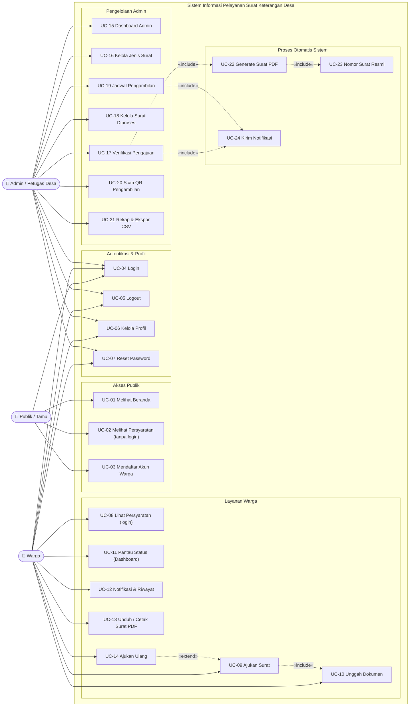
```mermaid
graph LR
    Tamu(["👤 Publik / Tamu"])
    Warga(["👤 Warga"])
    Admin(["👤 Admin / Petugas Desa"])

    subgraph SISTEM["Sistem Informasi Pelayanan Surat Keterangan Desa"]

        subgraph PUB["Akses Publik"]
            UC01["UC-01 Melihat Beranda"]
            UC02["UC-02 Melihat Persyaratan (tanpa login)"]
            UC03["UC-03 Mendaftar Akun Warga"]
        end

        subgraph AUTH["Autentikasi & Profil"]
            UC04["UC-04 Login"]
            UC05["UC-05 Logout"]
            UC06["UC-06 Kelola Profil"]
            UC07["UC-07 Reset Password"]
        end

        subgraph LAYAN["Layanan Warga"]
            UC08["UC-08 Lihat Persyaratan (login)"]
            UC09["UC-09 Ajukan Surat"]
            UC10["UC-10 Unggah Dokumen"]
            UC11["UC-11 Pantau Status (Dashboard)"]
            UC12["UC-12 Notifikasi & Riwayat"]
            UC13["UC-13 Unduh / Cetak Surat PDF"]
            UC14["UC-14 Ajukan Ulang"]
        end

        subgraph ADMIN["Pengelolaan Admin"]
            UC15["UC-15 Dashboard Admin"]
            UC16["UC-16 Kelola Jenis Surat"]
            UC17["UC-17 Verifikasi Pengajuan"]
            UC18["UC-18 Kelola Surat Diproses"]
            UC19["UC-19 Jadwal Pengambilan"]
            UC20["UC-20 Scan QR Pengambilan"]
            UC21["UC-21 Rekap & Ekspor CSV"]
        end

        subgraph SYS["Proses Otomatis Sistem"]
            UC22["UC-22 Generate Surat PDF"]
            UC23["UC-23 Nomor Surat Resmi"]
            UC24["UC-24 Kirim Notifikasi"]
        end

    end

    Tamu --> UC01
    Tamu --> UC02
    Tamu --> UC03
    Tamu --> UC04

    Warga --> UC04
    Warga --> UC05
    Warga --> UC06
    Warga --> UC07
    Warga --> UC08
    Warga --> UC09
    Warga --> UC10
    Warga --> UC11
    Warga --> UC12
    Warga --> UC13
    Warga --> UC14

    Admin --> UC04
    Admin --> UC05
    Admin --> UC06
    Admin --> UC07
    Admin --> UC15
    Admin --> UC16
    Admin --> UC17
    Admin --> UC18
    Admin --> UC19
    Admin --> UC20
    Admin --> UC21

    UC09 -.->|"«include»"| UC10
    UC17 -.->|"«include»"| UC22
    UC22 -.->|"«include»"| UC23
    UC17 -.->|"«include»"| UC24
    UC19 -.->|"«include»"| UC24
    UC14 -.->|"«extend»"| UC09
```

**Gambar 3.4 Use Case Diagram — Publik / Tamu**

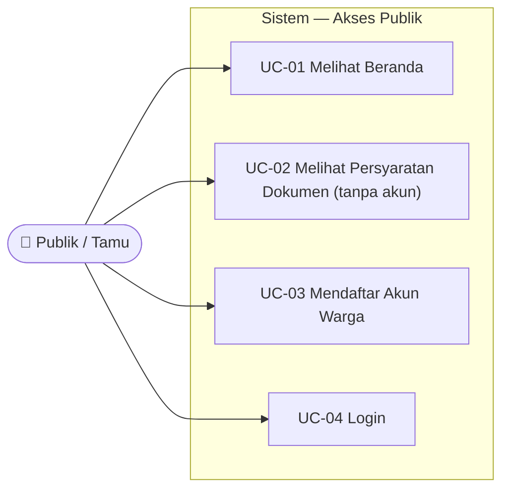
```mermaid
graph LR
    Tamu(["👤 Publik / Tamu"])
    subgraph SISTEM["Sistem — Akses Publik"]
        UC01["UC-01 Melihat Beranda"]
        UC02["UC-02 Melihat Persyaratan Dokumen (tanpa akun)"]
        UC03["UC-03 Mendaftar Akun Warga"]
        UC04["UC-04 Login"]
    end
    Tamu --> UC01
    Tamu --> UC02
    Tamu --> UC03
    Tamu --> UC04
```

**Gambar 3.5 Use Case Diagram — Warga**

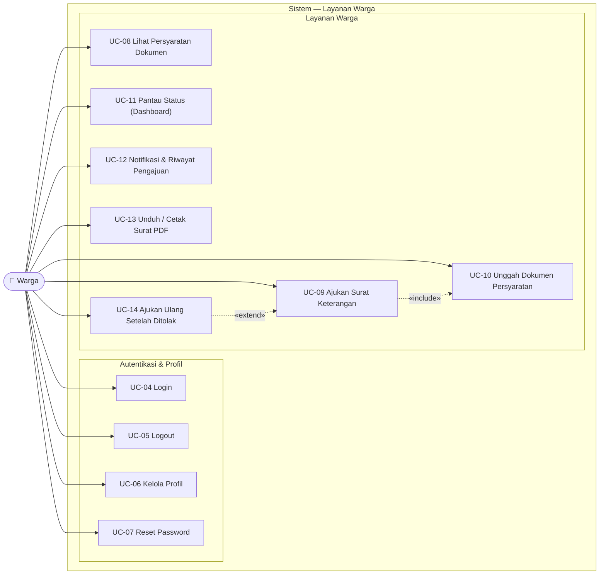
```mermaid
graph LR
    Warga(["👤 Warga"])
    subgraph SISTEM["Sistem — Layanan Warga"]
        subgraph AUTH["Autentikasi & Profil"]
            UC04["UC-04 Login"]
            UC05["UC-05 Logout"]
            UC06["UC-06 Kelola Profil"]
            UC07["UC-07 Reset Password"]
        end
        subgraph LAYAN["Layanan Warga"]
            UC08["UC-08 Lihat Persyaratan Dokumen"]
            UC09["UC-09 Ajukan Surat Keterangan"]
            UC10["UC-10 Unggah Dokumen Persyaratan"]
            UC11["UC-11 Pantau Status (Dashboard)"]
            UC12["UC-12 Notifikasi & Riwayat Pengajuan"]
            UC13["UC-13 Unduh / Cetak Surat PDF"]
            UC14["UC-14 Ajukan Ulang Setelah Ditolak"]
        end
    end
    Warga --> UC04
    Warga --> UC05
    Warga --> UC06
    Warga --> UC07
    Warga --> UC08
    Warga --> UC09
    Warga --> UC10
    Warga --> UC11
    Warga --> UC12
    Warga --> UC13
    Warga --> UC14
    UC09 -.->|"«include»"| UC10
    UC14 -.->|"«extend»"| UC09
```

**Gambar 3.6 Use Case Diagram — Admin / Petugas Desa**

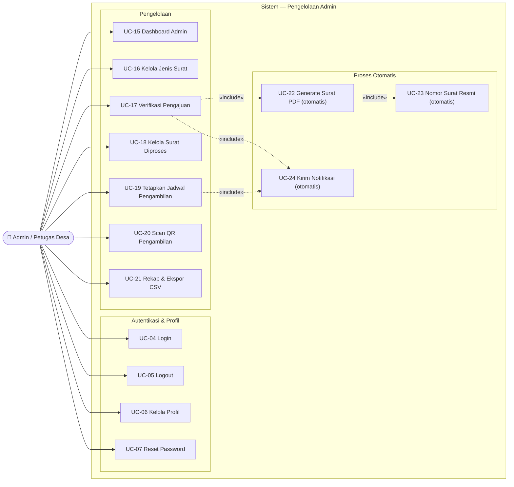
```mermaid
graph LR
    Admin(["👤 Admin / Petugas Desa"])
    subgraph SISTEM["Sistem — Pengelolaan Admin"]
        subgraph AUTH["Autentikasi & Profil"]
            UC04["UC-04 Login"]
            UC05["UC-05 Logout"]
            UC06["UC-06 Kelola Profil"]
            UC07["UC-07 Reset Password"]
        end
        subgraph ADMIN["Pengelolaan"]
            UC15["UC-15 Dashboard Admin"]
            UC16["UC-16 Kelola Jenis Surat"]
            UC17["UC-17 Verifikasi Pengajuan"]
            UC18["UC-18 Kelola Surat Diproses"]
            UC19["UC-19 Tetapkan Jadwal Pengambilan"]
            UC20["UC-20 Scan QR Pengambilan"]
            UC21["UC-21 Rekap & Ekspor CSV"]
        end
        subgraph SYS["Proses Otomatis"]
            UC22["UC-22 Generate Surat PDF (otomatis)"]
            UC23["UC-23 Nomor Surat Resmi (otomatis)"]
            UC24["UC-24 Kirim Notifikasi (otomatis)"]
        end
    end
    Admin --> UC04
    Admin --> UC05
    Admin --> UC06
    Admin --> UC07
    Admin --> UC15
    Admin --> UC16
    Admin --> UC17
    Admin --> UC18
    Admin --> UC19
    Admin --> UC20
    Admin --> UC21
    UC17 -.->|"«include»"| UC22
    UC22 -.->|"«include»"| UC23
    UC17 -.->|"«include»"| UC24
    UC19 -.->|"«include»"| UC24
```

**Tabel 3.8 Deskripsi Seluruh Use Case**

| **Kode** | **Nama Use Case** | **Aktor** | **Deskripsi** |
| -------- | ----------------- | --------- | ------------- |
| UC-01 | Melihat Beranda | Publik/Tamu | Membuka halaman utama sistem; berisi informasi layanan dan tautan daftar/masuk. |
| UC-02 | Melihat Persyaratan (tanpa login) | Publik/Tamu | Melihat daftar jenis surat dan persyaratan terstruktur tanpa memiliki akun. |
| UC-03 | Mendaftar Akun Warga | Publik/Tamu | Mendaftarkan akun baru dengan NIK, nama, no. telepon, alamat, email, dan password. |
| UC-04 | Login | Warga, Admin | Autentikasi dengan email dan password; sistem mengarahkan ke dashboard sesuai role. |
| UC-05 | Logout | Warga, Admin | Mengakhiri sesi login dan kembali ke halaman publik. |
| UC-06 | Kelola Profil | Warga, Admin | Memperbarui data diri dan kata sandi. |
| UC-07 | Reset Password | Warga, Admin | Mengatur ulang kata sandi melalui tautan yang dikirim ke email (berlaku 60 menit). |
| UC-08 | Lihat Persyaratan (login) | Warga | Melihat persyaratan dokumen terstruktur dalam tata letak aplikasi setelah login. |
| UC-09 | Ajukan Surat | Warga | Mengisi formulir pengajuan: pilih jenis surat, unggah dokumen, isi keperluan. |
| UC-10 | Unggah Dokumen Persyaratan | Warga | `«include»` UC-09; mengunggah file KTP/KK (JPG/PNG/PDF, maks. 2 MB). |
| UC-11 | Pantau Status (Dashboard) | Warga | Memantau status pengajuan aktif dan riwayat singkat melalui dashboard pribadi. |
| UC-12 | Notifikasi & Riwayat | Warga | Membuka panel notifikasi dan halaman riwayat semua pengajuan. |
| UC-13 | Unduh / Cetak Surat PDF | Warga | Mengunduh atau mencetak surat PDF setelah status siap diambil atau selesai. |
| UC-14 | Ajukan Ulang | Warga | `«extend»` UC-09; mengajukan kembali surat yang ditolak; nomor pengajuan baru dibuat. |
| UC-15 | Dashboard Admin | Admin | Memantau kartu aging per status, antrian mendesak, dan tabel pengajuan aktif. |
| UC-16 | Kelola Jenis Surat | Admin | Tambah, ubah, arsipkan, pulihkan, dan hapus master data jenis surat. |
| UC-17 | Verifikasi Pengajuan | Admin | Memeriksa dokumen pengajuan warga lalu menyetujui (→ diproses) atau menolak. |
| UC-18 | Kelola Surat Diproses | Admin | Memantau daftar surat berstatus diproses/siap diambil. |
| UC-19 | Tetapkan Jadwal Pengambilan | Admin | Menetapkan tanggal pengambilan surat pada hari kerja; label jam kerja otomatis. |
| UC-20 | Scan QR Pengambilan | Admin | Memindai QR code sekali pakai saat warga datang mengambil surat. |
| UC-21 | Rekap & Ekspor CSV | Admin | Melihat rekap dengan filter multi-kriteria dan mengekspor data ke CSV. |
| UC-22 | Generate Surat PDF | Sistem | `«include»` UC-17; otomatis membuat PDF surat menggunakan DomPDF saat disetujui. |
| UC-23 | Nomor Surat Resmi | Sistem | `«include»` UC-22; otomatis menerbitkan nomor surat berurutan format resmi desa. |
| UC-24 | Kirim Notifikasi | Sistem | `«include»` UC-17, UC-19; otomatis menyimpan notifikasi in-app ke tabel `notifikasi`. |

---

**_3.6.2.2 Activity Diagram_**

Activity Diagram digunakan untuk menggambarkan alur kerja proses utama pada sistem secara rinci. Berikut diuraikan activity diagram beserta penjelasan dan kondisi alternatif untuk setiap proses utama.

---

**a. AD-01: Registrasi Akun Warga**

**Gambar 3.7 Activity Diagram — Registrasi Akun Warga**

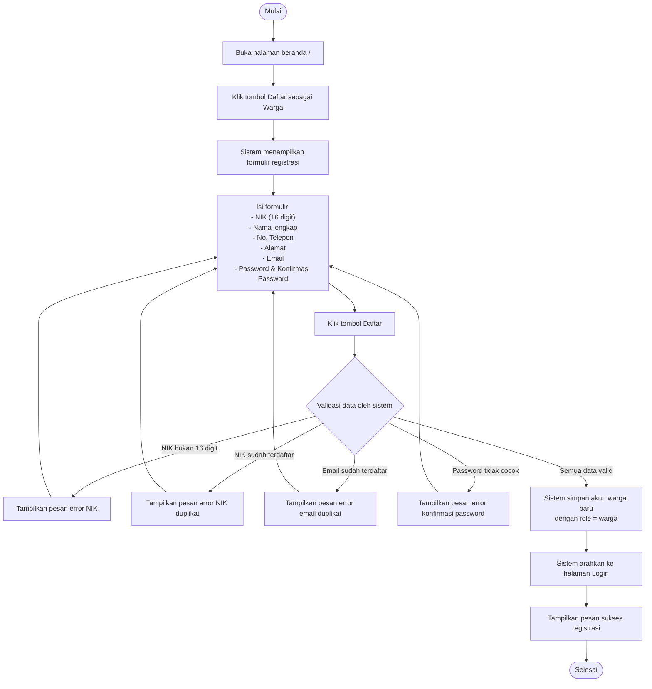
```mermaid
flowchart TD
    Start([Mulai]) --> A[Buka halaman beranda /]
    A --> B[Klik tombol Daftar sebagai Warga]
    B --> C[Sistem menampilkan formulir registrasi]
    C --> D["Isi formulir:\n- NIK (16 digit)\n- Nama lengkap\n- No. Telepon\n- Alamat\n- Email\n- Password & Konfirmasi Password"]
    D --> E[Klik tombol Daftar]
    E --> F{Validasi data oleh sistem}
    F -->|"NIK bukan 16 digit"| G1[Tampilkan pesan error NIK]
    G1 --> D
    F -->|"NIK sudah terdaftar"| G2[Tampilkan pesan error NIK duplikat]
    G2 --> D
    F -->|"Email sudah terdaftar"| G3[Tampilkan pesan error email duplikat]
    G3 --> D
    F -->|"Password tidak cocok"| G4[Tampilkan pesan error konfirmasi password]
    G4 --> D
    F -->|"Semua data valid"| H[Sistem simpan akun warga baru\ndengan role = warga]
    H --> I[Sistem arahkan ke halaman Login]
    I --> J[Tampilkan pesan sukses registrasi]
    J --> End([Selesai])
```

**Tabel 3.9 Penjelasan Alur — Registrasi Akun Warga**

| **Langkah** | **Aktivitas** | **Keterangan** |
| ----------- | ------------- | -------------- |
| 1 | Buka beranda | Pengguna mengakses halaman utama sistem |
| 2 | Klik Daftar | Pengguna memilih opsi membuat akun baru |
| 3 | Isi formulir | Pengguna memasukkan data identitas (NIK, nama, telepon, alamat, email, password) |
| 4 | Validasi | Sistem memeriksa keunikan NIK, email, format, dan kesesuaian password |
| 5 | Simpan akun | Jika valid, sistem menyimpan akun dengan role `warga` |
| 6 | Redirect login | Pengguna diarahkan ke halaman login dengan pesan sukses |

**Tabel 3.10 Kondisi Alternatif — Registrasi Akun Warga**

| **Kondisi** | **Penyebab** | **Tindakan Sistem** |
| ----------- | ------------ | ------------------- |
| NIK tidak valid | Bukan 16 digit angka | Tampilkan pesan error pada field NIK |
| NIK duplikat | NIK sudah dipakai akun lain | Tampilkan pesan error duplikat |
| Email duplikat | Email sudah dipakai akun lain | Tampilkan pesan error duplikat |
| Password tidak cocok | Konfirmasi password berbeda | Tampilkan pesan error pada field konfirmasi |

---

**b. AD-02: Login dan Redirect Dashboard**

**Gambar 3.8 Activity Diagram — Login dan Redirect Dashboard**

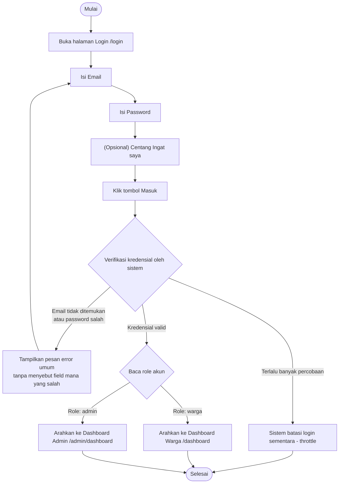
```mermaid
flowchart TD
    Start([Mulai]) --> A[Buka halaman Login /login]
    A --> B[Isi Email]
    B --> C[Isi Password]
    C --> D["(Opsional) Centang Ingat saya"]
    D --> E[Klik tombol Masuk]
    E --> F{Verifikasi kredensial oleh sistem}
    F -->|"Email tidak ditemukan\natau password salah"| G[Tampilkan pesan error umum\ntanpa menyebut field mana yang salah]
    G --> B
    F -->|"Terlalu banyak percobaan"| GT[Sistem batasi login sementara - throttle]
    GT --> End([Selesai])
    F -->|"Kredensial valid"| H{Baca role akun}
    H -->|"Role: warga"| I[Arahkan ke Dashboard Warga /dashboard]
    H -->|"Role: admin"| J[Arahkan ke Dashboard Admin /admin/dashboard]
    I --> End
    J --> End
```

**Tabel 3.11 Penjelasan Alur — Login dan Redirect Dashboard**

| **Langkah** | **Aktivitas** | **Keterangan** |
| ----------- | ------------- | -------------- |
| 1 | Buka halaman login | Pengguna mengakses `/login` dari beranda atau langsung |
| 2 | Isi kredensial | Email dan password dimasukkan pengguna |
| 3 | Verifikasi | Sistem mencocokkan email dan password dengan database |
| 4 | Baca role | Sistem memeriksa kolom `role` pada tabel `users` |
| 5 | Redirect | Sistem mengarahkan ke dashboard yang sesuai role |

**Tabel 3.12 Kondisi Alternatif — Login**

| **Kondisi** | **Penyebab** | **Tindakan Sistem** |
| ----------- | ------------ | ------------------- |
| Kredensial salah | Email tidak terdaftar atau password tidak cocok | Tampilkan pesan error umum (tidak spesifik field, mencegah enumeration) |
| Terlalu banyak percobaan | Melebihi batas percobaan login | Sistem membatasi login sementara (_throttle_) |

---

**c. AD-03: Reset Password**

**Gambar 3.9 Activity Diagram — Reset Password**

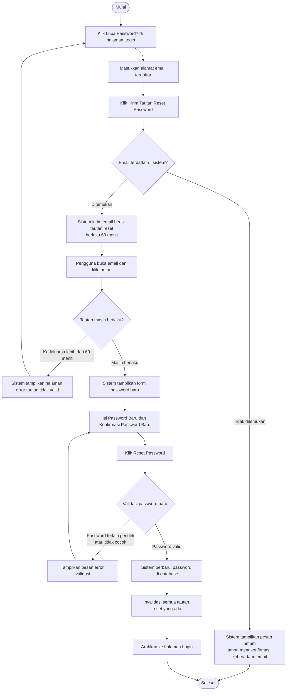
```mermaid
flowchart TD
    Start([Mulai]) --> A[Klik Lupa Password? di halaman Login]
    A --> B[Masukkan alamat email terdaftar]
    B --> C[Klik Kirim Tautan Reset Password]
    C --> D{Email terdaftar di sistem?}
    D -->|"Tidak ditemukan"| E[Sistem tampilkan pesan umum\ntanpa mengkonfirmasi keberadaan email]
    E --> End([Selesai])
    D -->|"Ditemukan"| F[Sistem kirim email berisi tautan reset\nberlaku 60 menit]
    F --> G[Pengguna buka email dan klik tautan]
    G --> H{Tautan masih berlaku?}
    H -->|"Kadaluarsa lebih dari 60 menit"| I[Sistem tampilkan halaman error tautan tidak valid]
    I --> A
    H -->|"Masih berlaku"| J[Sistem tampilkan form password baru]
    J --> K[Isi Password Baru dan Konfirmasi Password Baru]
    K --> L[Klik Reset Password]
    L --> M{Validasi password baru}
    M -->|"Password terlalu pendek\natau tidak cocok"| N[Tampilkan pesan error validasi]
    N --> K
    M -->|"Password valid"| O[Sistem perbarui password di database]
    O --> P[Invalidasi semua tautan reset yang ada]
    P --> Q[Arahkan ke halaman Login]
    Q --> End
```

**Tabel 3.13 Penjelasan Alur — Reset Password**

| **Langkah** | **Aktivitas** | **Keterangan** |
| ----------- | ------------- | -------------- |
| 1 | Klik Lupa Password? | Pengguna mengakses fitur reset dari halaman login |
| 2 | Masukkan email | Pengguna memasukkan email yang terdaftar |
| 3 | Kirim tautan | Sistem mengirim email dengan tautan reset berumur 60 menit |
| 4 | Klik tautan | Pengguna membuka tautan dari kotak masuk email |
| 5 | Verifikasi tautan | Sistem mengecek apakah tautan masih berlaku |
| 6 | Isi password baru | Pengguna memasukkan dan mengkonfirmasi password baru |
| 7 | Perbarui password | Sistem menyimpan password baru yang terenkripsi |
| 8 | Redirect login | Pengguna diarahkan ke halaman login untuk masuk kembali |

**Tabel 3.14 Kondisi Alternatif — Reset Password**

| **Kondisi** | **Penyebab** | **Tindakan Sistem** |
| ----------- | ------------ | ------------------- |
| Email tidak ditemukan | Email tidak terdaftar | Pesan umum ditampilkan tanpa mengkonfirmasi ada/tidak email |
| Tautan kadaluarsa | Lebih dari 60 menit sejak dikirim | Halaman error; pengguna harus meminta tautan baru |
| Password tidak valid | Terlalu pendek atau tidak cocok | Pesan error validasi pada form |

---

**d. AD-04: Pengajuan Surat Keterangan**

**Gambar 3.10 Activity Diagram — Pengajuan Surat Keterangan**

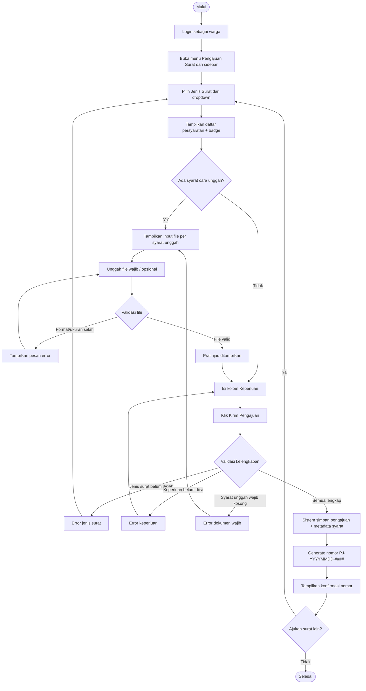
```mermaid
flowchart TD
    Start([Mulai]) --> A[Login sebagai warga]
    A --> B[Buka menu Pengajuan Surat dari sidebar]
    B --> C[Pilih Jenis Surat dari dropdown]
    C --> D[Tampilkan daftar persyaratan + badge]
    D --> E{Ada syarat cara unggah?}

    E -->|Ya| F[Tampilkan input file per syarat unggah]
    F --> G[Unggah file wajib / opsional]
    G --> H{Validasi file}
    H -->|"Format/ukuran salah"| I[Tampilkan pesan error]
    I --> G
    H -->|"File valid"| J[Pratinjau ditampilkan]

    E -->|Tidak| K
    J --> K[Isi kolom Keperluan]

    K --> L[Klik Kirim Pengajuan]
    L --> M{Validasi kelengkapan}
    M -->|"Jenis surat belum dipilih"| N1[Error jenis surat]
    N1 --> C
    M -->|"Keperluan belum diisi"| N2[Error keperluan]
    N2 --> K
    M -->|"Syarat unggah wajib kosong"| N3[Error dokumen wajib]
    N3 --> F
    M -->|"Semua lengkap"| O[Sistem simpan pengajuan + metadata syarat]
    O --> P["Generate nomor PJ-YYYYMMDD-####"]
    P --> Q[Tampilkan konfirmasi nomor]
    Q --> R{Ajukan surat lain?}
    R -->|Ya| C
    R -->|Tidak| End([Selesai])
```

**Tabel 3.15 Penjelasan Alur — Pengajuan Surat Keterangan**

| **Langkah** | **Aktivitas** | **Keterangan** |
| ----------- | ------------- | -------------- |
| 1 | Login | Warga harus sudah terautentikasi |
| 2 | Pilih jenis surat | Dropdown jenis surat aktif |
| 3 | Baca badge persyaratan | Sistem tampilkan badge: Wajib diunggah / Boleh dikosongkan / Bawa ke kantor / Informasi |
| 4 | Unggah dokumen | Hanya untuk persyaratan bertipe **unggah**; label = nama persyaratan |
| 5 | Validasi file | Format JPG/PNG/PDF, maks. 2 MB |
| 6 | Isi keperluan | Tujuan penggunaan surat diisi warga |
| 7 | Validasi kelengkapan | Hanya syarat unggah wajib (`is_wajib = true`) yang memblokir pengiriman |
| 8 | Simpan & generate nomor | Status `diajukan`; nomor pengajuan unik `PJ-YYYYMMDD-####` diterbitkan |

**Tabel 3.16 Kondisi Alternatif — Pengajuan Surat**

| **Kondisi** | **Penyebab** | **Tindakan Sistem** |
| ----------- | ------------ | ------------------- |
| Dokumen wajib kosong | Syarat unggah `is_wajib = true` tanpa file | Pesan "Dokumen {nama} wajib diunggah." — tidak menyimpan |
| Format/ukuran salah | Bukan JPG/PNG/PDF atau > 2 MB | Pesan error pada kolom file |
| Jenis surat belum dipilih | Dropdown kosong | Pesan error validasi |
| Keperluan belum diisi | Field teks kosong | Pesan error validasi |

---

**e. AD-05: Verifikasi Pengajuan oleh Admin**

**Gambar 3.11 Activity Diagram — Verifikasi Pengajuan oleh Admin**

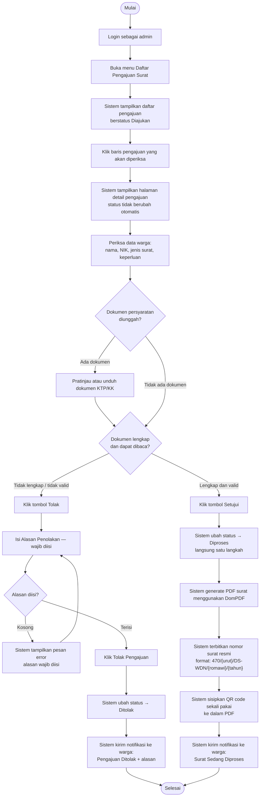
```mermaid
flowchart TD
    Start([Mulai]) --> A[Login sebagai admin]
    A --> B[Buka menu Daftar Pengajuan Surat]
    B --> C[Sistem tampilkan daftar pengajuan\nberstatus Diajukan]
    C --> D[Klik baris pengajuan yang akan diperiksa]
    D --> E[Sistem tampilkan halaman detail pengajuan\nstatus tidak berubah otomatis]
    E --> F[Periksa data warga:\nnama, NIK, jenis surat, keperluan]
    F --> G{Dokumen persyaratan\ndiunggah?}
    G -->|"Ada dokumen"| H[Pratinjau atau unduh dokumen KTP/KK]
    H --> I{Dokumen lengkap\ndan dapat dibaca?}
    G -->|"Tidak ada dokumen"| I
    I -->|"Tidak lengkap / tidak valid"| J[Klik tombol Tolak]
    J --> K[Isi Alasan Penolakan — wajib diisi]
    K --> L{Alasan diisi?}
    L -->|"Kosong"| M[Sistem tampilkan pesan error\nalasan wajib diisi]
    M --> K
    L -->|"Terisi"| N[Klik Tolak Pengajuan]
    N --> O[Sistem ubah status → Ditolak]
    O --> P[Sistem kirim notifikasi ke warga:\nPengajuan Ditolak + alasan]
    P --> End([Selesai])

    I -->|"Lengkap dan valid"| Q[Klik tombol Setujui]
    Q --> R[Sistem ubah status → Diproses\nlangsung satu langkah]
    R --> S[Sistem generate PDF surat menggunakan DomPDF]
    S --> T["Sistem terbitkan nomor surat resmi\nformat: 470/{urut}/DS-WDN/{romawi}/{tahun}"]
    T --> U[Sistem sisipkan QR code sekali pakai\nke dalam PDF]
    U --> V[Sistem kirim notifikasi ke warga:\nSurat Sedang Diproses]
    V --> End
```

**Tabel 3.17 Penjelasan Alur — Verifikasi Pengajuan**

| **Langkah** | **Aktivitas** | **Keterangan** |
| ----------- | ------------- | -------------- |
| 1 | Buka daftar pengajuan | Admin membuka menu Daftar Pengajuan Surat; filter default: status Diajukan |
| 2 | Pilih pengajuan | Klik baris untuk membuka detail; status pengajuan tidak berubah saat dibuka |
| 3 | Periksa data warga | Admin membaca data: nama, NIK, jenis surat, keperluan |
| 4 | Periksa dokumen | Pratinjau inline atau unduh file KTP/KK yang diunggah warga |
| 5a (Setujui) | Klik Setujui | Status langsung berubah → **Diproses** dalam satu langkah |
| 5a | Generate PDF | Sistem buat PDF otomatis menggunakan DomPDF dari template Blade |
| 5a | Nomor resmi | Sistem generate nomor surat berurutan format `470/{urut}/DS-WDN/{romawi}/{tahun}` |
| 5a | QR code | Sistem sisipkan QR code sekali pakai ke dalam PDF |
| 5a | Notifikasi | Satu notifikasi in-app dikirim ke warga: "Surat Sedang Diproses" |
| 5b (Tolak) | Klik Tolak | Admin wajib mengisi alasan penolakan pada modal yang muncul |
| 5b | Notifikasi | Notifikasi + alasan penolakan dikirim ke warga |

**Tabel 3.18 Kondisi Alternatif — Verifikasi Pengajuan**

| **Kondisi** | **Penyebab** | **Tindakan Sistem** |
| ----------- | ------------ | ------------------- |
| Alasan tolak kosong | Admin tidak mengisi field alasan | Pesan error; form tidak dapat dikirim |
| Gagal generate PDF | Error penyimpanan atau konfigurasi server | Log error sistem; admin perlu menghubungi pengelola teknis |
| Pengajuan sudah diproses | Admin membuka pengajuan yang statusnya bukan Diajukan | Tombol Setujui/Tolak tidak aktif (`canVerify()` = false) |

---

**f. AD-06: Proses Surat dan Penetapan Jadwal Pengambilan**

**Gambar 3.12 Activity Diagram — Proses Surat dan Penetapan Jadwal Pengambilan**

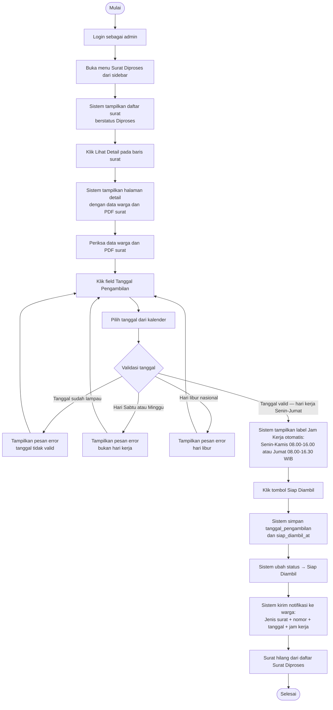
```mermaid
flowchart TD
    Start([Mulai]) --> A[Login sebagai admin]
    A --> B[Buka menu Surat Diproses dari sidebar]
    B --> C[Sistem tampilkan daftar surat\nberstatus Diproses]
    C --> D[Klik Lihat Detail pada baris surat]
    D --> E[Sistem tampilkan halaman detail\ndengan data warga dan PDF surat]
    E --> F[Periksa data warga dan PDF surat]
    F --> G[Klik field Tanggal Pengambilan]
    G --> H[Pilih tanggal dari kalender]
    H --> I{Validasi tanggal}
    I -->|"Tanggal sudah lampau"| J1[Tampilkan pesan error\ntanggal tidak valid]
    J1 --> G
    I -->|"Hari Sabtu atau Minggu"| J2[Tampilkan pesan error\nbukan hari kerja]
    J2 --> G
    I -->|"Hari libur nasional"| J3[Tampilkan pesan error\nhari libur]
    J3 --> G
    I -->|"Tanggal valid — hari kerja Senin-Jumat"| K[Sistem tampilkan label Jam Kerja otomatis:\nSenin-Kamis 08.00-16.00 atau Jumat 08.00-16.30 WIB]
    K --> L[Klik tombol Siap Diambil]
    L --> M[Sistem simpan tanggal_pengambilan\ndan siap_diambil_at]
    M --> N[Sistem ubah status → Siap Diambil]
    N --> O[Sistem kirim notifikasi ke warga:\nJenis surat + nomor + tanggal + jam kerja]
    O --> P[Surat hilang dari daftar Surat Diproses]
    P --> End([Selesai])
```

**Tabel 3.19 Penjelasan Alur — Penetapan Jadwal Pengambilan**

| **Langkah** | **Aktivitas** | **Keterangan** |
| ----------- | ------------- | -------------- |
| 1 | Buka Surat Diproses | Admin membuka menu khusus untuk surat yang sudah disetujui |
| 2 | Lihat detail | Admin memeriksa data warga dan dapat melakukan pratinjau PDF surat |
| 3 | Pilih tanggal | Admin memilih tanggal pengambilan dari kalender |
| 4 | Validasi tanggal | Sistem menolak tanggal lampau, hari Sabtu/Minggu, dan hari libur nasional |
| 5 | Jam kerja otomatis | Label jam kerja muncul otomatis: Senin–Kamis 08.00–16.00 WIB / Jumat 08.00–16.30 WIB |
| 6 | Klik Siap Diambil | Admin mengkonfirmasi penetapan jadwal |
| 7 | Simpan & notifikasi | Sistem menyimpan jadwal, ubah status → **Siap Diambil**, kirim notifikasi ke warga |

**Tabel 3.20 Kondisi Alternatif — Penetapan Jadwal Pengambilan**

| **Kondisi** | **Penyebab** | **Tindakan Sistem** |
| ----------- | ------------ | ------------------- |
| Tanggal lampau | Tanggal sebelum hari ini | Pesan error; tombol Siap Diambil tidak aktif |
| Hari Sabtu/Minggu | Bukan hari kerja | Pesan error |
| Hari libur nasional | Tanggal masuk daftar libur konfigurasi sistem | Pesan error |

---

**g. AD-07: Pengambilan Surat dengan Scan QR**

**Gambar 3.13 Activity Diagram — Pengambilan Surat dengan Scan QR**

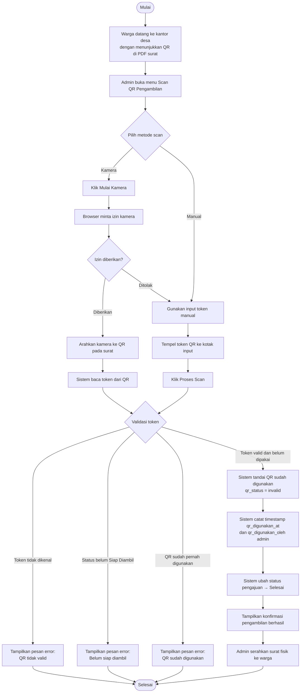
```mermaid
flowchart TD
    Start([Mulai]) --> A[Warga datang ke kantor desa\ndengan menunjukkan QR di PDF surat]
    A --> B[Admin buka menu Scan QR Pengambilan]
    B --> C{Pilih metode scan}
    C -->|"Kamera"| D[Klik Mulai Kamera]
    D --> E[Browser minta izin kamera]
    E --> F{Izin diberikan?}
    F -->|"Ditolak"| G[Gunakan input token manual]
    F -->|"Diberikan"| H[Arahkan kamera ke QR pada surat]
    H --> I[Sistem baca token dari QR]
    C -->|"Manual"| G
    G --> J[Tempel token QR ke kotak input]
    J --> K[Klik Proses Scan]
    I --> L{Validasi token}
    K --> L
    L -->|"Token tidak dikenal"| M1[Tampilkan pesan error:\nQR tidak valid]
    M1 --> End([Selesai])
    L -->|"Status belum Siap Diambil"| M2[Tampilkan pesan error:\nBelum siap diambil]
    M2 --> End
    L -->|"QR sudah pernah digunakan"| M3[Tampilkan pesan error:\nQR sudah digunakan]
    M3 --> End
    L -->|"Token valid dan belum dipakai"| N[Sistem tandai QR sudah digunakan\nqr_status = invalid]
    N --> O[Sistem catat timestamp qr_digunakan_at\ndan qr_digunakan_oleh admin]
    O --> P[Sistem ubah status pengajuan → Selesai]
    P --> Q[Tampilkan konfirmasi pengambilan berhasil]
    Q --> R[Admin serahkan surat fisik ke warga]
    R --> End
```

**Tabel 3.21 Penjelasan Alur — Scan QR Pengambilan**

| **Langkah** | **Aktivitas** | **Keterangan** |
| ----------- | ------------- | -------------- |
| 1 | Warga datang | Warga menunjukkan PDF surat dengan QR code kepada petugas |
| 2 | Buka menu scan | Admin membuka halaman Scan QR Pengambilan |
| 3 | Pilih metode | Kamera (jika didukung browser) atau input token manual |
| 4 | Validasi token | Sistem cek: token dikenal, status pengajuan `siap_diambil`, QR belum pernah dipakai |
| 5 | Tandai QR | Token dinonaktifkan (`qr_status = invalid`); tidak bisa dipakai lagi |
| 6 | Ubah status | Pengajuan → **Selesai** |
| 7 | Konfirmasi | Layar menampilkan pesan keberhasilan |
| 8 | Serahkan surat | Admin menyerahkan surat fisik ke warga |

**Tabel 3.22 Kondisi Alternatif — Scan QR**

| **Kondisi** | **Penyebab** | **Tindakan Sistem** |
| ----------- | ------------ | ------------------- |
| Token tidak dikenal | QR dari surat yang berbeda atau rusak | Pesan error: "QR tidak valid" |
| Status bukan Siap Diambil | Surat belum ditandai siap diambil | Pesan error: "Belum siap diambil" |
| QR sudah dipakai | Sudah pernah discan sebelumnya | Pesan error: "QR sudah digunakan" |
| Kamera tidak bisa jalan | Browser tidak mendukung atau izin ditolak | Gunakan input token manual |

---

**h. AD-08: Unduh / Cetak Surat oleh Warga**

**Gambar 3.14 Activity Diagram — Unduh / Cetak Surat oleh Warga**

```mermaid
flowchart TD
    Start([Mulai]) --> A[Login sebagai warga]
    A --> B[Buka Riwayat Pengajuan atau Dashboard]
    B --> C{Status pengajuan\nSiap Diambil atau Selesai?}
    C -->|"Tidak — status lain"| D[Tombol Unduh/Cetak tidak tersedia]
    D --> End([Selesai])
    C -->|"Ya"| E{Pilih aksi}
    E -->|"Unduh"| F[Klik tombol Unduh Surat]
    E -->|"Cetak"| G[Klik tombol Cetak Surat]
    F --> H{File PDF ada di storage?}
    G --> H
    H -->|"Ya"| I[Sajikan PDF ke browser\n(download atau inline untuk cetak)]
    H -->|"Tidak — file hilang"| J[Sistem generate ulang PDF\ntanpa membuat QR baru]
    J --> I
    I --> End
```

**Tabel 3.23 Penjelasan Alur — Unduh / Cetak Surat**

| **Langkah** | **Aktivitas** | **Keterangan** |
| ----------- | ------------- | -------------- |
| 1 | Login | Warga harus sudah terautentikasi |
| 2 | Buka riwayat atau dashboard | Tombol unduh/cetak muncul di halaman detail atau dashboard jika statusnya memenuhi syarat |
| 3 | Cek status | Tombol hanya aktif jika status `siap_diambil` atau `selesai` |
| 4 | Pilih Unduh/Cetak | Unduh = browser download; Cetak = PDF dibuka inline untuk dicetak |
| 5 | Cek file | Sistem memeriksa keberadaan file PDF di storage |
| 6 | Sajikan PDF | File dilayani ke browser; jika hilang, sistem regenerasi tanpa QR baru |

**Tabel 3.24 Kondisi Alternatif — Unduh / Cetak Surat**

| **Kondisi** | **Tindakan Sistem** |
| ----------- | ------------------- |
| Status Diproses/Diajukan/Ditolak | Tombol unduh/cetak tidak ditampilkan |
| File PDF hilang dari storage | Sistem regenerasi PDF dari data `surat_terbit` tanpa menerbitkan QR baru |

---

**i. AD-09: Ajukan Ulang Setelah Ditolak**

**Gambar 3.15 Activity Diagram — Ajukan Ulang Setelah Ditolak**

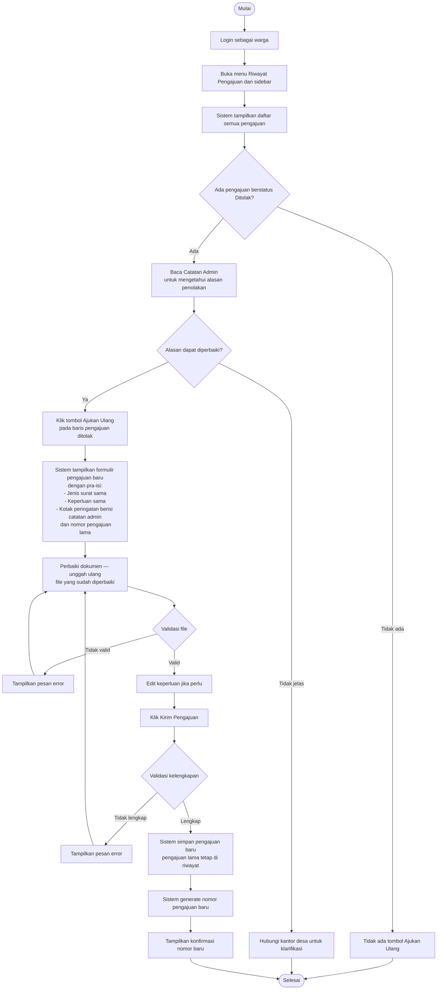
```mermaid
flowchart TD
    Start([Mulai]) --> A[Login sebagai warga]
    A --> B[Buka menu Riwayat Pengajuan dari sidebar]
    B --> C[Sistem tampilkan daftar semua pengajuan]
    C --> D{Ada pengajuan berstatus Ditolak?}
    D -->|"Tidak ada"| E[Tidak ada tombol Ajukan Ulang]
    E --> End([Selesai])
    D -->|"Ada"| F[Baca Catatan Admin\nuntuk mengetahui alasan penolakan]
    F --> G{Alasan dapat diperbaiki?}
    G -->|"Tidak jelas"| H[Hubungi kantor desa untuk klarifikasi]
    H --> End
    G -->|"Ya"| I[Klik tombol Ajukan Ulang\npada baris pengajuan ditolak]
    I --> J["Sistem tampilkan formulir pengajuan baru\ndengan pra-isi:\n- Jenis surat sama\n- Keperluan sama\n- Kotak peringatan berisi catatan admin\n  dan nomor pengajuan lama"]
    J --> K[Perbaiki dokumen — unggah ulang\nfile yang sudah diperbaiki]
    K --> L{Validasi file}
    L -->|"Tidak valid"| M[Tampilkan pesan error]
    M --> K
    L -->|"Valid"| N[Edit keperluan jika perlu]
    N --> O[Klik Kirim Pengajuan]
    O --> P{Validasi kelengkapan}
    P -->|"Tidak lengkap"| Q[Tampilkan pesan error]
    Q --> K
    P -->|"Lengkap"| R[Sistem simpan pengajuan baru\npengajuan lama tetap di riwayat]
    R --> S[Sistem generate nomor pengajuan baru]
    S --> T[Tampilkan konfirmasi nomor baru]
    T --> End
```

**Tabel 3.25 Penjelasan Alur — Ajukan Ulang**

| **Langkah** | **Aktivitas** | **Keterangan** |
| ----------- | ------------- | -------------- |
| 1 | Buka riwayat | Warga membuka halaman Riwayat Pengajuan |
| 2 | Baca catatan admin | Warga membaca alasan penolakan sebelum mengajukan ulang |
| 3 | Klik Ajukan Ulang | Tombol hanya tersedia pada baris berstatus **Ditolak** |
| 4 | Formulir pra-isi | Jenis surat dan keperluan terisi otomatis dari pengajuan lama |
| 5 | Unggah ulang | Warga mengunggah dokumen yang sudah diperbaiki |
| 6 | Kirim | Sistem memvalidasi dan menyimpan pengajuan baru |
| 7 | Nomor baru | Nomor pengajuan baru diterbitkan; pengajuan lama tetap ada di riwayat sebagai rekam jejak |

**Tabel 3.26 Kondisi Alternatif — Ajukan Ulang**

| **Kondisi** | **Penyebab** | **Tindakan Sistem** |
| ----------- | ------------ | ------------------- |
| Tidak ada pengajuan ditolak | Tidak ada status Ditolak milik warga | Tombol Ajukan Ulang tidak muncul |
| Dokumen tidak valid | Format/ukuran tidak sesuai | Pesan error pada field unggah |
| Jenis surat tidak tersedia | Admin telah mengarsipkan jenis surat | Dropdown kosong; warga perlu menghubungi admin |

---

**j. AD-10: Kelola Master Jenis Surat**

**Gambar 3.16 Activity Diagram — Kelola Master Jenis Surat**

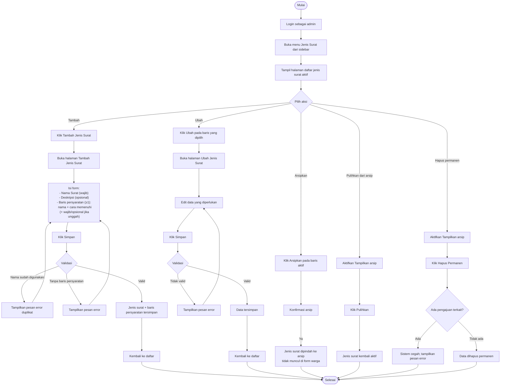
```mermaid
flowchart TD
    Start([Mulai]) --> A[Login sebagai admin]
    A --> B[Buka menu Jenis Surat dari sidebar]
    B --> C[Tampil halaman daftar jenis surat aktif]
    C --> D{Pilih aksi}

    D -->|"Tambah"| E[Klik Tambah Jenis Surat]
    E --> E2[Buka halaman Tambah Jenis Surat]
    E2 --> F["Isi form:\n- Nama Surat (wajib)\n- Deskripsi (opsional)\n- Baris persyaratan (≥1):\n  nama + cara memenuhi\n  (+ wajib/opsional jika unggah)"]
    F --> G[Klik Simpan]
    G --> H{Validasi}
    H -->|"Nama sudah digunakan"| I1[Tampilkan pesan error duplikat]
    I1 --> F
    H -->|"Tanpa baris persyaratan"| I2[Tampilkan pesan error]
    I2 --> F
    H -->|"Valid"| J[Jenis surat + baris persyaratan tersimpan]
    J --> J2[Kembali ke daftar]
    J2 --> End([Selesai])

    D -->|"Ubah"| K[Klik Ubah pada baris yang dipilih]
    K --> K2[Buka halaman Ubah Jenis Surat]
    K2 --> L[Edit data yang diperlukan]
    L --> M[Klik Simpan]
    M --> N{Validasi}
    N -->|"Tidak valid"| O[Tampilkan pesan error]
    O --> L
    N -->|"Valid"| P[Data tersimpan]
    P --> P2[Kembali ke daftar]
    P2 --> End

    D -->|"Arsipkan"| Q[Klik Arsipkan pada baris aktif]
    Q --> R[Konfirmasi arsip]
    R -->|"Ya"| T[Jenis surat dipindah ke arsip\ntidak muncul di form warga]
    T --> End

    D -->|"Pulihkan dari arsip"| U[Aktifkan Tampilkan arsip]
    U --> V[Klik Pulihkan]
    V --> W[Jenis surat kembali aktif]
    W --> End

    D -->|"Hapus permanen"| X[Aktifkan Tampilkan arsip]
    X --> Y[Klik Hapus Permanen]
    Y --> AA{Ada pengajuan terkait?}
    AA -->|"Ada"| AC[Sistem cegah; tampilkan pesan error]
    AC --> End
    AA -->|"Tidak ada"| AD[Data dihapus permanen]
    AD --> End
```

**Tabel 3.27 Penjelasan Alur — Kelola Jenis Surat**

| **Aksi** | **Aktivitas** | **Keterangan** |
| -------- | ------------- | -------------- |
| Tambah | Buat jenis surat baru di halaman khusus | Nama wajib unik; minimal satu baris persyaratan terstruktur |
| Ubah | Edit data di halaman khusus | Nama tetap harus unik; soft-deleted dikembalikan 404 |
| Arsipkan | Soft delete | Data tersimpan di arsip; tidak muncul di form warga |
| Pulihkan | Kembalikan dari arsip | Jenis surat kembali aktif dan bisa dipilih warga |
| Hapus permanen | Hard delete dari arsip | Gagal jika ada pengajuan yang mengacu jenis surat ini |

**Tabel 3.28 Kondisi Alternatif — Kelola Jenis Surat**

| **Kondisi** | **Penyebab** | **Tindakan Sistem** |
| ----------- | ------------ | ------------------- |
| Nama duplikat | Nama sudah dipakai jenis surat lain | Pesan error duplikat |
| Persyaratan kosong | Tidak ada baris persyaratan | Pesan error validasi |
| Hapus permanen gagal | Ada pengajuan yang mengacu jenis surat ini | Sistem mencegah penghapusan |

---

**k. AD-11: Rekap Pengajuan dan Ekspor CSV**

**Gambar 3.17 Activity Diagram — Rekap Pengajuan dan Ekspor CSV**

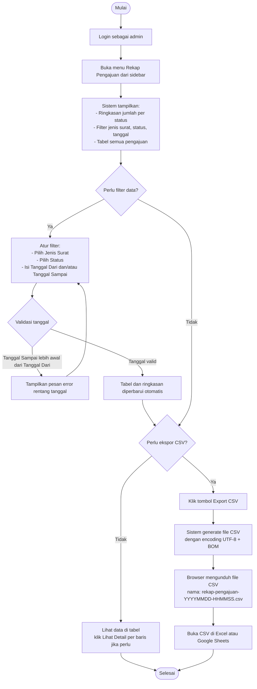
```mermaid
flowchart TD
    Start([Mulai]) --> A[Login sebagai admin]
    A --> B[Buka menu Rekap Pengajuan dari sidebar]
    B --> C["Sistem tampilkan:\n- Ringkasan jumlah per status\n- Filter jenis surat, status, tanggal\n- Tabel semua pengajuan"]
    C --> D{Perlu filter data?}

    D -->|"Ya"| E["Atur filter:\n- Pilih Jenis Surat\n- Pilih Status\n- Isi Tanggal Dari dan/atau Tanggal Sampai"]
    E --> F{Validasi tanggal}
    F -->|"Tanggal Sampai lebih awal dari Tanggal Dari"| G[Tampilkan pesan error rentang tanggal]
    G --> E
    F -->|"Tanggal valid"| H[Tabel dan ringkasan diperbarui otomatis]
    H --> L{Perlu ekspor CSV?}
    D -->|"Tidak"| L

    L -->|"Tidak"| M[Lihat data di tabel\nklik Lihat Detail per baris jika perlu]
    M --> End([Selesai])

    L -->|"Ya"| N[Klik tombol Export CSV]
    N --> O[Sistem generate file CSV\ndengan encoding UTF-8 + BOM]
    O --> P["Browser mengunduh file CSV\nnama: rekap-pengajuan-YYYYMMDD-HHMMSS.csv"]
    P --> Q[Buka CSV di Excel atau Google Sheets]
    Q --> End
```

**Tabel 3.29 Penjelasan Alur — Rekap & Ekspor CSV**

| **Langkah** | **Aktivitas** | **Keterangan** |
| ----------- | ------------- | -------------- |
| 1 | Buka rekap | Admin membuka halaman Rekap Pengajuan |
| 2 | Lihat ringkasan | Jumlah per status ditampilkan di atas tabel |
| 3 | Terapkan filter | Filter jenis surat, status, dan rentang tanggal dapat dikombinasikan |
| 4 | Validasi tanggal | Sistem menolak jika tanggal sampai lebih awal dari tanggal dari |
| 5 | Ekspor CSV | Sistem menghasilkan file CSV dari data yang sudah difilter, encoding UTF-8 BOM |
| 6 | Buka CSV | File dibuka di spreadsheet untuk keperluan pelaporan desa |

**Tabel 3.30 Kondisi Alternatif — Rekap & Ekspor CSV**

| **Kondisi** | **Penyebab** | **Tindakan Sistem** |
| ----------- | ------------ | ------------------- |
| Tanggal sampai lebih awal | Rentang tanggal tidak valid | Pesan error validasi |
| Tidak ada data sesuai filter | Tidak ada pengajuan yang cocok | Tampilkan pesan "tidak ada data" |

---

**l. AD-12: Alur Transisi Status Pengajuan**

Gambar 3.18 berikut menggambarkan seluruh kemungkinan transisi status pada sebuah pengajuan surat keterangan.

**Gambar 3.18 State Diagram — Alur Transisi Status Pengajuan**

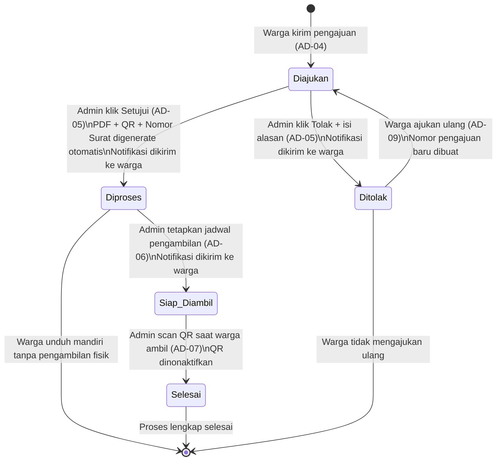
```mermaid
stateDiagram-v2
    [*] --> Diajukan : Warga kirim pengajuan (AD-04)

    Diajukan --> Diproses : Admin klik Setujui (AD-05)\nPDF + QR + Nomor Surat digenerate otomatis\nNotifikasi dikirim ke warga

    Diajukan --> Ditolak : Admin klik Tolak + isi alasan (AD-05)\nNotifikasi dikirim ke warga

    Diproses --> Siap_Diambil : Admin tetapkan jadwal pengambilan (AD-06)\nNotifikasi dikirim ke warga

    Siap_Diambil --> Selesai : Admin scan QR saat warga ambil (AD-07)\nQR dinonaktifkan

    Ditolak --> Diajukan : Warga ajukan ulang (AD-09)\nNomor pengajuan baru dibuat

    Diproses --> [*] : Warga unduh mandiri tanpa pengambilan fisik
    Selesai --> [*] : Proses lengkap selesai
    Ditolak --> [*] : Warga tidak mengajukan ulang
```

**Tabel 3.31 Penjelasan Transisi Status**

| **Dari** | **Ke** | **Dipicu Oleh** | **Proses Otomatis** |
| -------- | ------ | --------------- | ------------------- |
| — | Diajukan | Warga kirim form pengajuan | Nomor pengajuan `PJ-YYYYMMDD-####` dibuat |
| Diajukan | Diproses | Admin klik Setujui | Generate PDF, nomor surat resmi, QR code, notifikasi ke warga |
| Diajukan | Ditolak | Admin klik Tolak + isi alasan | Notifikasi + alasan dikirim ke warga |
| Diproses | Siap Diambil | Admin tetapkan tanggal pengambilan | Notifikasi + jadwal + jam kerja dikirim ke warga |
| Siap Diambil | Selesai | Admin scan QR saat warga datang | QR dinonaktifkan; timestamp dicatat |
| Ditolak | Diajukan | Warga klik Ajukan Ulang | Nomor pengajuan baru dibuat; pengajuan lama tetap di riwayat |

---

**m. AD-13: Melihat Detail Rekap dan Timeline Proses Pengajuan**

**Gambar 3.19 Activity Diagram — Detail Rekap dan Timeline Pengajuan**

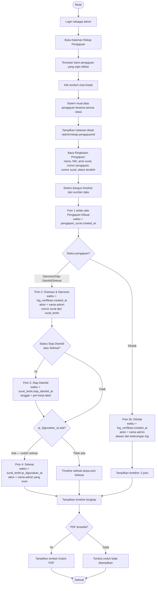
```mermaid
flowchart TD
    Start([Mulai]) --> A[Login sebagai admin]
    A --> B[Buka halaman Rekap Pengajuan]
    B --> C[Temukan baris pengajuan yang ingin dilihat]
    C --> D[Klik tombol Lihat Detail]
    D --> E[Sistem muat data pengajuan beserta semua relasi]
    E --> F[Tampilkan halaman detail /admin/rekap-pengajuan/id]

    F --> G[Baca Ringkasan Pengajuan:\nnama, NIK, jenis surat, nomor pengajuan,\nnomor surat, status terakhir]

    G --> H[Sistem bangun timeline dari sumber data]

    H --> I[Poin 1 selalu ada:\nPengajuan Dibuat\nwaktu = pengajuan_surat.created_at]

    I --> J{Status pengajuan?}

    J -->|"Ditolak"| K["Poin 2b: Ditolak\nwaktu = log_verifikasi.created_at\naktor = nama admin\nalasan dari keterangan log"]
    K --> M[Tampilkan timeline: 2 poin]

    J -->|"Diproses/Siap Diambil/Selesai"| N["Poin 2: Disetujui & Diproses\nwaktu = log_verifikasi.created_at\naktor = nama admin\nnomor surat dari surat_terbit"]

    N --> Q{Status Siap Diambil\natau Selesai?}

    Q -->|"Ya"| R["Poin 3: Siap Diambil\nwaktu = surat_terbit.siap_diambil_at\ntanggal + jam kerja label"]
    R --> U{qr_digunakan_at ada?}

    Q -->|"Tidak"| U

    U -->|"Ada — sudah selesai"| V["Poin 4: Selesai\nwaktu = surat_terbit.qr_digunakan_at\naktor = nama admin yang scan"]
    U -->|"Tidak ada"| W[Timeline selesai tanpa poin Selesai]

    V --> X[Tampilkan timeline lengkap]
    W --> X
    M --> X

    X --> Y{PDF tersedia?}
    Y -->|"Ya"| Z[Tampilkan tombol Unduh PDF]
    Y -->|"Tidak"| AA[Tombol unduh tidak ditampilkan]

    Z --> End([Selesai])
    AA --> End
```

**Tabel 3.32 Penjelasan Alur — Detail Rekap Timeline**

| **Langkah** | **Aktivitas** | **Keterangan** |
| ----------- | ------------- | -------------- |
| 1 | Buka rekap | Admin membuka halaman Rekap Pengajuan |
| 2 | Klik Lihat Detail | Admin memilih baris pengajuan yang ingin diaudit |
| 3 | Muat data | Sistem eager-load semua relasi: log verifikasi, surat terbit, user |
| 4 | Poin 1 (selalu ada) | Pengajuan Dibuat — dari `pengajuan_surat.created_at` |
| 5a | Poin 2b (jika ditolak) | Ditolak — dari `log_verifikasi` aksi=tolak; timeline berhenti di sini |
| 5b | Poin 2 (jika disetujui) | Disetujui & Diproses — dari `log_verifikasi` aksi=setujui + nomor surat |
| 6 | Poin 3 (jika siap) | Siap Diambil — dari `siap_diambil_at` + label jam kerja |
| 7 | Poin 4 (jika selesai) | Selesai — dari `qr_digunakan_at` + nama admin yang scan |
| 8 | Tombol Unduh PDF | Ditampilkan jika file PDF ada di storage |

**Tabel 3.33 Sumber Data Timeline**

| **Poin Timeline** | **Sumber Waktu** | **Sumber Aktor** |
| ----------------- | ---------------- | ---------------- |
| Pengajuan Dibuat | `pengajuan_surat.created_at` | Sistem |
| Disetujui & Diproses | `log_verifikasi.created_at` (aksi=setujui) | `log_verifikasi → admin.name` |
| Ditolak | `log_verifikasi.created_at` (aksi=tolak) | `log_verifikasi → admin.name` |
| Siap Diambil | `surat_terbit.siap_diambil_at` | `surat_terbit → diterbitkanOleh.name` |
| Selesai | `surat_terbit.qr_digunakan_at` | `surat_terbit → qrDigunakanOleh.name` |

---

**_3.6.3 Perancangan Basis Data_**

Perancangan basis data digambarkan melalui Entity Relationship Diagram (ERD) yang menunjukkan entitas beserta relasinya. Sistem menggunakan delapan tabel utama.

**Gambar 3.20 Entity Relationship Diagram (ERD)**

```mermaid
erDiagram
    users {
        bigint id PK
        string nik UK "16 chars, unique"
        string name
        string email UK
        string no_telepon
        text alamat
        string role "warga | admin"
        timestamp email_verified_at
        string password
        timestamps created_at
    }

    jenis_surat {
        bigint id PK
        string nama_surat UK "100 chars"
        text deskripsi
        text persyaratan_dokumen "ringkasan generated"
        timestamps created_at
        timestamp deleted_at "SoftDeletes"
    }

    jenis_surat_persyaratan {
        bigint id PK
        bigint jenis_surat_id FK
        string nama
        string cara_pemenuhan "unggah|bawa_kantor|info"
        boolean is_wajib
        int urutan
        timestamps created_at
    }

    pengajuan_surat {
        bigint id PK
        bigint user_id FK
        bigint jenis_surat_id FK
        string nomor_pengajuan UK "PJ-YYYYMMDD-####"
        text keperluan
        string status "diajukan|diproses|ditolak|siap_diambil|selesai"
        text catatan_admin
        bigint diverifikasi_oleh FK "nullable"
        date tanggal_pengajuan
        timestamps created_at
    }

    dokumen_persyaratan {
        bigint id PK
        bigint pengajuan_id FK
        string jenis_dokumen "ktp | kk"
        string file_path "disk local privat"
        timestamps created_at
    }

    log_verifikasi {
        bigint id PK
        bigint pengajuan_id FK
        bigint admin_id FK
        string aksi "setujui|tolak|siap_diambil"
        text keterangan
        timestamp created_at
    }

    notifikasi {
        bigint id PK
        bigint user_id FK
        bigint pengajuan_id FK
        text pesan
        enum status_baca "belum | dibaca"
        timestamp created_at
    }

    surat_terbit {
        bigint id PK
        bigint pengajuan_id UK_FK "1:1"
        string nomor_surat UK "470/{urut}/DS-WDN/{romawi}/{tahun}"
        string file_path "disk local privat"
        date tanggal_terbit
        date tanggal_pengambilan
        timestamp siap_diambil_at
        string jam_kerja_label
        string qr_token UK "64 chars opaque"
        string qr_status "valid | invalid"
        timestamp qr_digunakan_at
        bigint qr_digunakan_oleh FK "nullable"
        bigint diterbitkan_oleh FK
        timestamps created_at
    }

    users ||--o{ pengajuan_surat : "mengajukan"
    users ||--o{ pengajuan_surat : "memverifikasi"
    users ||--o{ notifikasi : "menerima"
    users ||--o{ log_verifikasi : "mencatat"
    users ||--o{ surat_terbit : "menerbitkan"
    users ||--o{ surat_terbit : "scan QR"
    jenis_surat ||--o{ jenis_surat_persyaratan : "memiliki"
    jenis_surat ||--o{ pengajuan_surat : "digunakan di"
    pengajuan_surat ||--o{ dokumen_persyaratan : "memiliki"
    pengajuan_surat ||--o{ log_verifikasi : "dicatat pada"
    pengajuan_surat ||--o{ notifikasi : "memicu"
    pengajuan_surat ||--|| surat_terbit : "menghasilkan"
```

Rancangan struktur tabel basis data disajikan pada Tabel 3.34 sampai dengan Tabel 3.41 berikut.

**Tabel 3.34 Struktur Tabel `users`**

| **Kolom** | **Tipe Data** | **Keterangan** |
| --------- | ------------- | -------------- |
| id | BIGINT PK AI | Primary key |
| nik | VARCHAR(16) UNIQUE | NIK 16 digit; digunakan saat registrasi |
| name | VARCHAR(100) | Nama lengkap pengguna |
| email | VARCHAR(100) UNIQUE | Email untuk login dan reset password |
| password | VARCHAR(255) | Kata sandi terenkripsi (Bcrypt) |
| no_telepon | VARCHAR(20) | Nomor telepon warga |
| alamat | TEXT | Alamat domisili warga |
| role | VARCHAR(20) | `warga` (default) atau `admin` |
| email_verified_at | TIMESTAMP (nullable) | Waktu verifikasi email; null jika belum |
| created_at / updated_at | TIMESTAMP | Waktu pembuatan/pembaruan data |

**Tabel 3.35 Struktur Tabel `jenis_surat`**

| **Kolom** | **Tipe Data** | **Keterangan** |
| --------- | ------------- | -------------- |
| id | BIGINT PK AI | Primary key |
| nama_surat | VARCHAR(100) UNIQUE | Nama jenis surat keterangan |
| deskripsi | TEXT (nullable) | Deskripsi singkat kegunaan surat |
| persyaratan_dokumen | TEXT (nullable) | Ringkasan teks persyaratan (digenerate otomatis dari baris terstruktur) |
| deleted_at | TIMESTAMP (nullable) | Soft delete; null = aktif; terisi = diarsipkan |
| created_at / updated_at | TIMESTAMP | Waktu pembuatan/pembaruan data |

**Tabel 3.36 Struktur Tabel `jenis_surat_persyaratan`**

| **Kolom** | **Tipe Data** | **Keterangan** |
| --------- | ------------- | -------------- |
| id | BIGINT PK AI | Primary key |
| jenis_surat_id | BIGINT FK | Relasi ke `jenis_surat` |
| nama | VARCHAR(255) | Nama persyaratan; misal: "KTP Pemohon", "Surat Pengantar RT" |
| cara_pemenuhan | VARCHAR(20) | Cara memenuhi persyaratan: `unggah`, `bawa_kantor`, atau `info` |
| is_wajib | BOOLEAN | Jika `unggah`: apakah file wajib diunggah atau boleh kosong |
| urutan | INT | Urutan tampil persyaratan di form pengajuan |
| created_at / updated_at | TIMESTAMP | Waktu pembuatan/pembaruan data |

**Tabel 3.37 Struktur Tabel `pengajuan_surat`**

| **Kolom** | **Tipe Data** | **Keterangan** |
| --------- | ------------- | -------------- |
| id | BIGINT PK AI | Primary key |
| user_id | BIGINT FK | Relasi ke `users` (pemohon) |
| jenis_surat_id | BIGINT FK | Relasi ke `jenis_surat` |
| nomor_pengajuan | VARCHAR(30) UNIQUE | Format `PJ-YYYYMMDD-####` |
| keperluan | TEXT | Tujuan penggunaan surat |
| status | VARCHAR(20) | `diajukan`, `diproses`, `ditolak`, `siap_diambil`, `selesai` |
| catatan_admin | TEXT (nullable) | Catatan atau alasan penolakan dari admin |
| diverifikasi_oleh | BIGINT FK (nullable) | Relasi ke `users` (admin); null jika belum diverifikasi |
| tanggal_pengajuan | DATE | Tanggal warga mengirim pengajuan |
| created_at / updated_at | TIMESTAMP | Waktu pembuatan/pembaruan data |

**Tabel 3.38 Struktur Tabel `dokumen_persyaratan`**

| **Kolom** | **Tipe Data** | **Keterangan** |
| --------- | ------------- | -------------- |
| id | BIGINT PK AI | Primary key |
| pengajuan_id | BIGINT FK | Relasi ke `pengajuan_surat` |
| jenis_dokumen | VARCHAR(10) | Jenis dokumen: `ktp` atau `kk` |
| file_path | VARCHAR(255) | Path penyimpanan berkas di disk privat |
| created_at / updated_at | TIMESTAMP | Waktu pembuatan/pembaruan data |

> Satu pengajuan hanya boleh memiliki satu KTP dan satu KK (diterapkan melalui unique index pada pasangan `pengajuan_id` + `jenis_dokumen`). File hanya dapat diakses admin melalui route yang dilindungi middleware `role:admin`.

**Tabel 3.39 Struktur Tabel `log_verifikasi`**

| **Kolom** | **Tipe Data** | **Keterangan** |
| --------- | ------------- | -------------- |
| id | BIGINT PK AI | Primary key |
| pengajuan_id | BIGINT FK | Relasi ke `pengajuan_surat` |
| admin_id | BIGINT FK | Relasi ke `users` (admin yang melakukan aksi) |
| aksi | VARCHAR(50) | Aksi: `setujui`, `tolak`, `siap_diambil` |
| keterangan | TEXT (nullable) | Alasan penolakan atau catatan tambahan |
| created_at | TIMESTAMP | Waktu aksi dilakukan |

> Tabel ini bersifat _insert-only_ dan tidak pernah dihapus, berfungsi sebagai audit trail seluruh keputusan admin.

**Tabel 3.40 Struktur Tabel `notifikasi`**

| **Kolom** | **Tipe Data** | **Keterangan** |
| --------- | ------------- | -------------- |
| id | BIGINT PK AI | Primary key |
| user_id | BIGINT FK | Relasi ke `users` (warga penerima) |
| pengajuan_id | BIGINT FK | Relasi ke `pengajuan_surat` |
| pesan | TEXT | Isi pesan notifikasi dalam Bahasa Indonesia |
| status_baca | ENUM('belum','dibaca') | Status baca; default `belum` |
| created_at | TIMESTAMP | Waktu notifikasi dibuat |

**Tabel 3.41 Struktur Tabel `surat_terbit`**

| **Kolom** | **Tipe Data** | **Keterangan** |
| --------- | ------------- | -------------- |
| id | BIGINT PK AI | Primary key |
| pengajuan_id | BIGINT FK UNIQUE | Relasi 1:1 ke `pengajuan_surat` |
| nomor_surat | VARCHAR(50) UNIQUE | Format `470/{urut}/DS-WDN/{romawi}/{tahun}` |
| file_path | VARCHAR(255) | Path file PDF di disk privat |
| tanggal_terbit | DATE | Tanggal PDF digenerate |
| tanggal_pengambilan | DATE (nullable) | Tanggal pengambilan yang ditetapkan admin |
| siap_diambil_at | TIMESTAMP (nullable) | Waktu admin menetapkan surat siap diambil |
| jam_kerja_label | VARCHAR(100) (nullable) | Label jam kerja; misal "Senin–Kamis 08.00–16.00 WIB" |
| qr_token | VARCHAR(64) UNIQUE | Token QR acak; disisipkan ke PDF untuk verifikasi pengambilan |
| qr_status | VARCHAR(20) | `valid` (belum dipakai) atau `invalid` (sudah dipakai) |
| qr_digunakan_at | TIMESTAMP (nullable) | Waktu token berhasil dipindai |
| qr_digunakan_oleh | BIGINT FK (nullable) | Relasi ke `users`; admin yang memindai QR |
| diterbitkan_oleh | BIGINT FK | Relasi ke `users`; admin yang menyetujui pengajuan |
| created_at / updated_at | TIMESTAMP | Waktu pembuatan/pembaruan data |

> Pembuatan baris pada tabel ini dilakukan secara atomik menggunakan `DB::transaction` + `lockForUpdate` untuk menjamin keamanan dari kondisi balapan (_race condition_).

---

**_3.6.4 Perancangan Antarmuka (Interface)_**

Perancangan antarmuka menggambarkan rancangan halaman-halaman utama sistem. Antarmuka dibagi menjadi tiga kelompok berdasarkan peran pengguna.

**a. Rancangan Halaman Publik (tanpa login)**

- **Halaman Beranda (`/`)** — menampilkan informasi singkat tentang layanan, tombol masuk dan daftar, serta tautan ke halaman persyaratan dokumen.
- **Halaman Persyaratan Dokumen Publik (`/persyaratan-dokumen`)** — menampilkan kartu jenis surat aktif beserta daftar persyaratan terstruktur (nama + badge cara pemenuhan). Dapat diakses tanpa akun; tersedia kolom pencarian.
- **Halaman Registrasi (`/register`)** — formulir pendaftaran akun warga: NIK, nama, nomor telepon, alamat, email, password.
- **Halaman Login (`/login`)** — formulir masuk; sistem mengarahkan otomatis ke dashboard sesuai role setelah berhasil.
- **Halaman Reset Password** — dua tahap: permintaan tautan via email, kemudian form penetapan password baru.

_Sisipkan Gambar 3.21 Rancangan Halaman Publik._

**b. Rancangan Antarmuka Warga (setelah login)**

- **Dashboard Warga (`/dashboard`)** — kartu hero yang menampilkan status pengajuan aktif secara visual: badge status besar, alur progres bertahap, jadwal pengambilan bila sudah ditetapkan, dan tombol unduh/cetak surat bila sudah siap. Terdapat juga ringkasan riwayat tiga pengajuan terakhir dan banner notifikasi belum dibaca.
- **Halaman Persyaratan Dokumen (`/persyaratan-dokumen`)** — identik dengan versi publik namun menggunakan tata letak aplikasi dengan sidebar navigasi.
- **Halaman Form Pengajuan Surat (`/pengajuan-surat`)** — dropdown pilihan jenis surat; setelah dipilih, daftar persyaratan terstruktur muncul dengan badge cara pemenuhan dan slot unggah file untuk persyaratan bertipe `unggah`; kolom keperluan surat.
- **Halaman Riwayat Pengajuan (`/riwayat-pengajuan`)** — tabel semua pengajuan milik warga dengan filter status, tautan ke halaman detail, dan tombol "Ajukan Ulang" pada baris berstatus Ditolak.
- **Halaman Detail Pengajuan (`/pengajuan-surat/detail/{id}`)** — tampilan lengkap satu pengajuan: status, nomor, keperluan, riwayat notifikasi, dan tombol unduh/cetak bila surat sudah siap.
- **Panel Notifikasi In-App** — ikon lonceng di header; menampilkan daftar notifikasi terbaru dan penanda jumlah belum dibaca; klik notifikasi menandai sebagai dibaca dan mengarah ke detail pengajuan.

_Sisipkan Gambar 3.22 Rancangan Antarmuka Warga._

**c. Rancangan Antarmuka Admin / Petugas Desa**

- **Dashboard Admin (`/admin/dashboard`)** — kartu aging per status (Menunggu/Diproses/Siap Diambil/Selesai) dengan warna peringatan, antrian mendesak (pengajuan paling lama menunggu), dan tabel pengajuan aktif dengan pintasan ke verifikasi.
- **Halaman Kelola Jenis Surat (`/admin/jenis-surat`)** — daftar jenis surat aktif + arsip; tombol Tambah, Ubah, Arsipkan, Pulihkan, Hapus Permanen.
- **Halaman Form Jenis Surat (Tambah/Ubah)** — formulir nama, deskripsi, dan editor baris persyaratan terstruktur (nama + cara pemenuhan + wajib/opsional) yang dapat ditambah, dihapus, dan diurutkan ulang.
- **Halaman Pengaturan Desa (`/admin/pengaturan-desa`)** — formulir identitas resmi desa yang digunakan pada template PDF surat keterangan.
- **Halaman Daftar Pengajuan Surat (`/admin/verifikasi`)** — tabel semua pengajuan dengan filter status (default: Diajukan); tautan ke detail verifikasi.
- **Halaman Detail Verifikasi (`/admin/verifikasi/{id}`)** — tampilan lengkap pengajuan, pratinjau inline atau unduh KTP/KK, tombol Setujui dan Tolak (dengan modal alasan penolakan wajib isi).
- **Halaman Surat Diproses (`/admin/surat-diproses`)** — daftar surat berstatus Diproses dan Siap Diambil; tautan ke detail penetapan jadwal.
- **Halaman Detail Surat Diproses (`/admin/surat-diproses/{id}`)** — date picker tanggal pengambilan dengan validasi hari kerja, pratinjau label jam kerja otomatis, dan tombol Siap Diambil.
- **Halaman Scan QR Pengambilan (`/admin/scan-qr-pengambilan`)** — antarmuka pemindaian QR via kamera atau input token manual; tampilkan konfirmasi keberhasilan atau pesan error yang spesifik.
- **Halaman Rekap Pengajuan (`/admin/rekap-pengajuan`)** — tabel rekap dengan filter multi-kriteria (jenis surat, status, rentang tanggal), ringkasan jumlah per status, dan tombol Ekspor CSV.
- **Halaman Detail Rekap Timeline (`/admin/rekap-pengajuan/{id}`)** — tampilan kronologis timeline proses satu pengajuan (Dibuat → Disetujui → Siap Diambil → Selesai / Ditolak) beserta nama aktor dan waktu WIB; tombol unduh PDF bila tersedia.

_Sisipkan Gambar 3.23 Rancangan Antarmuka Admin._
