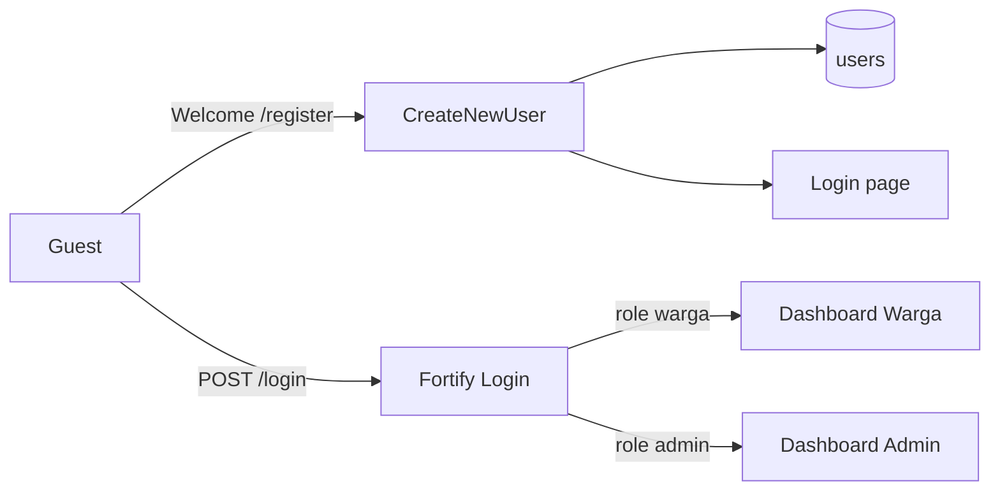

# System Architecture

High-level overview of Sistem Informasi Pelayanan Surat Keterangan (**Pelayanan Surat Desa**).

## Stack

- **Backend:** Laravel 13 + Fortify (authentication)
- **Frontend:** Livewire 4 + Flux UI + Blade + Tailwind CSS v4
- **Database:** SQLite (local/dev); schema via Eloquent migrations
- **E2E:** Playwright (Chromium) — `e2e/smoke.spec.ts`, `e2e/public-pages.spec.ts`, plus Phase 01 auth specs
- **Test data:** `UserSeeder` via `php artisan db:seed` (admin + warga baku); covered by `tests/Feature/DatabaseSeederTest.php`

## Public UI Brand

Guest-facing pages (welcome, login, register) use a forest-green / saffron brand with Fraunces (display) + Instrument Sans. Auth forms share `layouts/auth/split` (brand panel + form). See [ADR-005](dev-docs/decisions/005-public-pages-brand-redesign.md).

## Auth Foundation (Phase 01)

Phase 01 stories:

| Story | Status |
|-------|--------|
| US-1.1 Registrasi Akun Warga | Implemented |
| US-1.2 Login Berbasis Role | Implemented |
| US-1.3 Middleware Proteksi Role | Implemented |
| US-1.4 Manajemen Profil | Implemented |
| US-1.5 Lupa Password | Implemented |

## Local seed accounts

| Email | Password | Role |
|-------|----------|------|
| `admin@desa.test` | `password` | admin |
| `warga@desa.test` | `password` | warga |

Plus 5 additional random warga from the factory. Details: [dev-docs/features/database-seeders.md](dev-docs/features/database-seeders.md).

## Related

- [Developer docs](dev-docs/README.md)
- [User docs](user-docs/README.md)
- [Public pages](dev-docs/features/public-pages.md)
