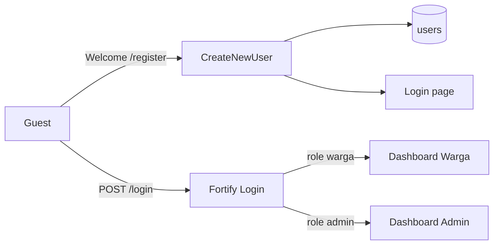
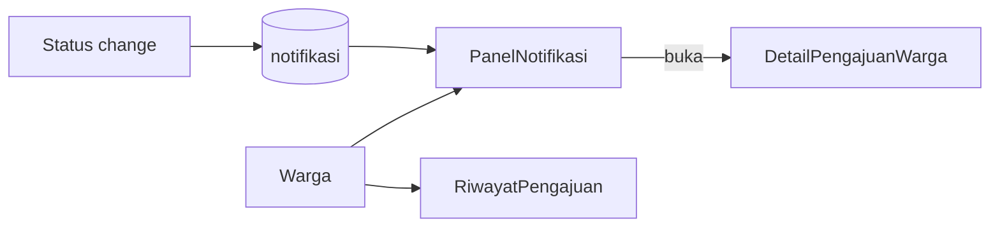
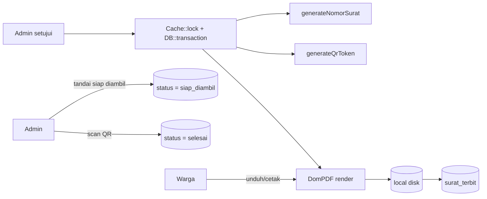
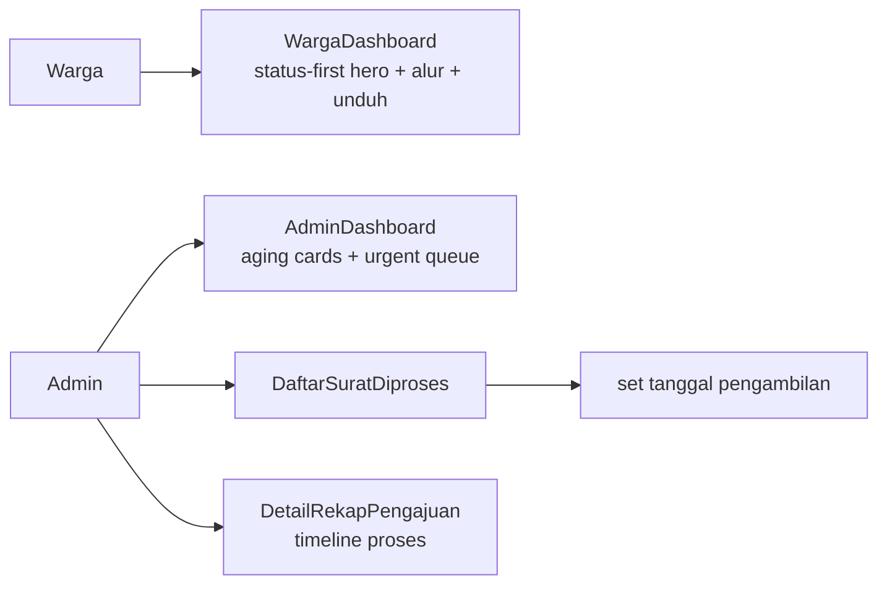

# System Architecture

High-level overview of Sistem Informasi Pelayanan Surat Keterangan (**Pelayanan Surat Desa**).

## Stack

- **Backend:** Laravel 13 + Fortify (authentication)
- **Frontend:** Livewire 4 + Flux UI + Blade + Tailwind CSS v4
- **Database:** SQLite (local/dev); schema via Eloquent migrations
- **E2E:** Playwright (Chromium) — `e2e/` covers Phase 01–06 (auth, jenis surat, pengajuan, verifikasi, notifikasi, rekap)
- **Test data:** `UserSeeder` via `php artisan db:seed` (admin + warga baku); covered by `tests/Feature/DatabaseSeederTest.php`

## Database

Full schema, ER diagram, table dictionary, and index summary: **[dev-docs/database.md](dev-docs/database.md)**

Tables: `users`, `jenis_surat`, `pengajuan_surat`, `dokumen_persyaratan`, `log_verifikasi`, `notifikasi`, `surat_terbit`, `passkeys`, plus Laravel framework tables (`cache`, `jobs`, `sessions`, `password_reset_tokens`).

## Public UI Brand

Guest-facing pages (welcome, login, register, and public persyaratan dokumen) use a forest-green / saffron brand with Fraunces (display) + Instrument Sans. Auth forms share `layouts/auth/split` (brand panel + form). Guest Livewire pages use `layouts/public`. See [ADR-005](dev-docs/decisions/005-public-pages-brand-redesign.md) and [ADR-008](dev-docs/decisions/008-public-persyaratan-dokumen-access.md).

## Auth Foundation (Phase 01)



Phase 01 stories:

| Story | Status |
|-------|--------|
| US-1.1 Registrasi Akun Warga | Implemented |
| US-1.2 Login Berbasis Role | Implemented |
| US-1.3 Middleware Proteksi Role | Implemented |
| US-1.4 Manajemen Profil | Implemented |
| US-1.5 Lupa Password | Implemented |

## Master Data — Jenis Surat (Phase 02)

```mermaid
flowchart LR
    Admin[Admin] --> JS[/admin/jenis-surat]
    JS --> Model[JenisSurat SoftDeletes]
    Model --> Table[(jenis_surat)]
    Guest[Guest] --> PD[/persyaratan-dokumen]
    Warga[Warga] --> PD
    PD --> Model
```

| Story | Status |
|-------|--------|
| US-2.1 Kelola Data Jenis Surat (admin CRUD + soft/hard delete) | Implemented |
| US-2.2 Tampilan Persyaratan untuk Warga | Implemented |
| US-2.3 Akses Publik Persyaratan | Implemented |

Details: [dev-docs/features/jenis-surat.md](dev-docs/features/jenis-surat.md), [dev-docs/features/persyaratan-dokumen.md](dev-docs/features/persyaratan-dokumen.md), [dev-docs/features/persyaratan-dokumen-publik.md](dev-docs/features/persyaratan-dokumen-publik.md), ADR-006, ADR-007, ADR-008.

## Pengajuan Surat Keterangan (Phase 03)

```mermaid
flowchart LR
    Warga[Warga] --> Form[/pengajuan-surat]
    Form --> Validate[Validate fields + required docs]
    Validate --> PS[(pengajuan_surat)]
    Validate --> DP[(dokumen_persyaratan)]
    Form --> JS[(jenis_surat)]
```

| Story | Status |
|-------|--------|
| US-3.1 Form Pengajuan Surat | Implemented |
| US-3.2 Unggah Dokumen Persyaratan | Implemented |
| US-3.3 Validasi Kelengkapan Pengajuan | Implemented |
| US-3.4 Ajukan Ulang Setelah Ditolak | Done |

Details: [dev-docs/features/pengajuan-surat-form.md](dev-docs/features/pengajuan-surat-form.md), [dev-docs/features/pengajuan-surat-dokumen.md](dev-docs/features/pengajuan-surat-dokumen.md), [dev-docs/features/pengajuan-surat-kelengkapan.md](dev-docs/features/pengajuan-surat-kelengkapan.md), ADR-009, ADR-010.

## Verifikasi Pengajuan (Phase 04)

```mermaid
flowchart LR
    Admin[Admin] --> Daftar[/admin/verifikasi]
    Daftar --> Detail[/admin/verifikasi/id]
    Detail -->|setujui| Lock[lockForUpdate]
    Lock --> Diproses[(status = diproses)]
    Lock --> SuratTerbit[(surat_terbit)]
    Lock --> LogV[(log_verifikasi)]
    Lock --> Notif[(notifikasi)]
    Detail -->|tolak| Ditolak[(status = ditolak)]
```

| Story | Status |
|-------|--------|
| US-4.1 Daftar Pengajuan (Admin) | Implemented |
| US-4.2 Detail + Aksi Verifikasi | Implemented |
| US-4.3 Log Audit Verifikasi | Implemented |
| US-8.3 Rename ke Daftar Pengajuan Surat | Implemented |
| US-8.4 Setujui Langsung → Diproses | Implemented |

Details: [dev-docs/features/verifikasi-pengajuan.md](dev-docs/features/verifikasi-pengajuan.md), [dev-docs/features/setujui-langsung-diproses.md](dev-docs/features/setujui-langsung-diproses.md), ADR-011, ADR-012, ADR-020.

## Notifikasi & Riwayat Pengajuan (Phase 05)



| Story | Status |
|-------|--------|
| US-5.1 Notifikasi In-App | Implemented |
| US-5.2 Bell Panel + Tandai Dibaca | Implemented |
| US-5.3 Detail Pengajuan + Riwayat Warga | Implemented |

Details: [dev-docs/features/notifikasi-pengajuan.md](dev-docs/features/notifikasi-pengajuan.md).

## Rekap Pengajuan & Reporting (Phase 06)

```mermaid
flowchart LR
    Admin[Admin] --> Rekap[/admin/rekap-pengajuan]
    Rekap --> Filter[jenis + status + tanggal]
    Filter --> Table[(pengajuan_surat)]
    Rekap --> CSV[Export CSV UTF-8 BOM]
```

| Story | Status |
|-------|--------|
| US-6.1 Halaman Rekap dengan Filter | Implemented |
| US-6.2 Export Data Rekap | Implemented |

Details: [dev-docs/features/rekap-pengajuan.md](dev-docs/features/rekap-pengajuan.md), ADR-013.

## Surat Keterangan & QR (Phase 07)



| Story | Status |
|-------|--------|
| US-7.1 Migrasi Alur Status | Implemented |
| US-7.2 Generate Surat PDF (DomPDF) | Implemented |
| US-7.3 Nomor Surat Resmi Otomatis | Implemented |
| US-7.4 QR Code Sekali Pakai | Implemented |
| US-7.5 Dokumen Siap Diambil | Implemented |
| US-7.6 Unduh/Cetak Surat Warga | Implemented |

Details: [dev-docs/features/generate-surat-pdf.md](dev-docs/features/generate-surat-pdf.md), [dev-docs/features/nomor-surat-resmi.md](dev-docs/features/nomor-surat-resmi.md), [dev-docs/features/qr-sekali-pakai.md](dev-docs/features/qr-sekali-pakai.md), [dev-docs/features/dokumen-siap-diambil.md](dev-docs/features/dokumen-siap-diambil.md), [dev-docs/features/unduh-surat-warga.md](dev-docs/features/unduh-surat-warga.md), ADR-015, ADR-016, ADR-017, ADR-018, ADR-024 (supersedes ADR-019).

## Dashboard, Rekap Lanjut & UX Improvements (Phase 08)



| Story | Status |
|-------|--------|
| US-8.1 Dashboard Admin (aging + urgent) | Implemented |
| US-8.2 Dashboard Warga (status-first hero + unduh) | Implemented |
| US-8.3 Rename Daftar Pengajuan Surat | Implemented |
| US-8.4 Setujui Langsung Diproses | Implemented |
| US-8.5 Halaman Surat Diproses (daftar) | Implemented |
| US-8.6 Detail Surat Diproses + Siap Diambil | Implemented |
| US-8.7 Rekap Timeline Detail | Implemented |

Details: [dev-docs/features/dashboard-admin.md](dev-docs/features/dashboard-admin.md), [dev-docs/features/dashboard-warga.md](dev-docs/features/dashboard-warga.md), [dev-docs/features/surat-diproses.md](dev-docs/features/surat-diproses.md), [dev-docs/features/rekap-timeline.md](dev-docs/features/rekap-timeline.md), ADR-021, ADR-022, ADR-023, ADR-025.

## Local seed accounts

| Email | Password | Role |
|-------|----------|------|
| `admin@desa.test` | `password` | admin |
| `warga@desa.test` | `password` | warga |

Plus 5 additional random warga from the factory. Details: [dev-docs/features/database-seeders.md](dev-docs/features/database-seeders.md).

## Related

- [Developer docs](dev-docs/README.md)
- [Database Architecture](dev-docs/database.md)
- [Route Map](dev-docs/routes.md)
- [Livewire Components](dev-docs/livewire-components.md)
- [User docs](user-docs/README.md)
- [Public pages](dev-docs/features/public-pages.md)
