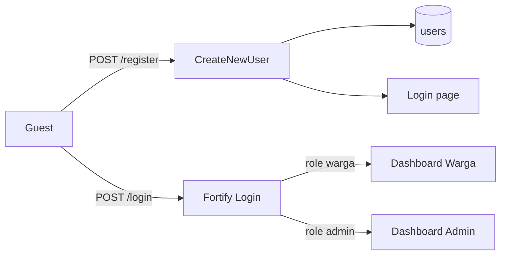

# System Architecture

High-level overview of Sistem Informasi Pelayanan Surat Keterangan.

## Stack

- **Backend:** Laravel 13 + Fortify (authentication)
- **Frontend:** Livewire 4 + Flux UI + Blade
- **Database:** SQLite (local/dev); schema via Eloquent migrations
- **E2E:** Playwright (Chromium)

## Auth Foundation (Phase 01)

Phase 01 stories:

| Story | Status |
|-------|--------|
| US-1.1 Registrasi Akun Warga | Implemented |
| US-1.2 Login Berbasis Role | Pending |
| US-1.3 Middleware Proteksi Role | Pending |
| US-1.4 Manajemen Profil | Pending |
| US-1.5 Lupa Password | Scaffold exists via Fortify |

## Related

- [Developer docs](dev-docs/README.md)
- [User docs](user-docs/README.md)
