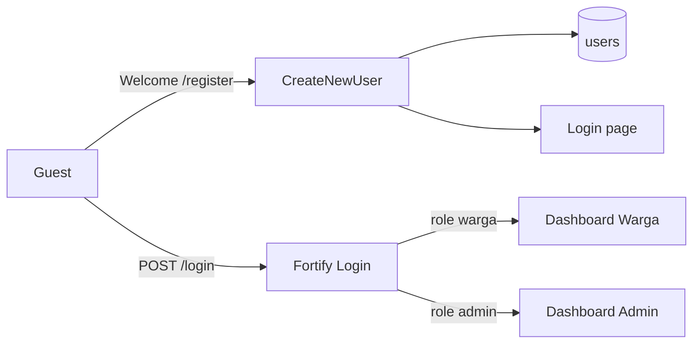

# System Architecture

High-level overview of Sistem Informasi Pelayanan Surat Keterangan (**Pelayanan Surat Desa**).

## Stack

- **Backend:** Laravel 13 + Fortify (authentication)
- **Frontend:** Livewire 4 + Flux UI + Blade + Tailwind CSS v4
- **Database:** SQLite (local/dev); schema via Eloquent migrations
- **E2E:** Playwright (Chromium) — `e2e/` includes Phase 01 auth specs, Phase 02 persyaratan specs, and `e2e/pengajuan-surat.spec.ts` (US-3.1–3.3)
- **Test data:** `UserSeeder` via `php artisan db:seed` (admin + warga baku); covered by `tests/Feature/DatabaseSeederTest.php`

## Public UI Brand

Guest-facing pages (welcome, login, register, and public persyaratan dokumen) use a forest-green / saffron brand with Fraunces (display) + Instrument Sans. Auth forms share `layouts/auth/split` (brand panel + form). Guest Livewire pages use `layouts/public`. See [ADR-005](dev-docs/decisions/005-public-pages-brand-redesign.md) and [ADR-008](dev-docs/decisions/008-public-persyaratan-dokumen-access.md).

## Auth Foundation (Phase 01)



Phase 01 stories:

| Story | Status |
|-------|--------|
| US-1.1 Registrasi Akun Warga | Implemented |
| US-1.2 Login Berbasis Role | Implemented |
| US-1.3 Middleware Proteksi Role | Implemented |
| US-1.4 Manajemen Profil | Implemented |
| US-1.5 Lupa Password | Implemented |

## Master Data — Jenis Surat (Phase 02)

```mermaid
flowchart LR
    Admin[Admin] --> JS[/admin/jenis-surat]
    JS --> Model[JenisSurat SoftDeletes]
    Model --> Table[(jenis_surat)]
    Guest[Guest] --> PD[/persyaratan-dokumen]
    Warga[Warga] --> PD
    PD --> Model
```

| Story | Status |
|-------|--------|
| US-2.1 Kelola Data Jenis Surat (admin CRUD + soft/hard delete) | Implemented |
| US-2.2 Tampilan Persyaratan untuk Warga | Implemented |
| US-2.3 Akses Publik Persyaratan | Implemented |

Details: [dev-docs/features/jenis-surat.md](dev-docs/features/jenis-surat.md), [dev-docs/features/persyaratan-dokumen.md](dev-docs/features/persyaratan-dokumen.md), [dev-docs/features/persyaratan-dokumen-publik.md](dev-docs/features/persyaratan-dokumen-publik.md), ADR-006, ADR-007, ADR-008.

## Pengajuan Surat Keterangan (Phase 03)

```mermaid
flowchart LR
    Warga[Warga] --> Form[/pengajuan-surat]
    Form --> Validate[Validate fields + required docs]
    Validate --> PS[(pengajuan_surat)]
    Validate --> DP[(dokumen_persyaratan)]
    Form --> JS[(jenis_surat)]
```

| Story | Status |
|-------|--------|
| US-3.1 Form Pengajuan Surat | Implemented |
| US-3.2 Unggah Dokumen Persyaratan | Implemented |
| US-3.3 Validasi Kelengkapan Pengajuan | Implemented |
| US-3.4 Ajukan Ulang Setelah Ditolak | Not started |

Details: [dev-docs/features/pengajuan-surat-form.md](dev-docs/features/pengajuan-surat-form.md), [dev-docs/features/pengajuan-surat-dokumen.md](dev-docs/features/pengajuan-surat-dokumen.md), [dev-docs/features/pengajuan-surat-kelengkapan.md](dev-docs/features/pengajuan-surat-kelengkapan.md), ADR-009, ADR-010.

## Local seed accounts

| Email | Password | Role |
|-------|----------|------|
| `admin@desa.test` | `password` | admin |
| `warga@desa.test` | `password` | warga |

Plus 5 additional random warga from the factory. Details: [dev-docs/features/database-seeders.md](dev-docs/features/database-seeders.md).

## Related

- [Developer docs](dev-docs/README.md)
- [User docs](user-docs/README.md)
- [Public pages](dev-docs/features/public-pages.md)
