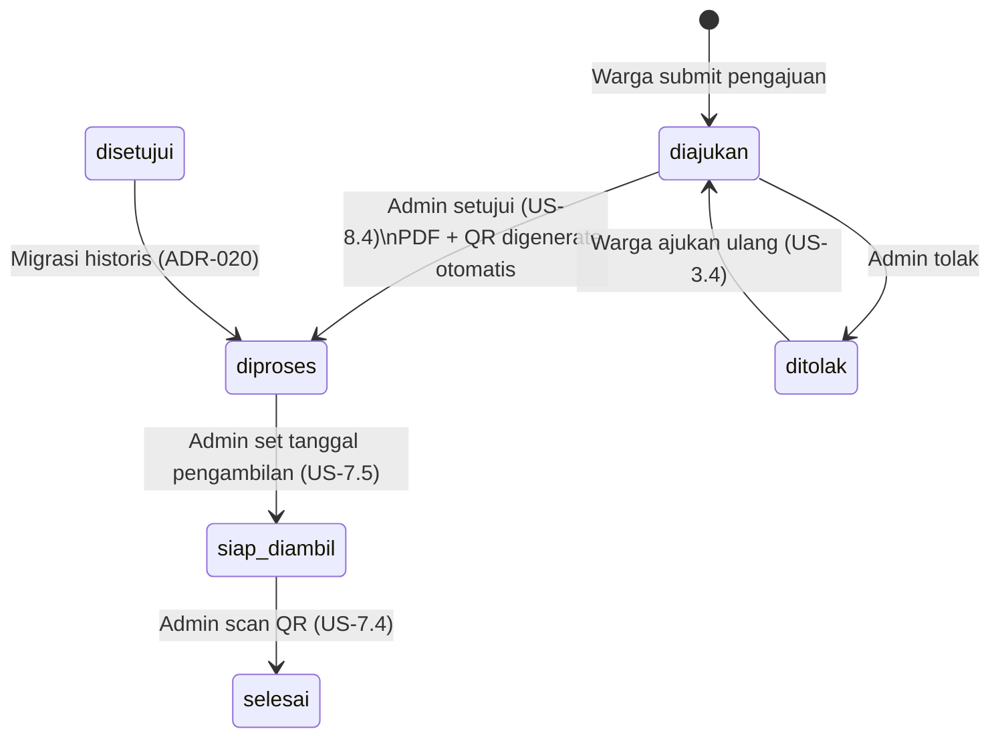

# Database Architecture

Complete schema reference for Sistem Informasi Pelayanan Surat Keterangan.

## Entity-Relationship Diagram

```mermaid
erDiagram
    users {
        bigint id PK
        string nik UK "16 chars, unique"
        string name
        string email UK
        string no_telepon
        text alamat
        string role "warga | admin"
        timestamp email_verified_at
        string password
        string remember_token
        timestamps created_at
    }

    jenis_surat {
        bigint id PK
        string nama_surat UK "100 chars"
        text deskripsi
        text persyaratan_dokumen
        timestamps created_at
        timestamp deleted_at "SoftDeletes"
    }

    pengajuan_surat {
        bigint id PK
        bigint user_id FK
        bigint jenis_surat_id FK
        string nomor_pengajuan UK "PJ-YYYYMMDD-####"
        text keperluan
        string status "diajukan|diproses|disetujui|ditolak|siap_diambil|selesai"
        text catatan_admin
        bigint diverifikasi_oleh FK "nullable → users"
        date tanggal_pengajuan
        timestamps created_at
    }

    dokumen_persyaratan {
        bigint id PK
        bigint pengajuan_id FK
        string jenis_dokumen "ktp | kk"
        string file_path "private disk"
        timestamps created_at
    }

    log_verifikasi {
        bigint id PK
        bigint pengajuan_id FK
        bigint admin_id FK
        string aksi "setujui | tolak"
        text keterangan
        timestamp created_at
    }

    notifikasi {
        bigint id PK
        bigint user_id FK
        bigint pengajuan_id FK
        text pesan
        enum status_baca "dibaca | belum"
        timestamp created_at
    }

    surat_terbit {
        bigint id PK
        bigint pengajuan_id UK+FK "1:1 with pengajuan_surat"
        string nomor_surat UK "470/{urut}/DS-WDN/{romawi}/{tahun}"
        string file_path "private disk"
        date tanggal_terbit
        date tanggal_pengambilan
        timestamp siap_diambil_at
        string jam_kerja_label
        string qr_token UK "64 chars opaque"
        string qr_status "valid | invalid"
        timestamp qr_digunakan_at
        bigint qr_digunakan_oleh FK "nullable → users"
        bigint diterbitkan_oleh FK "→ users"
        timestamps created_at
    }

    passkeys {
        bigint id PK
        bigint user_id FK
        string name
        string credential_id UK
        json credential
        timestamp last_used_at
        timestamps created_at
    }

    users ||--o{ pengajuan_surat : "mengajukan"
    users ||--o{ pengajuan_surat : "memverifikasi (diverifikasi_oleh)"
    users ||--o{ notifikasi : "menerima"
    users ||--o{ log_verifikasi : "mencatat (admin_id)"
    users ||--o{ surat_terbit : "menerbitkan (diterbitkan_oleh)"
    users ||--o{ surat_terbit : "scan QR (qr_digunakan_oleh)"
    users ||--o{ passkeys : "memiliki"
    jenis_surat ||--o{ pengajuan_surat : "digunakan di"
    pengajuan_surat ||--o{ dokumen_persyaratan : "memiliki"
    pengajuan_surat ||--o{ log_verifikasi : "dicatat pada"
    pengajuan_surat ||--o{ notifikasi : "memicu"
    pengajuan_surat ||--|| surat_terbit : "menghasilkan"
```

---

## Table Dictionary

### `users`

Akun pengguna sistem. Setiap baris memiliki `role` yang menentukan akses halaman.

| Column | Type | Nullable | Notes |
|--------|------|----------|-------|
| `id` | bigint PK | No | Auto-increment |
| `nik` | varchar(16) | No | Unique; digunakan sebagai username login |
| `name` | varchar(100) | No | Nama lengkap; kolom standar Laravel Fortify |
| `email` | varchar(100) | No | Unique; target password reset |
| `no_telepon` | varchar(20) | No | Nomor telepon warga |
| `alamat` | text | No | Alamat domisili warga |
| `role` | varchar(20) | No | Default `warga`; nilai lain: `admin` |
| `email_verified_at` | timestamp | Yes | Null jika belum verifikasi email |
| `password` | varchar | No | Bcrypt hash |
| `two_factor_secret` | text | Yes | TOTP secret (Fortify 2FA) |
| `two_factor_recovery_codes` | text | Yes | Recovery codes terenkripsi |
| `two_factor_confirmed_at` | timestamp | Yes | Null jika 2FA belum aktif |
| `remember_token` | varchar(100) | Yes | Laravel remember-me cookie |
| `created_at` / `updated_at` | timestamp | Yes | — |

**Indexes:** `nik` (unique), `email` (unique)

---

### `jenis_surat`

Master data jenis surat yang tersedia. Admin dapat CRUD; soft delete menjaga integritas FK.

| Column | Type | Nullable | Notes |
|--------|------|----------|-------|
| `id` | bigint PK | No | — |
| `nama_surat` | varchar(100) | No | Unique; e.g. "Surat Keterangan Domisili" |
| `deskripsi` | text | Yes | Penjelasan singkat jenis surat |
| `persyaratan_dokumen` | text | Yes | Daftar dokumen yang dibutuhkan (teks bebas) |
| `deleted_at` | timestamp | Yes | SoftDeletes; null = aktif |
| `created_at` / `updated_at` | timestamp | Yes | — |

**Indexes:** `nama_surat` (unique)

> Admin dapat melakukan hard-delete hanya jika tidak ada `pengajuan_surat` yang merujuk. Selama ada FK aktif, sistem hanya mengizinkan soft-delete. Lihat [ADR-006](decisions/006-jenis-surat-table-and-admin-crud.md).

---

### `pengajuan_surat`

Inti sistem — setiap baris adalah satu pengajuan surat oleh warga.

| Column | Type | Nullable | Notes |
|--------|------|----------|-------|
| `id` | bigint PK | No | — |
| `user_id` | bigint FK | No | → `users.id` CASCADE DELETE |
| `jenis_surat_id` | bigint FK | No | → `jenis_surat.id` RESTRICT DELETE |
| `nomor_pengajuan` | varchar(30) | No | Unique; format `PJ-YYYYMMDD-####` |
| `keperluan` | text | No | Keterangan keperluan dari warga |
| `status` | varchar(20) | No | Lihat tabel status di bawah |
| `catatan_admin` | text | Yes | Komentar penolakan atau keterangan admin |
| `diverifikasi_oleh` | bigint FK | Yes | → `users.id` SET NULL; null jika belum diverifikasi |
| `tanggal_pengajuan` | date | No | Tanggal warga mengajukan |
| `created_at` / `updated_at` | timestamp | Yes | — |

**Indexes:** `(user_id, status)`, `tanggal_pengajuan`, `status`, `(jenis_surat_id, status, tanggal_pengajuan)`

#### Status Flow



| Status | Label UI | Keterangan |
|--------|----------|------------|
| `diajukan` | Diajukan | Menunggu verifikasi admin |
| `diproses` | Diproses | PDF terbit; sedang diproses |
| `disetujui` | Diproses *(historis)* | Status lama Phase 07; tampil sebagai "Diproses" |
| `ditolak` | Ditolak | Verifikasi gagal; warga dapat ajukan ulang |
| `siap_diambil` | Siap Diambil | Tanggal pengambilan sudah ditetapkan |
| `selesai` | Selesai | QR sudah discan; dokumen sudah diambil |

---

### `dokumen_persyaratan`

File KTP/KK yang diunggah warga saat pengajuan. Disimpan di disk `local` (privat).

| Column | Type | Nullable | Notes |
|--------|------|----------|-------|
| `id` | bigint PK | No | — |
| `pengajuan_id` | bigint FK | No | → `pengajuan_surat.id` CASCADE DELETE |
| `jenis_dokumen` | varchar(10) | No | `ktp` atau `kk` |
| `file_path` | varchar(255) | No | Path relatif di Storage `local` disk |
| `created_at` / `updated_at` | timestamp | Yes | — |

**Indexes:** `(pengajuan_id, jenis_dokumen)` (unique — satu pengajuan hanya satu KTP + satu KK), `jenis_dokumen`

> File hanya dapat diakses admin via route yang dilindungi `role:admin`. Lihat [ADR-010](decisions/010-dokumen-persyaratan-text-detection-and-storage.md) dan [ADR-011](decisions/011-verifikasi-dokumen-secure-route.md).

---

### `log_verifikasi`

Audit trail setiap keputusan verifikasi admin (setujui / tolak). Tidak pernah dihapus.

| Column | Type | Nullable | Notes |
|--------|------|----------|-------|
| `id` | bigint PK | No | — |
| `pengajuan_id` | bigint FK | No | → `pengajuan_surat.id` CASCADE DELETE |
| `admin_id` | bigint FK | No | → `users.id` CASCADE DELETE |
| `aksi` | varchar | No | e.g. `setujui`, `tolak`, `siap_diambil` |
| `keterangan` | text | Yes | Catatan tambahan atau alasan |
| `created_at` | timestamp | No | `useCurrent()` — tidak ada `updated_at` |

> Tabel hanya insert. Tidak ada update/delete. Digunakan di halaman rekap timeline. Lihat [ADR-012](decisions/012-verifikasi-log-and-concurrent-lock.md).

---

### `notifikasi`

Notifikasi in-app untuk warga; ditampilkan di bell panel di header.

| Column | Type | Nullable | Notes |
|--------|------|----------|-------|
| `id` | bigint PK | No | — |
| `user_id` | bigint FK | No | → `users.id` CASCADE DELETE |
| `pengajuan_id` | bigint FK | No | → `pengajuan_surat.id` CASCADE DELETE |
| `pesan` | text | No | Teks notifikasi dalam bahasa Indonesia |
| `status_baca` | enum | No | `belum` (default) atau `dibaca` |
| `created_at` | timestamp | No | `useCurrent()` — tidak ada `updated_at` |

**Indexes:** `(user_id, status_baca)`, `(user_id, created_at)`

---

### `surat_terbit`

PDF surat yang digenerate saat pengajuan disetujui. Relasi 1:1 dengan `pengajuan_surat`.

| Column | Type | Nullable | Notes |
|--------|------|----------|-------|
| `id` | bigint PK | No | — |
| `pengajuan_id` | bigint UK+FK | No | → `pengajuan_surat.id` CASCADE DELETE; unique (1:1) |
| `nomor_surat` | varchar(50) | No | Unique; format `470/{urut}/DS-WDN/{romawi}/{tahun}` |
| `file_path` | varchar(255) | No | Path relatif di Storage `local` disk |
| `tanggal_terbit` | date | No | Tanggal surat digenerate |
| `tanggal_pengambilan` | date | Yes | Tanggal yang ditetapkan admin untuk pengambilan |
| `siap_diambil_at` | timestamp | Yes | Waktu admin set siap diambil (untuk timeline) |
| `jam_kerja_label` | varchar(100) | Yes | e.g. "Senin–Kamis 08.00–16.00 WIB" |
| `qr_token` | varchar(64) | No | Unique; opaque random string untuk scan QR |
| `qr_status` | varchar(20) | No | `valid` (default) atau `invalid` |
| `qr_digunakan_at` | timestamp | Yes | Waktu QR berhasil discan |
| `qr_digunakan_oleh` | bigint FK | Yes | → `users.id` SET NULL; admin yang scan |
| `diterbitkan_oleh` | bigint FK | No | → `users.id` RESTRICT DELETE; admin yang approve |
| `created_at` / `updated_at` | timestamp | Yes | — |

**Indexes:** `qr_status`, `tanggal_terbit`, `pengajuan_id` (unique), `nomor_surat` (unique), `qr_token` (unique)

> Generasi PDF + nomor + QR menggunakan `Cache::lock` + `DB::transaction` + `lockForUpdate` untuk concurrency-safety. Lihat [ADR-015](decisions/015-dompdf-surat-terbit-on-approve.md), [ADR-016](decisions/016-nomor-surat-resmi-format.md), [ADR-017](decisions/017-qr-sekali-pakai-conditional-update.md).

---

### `passkeys` *(framework table)*

WebAuthn/Passkey credentials untuk login tanpa password (Laravel Fortify passkeys).

| Column | Type | Nullable | Notes |
|--------|------|----------|-------|
| `id` | bigint PK | No | — |
| `user_id` | bigint FK | No | → `users.id` CASCADE DELETE |
| `name` | varchar | No | Label nama perangkat |
| `credential_id` | varchar | No | Unique; WebAuthn credential ID |
| `credential` | json | No | Full credential data |
| `last_used_at` | timestamp | Yes | — |
| `created_at` / `updated_at` | timestamp | Yes | — |

---

## Eloquent Model Map

| Model | Table | Key Relations |
|-------|-------|---------------|
| `User` | `users` | `hasMany(PengajuanSurat)`, `hasMany(Notifikasi)` |
| `JenisSurat` | `jenis_surat` | `hasMany(PengajuanSurat)` |
| `PengajuanSurat` | `pengajuan_surat` | `belongsTo(User)`, `belongsTo(JenisSurat)`, `hasMany(DokumenPersyaratan)`, `hasMany(LogVerifikasi)`, `hasMany(Notifikasi)`, `hasOne(SuratTerbit)` |
| `DokumenPersyaratan` | `dokumen_persyaratan` | `belongsTo(PengajuanSurat)` |
| `LogVerifikasi` | `log_verifikasi` | `belongsTo(PengajuanSurat)`, `belongsTo(User)` |
| `Notifikasi` | `notifikasi` | `belongsTo(User)`, `belongsTo(PengajuanSurat)` |
| `SuratTerbit` | `surat_terbit` | `belongsTo(PengajuanSurat)`, `belongsTo(User, 'diterbitkan_oleh')`, `belongsTo(User, 'qr_digunakan_oleh')` |

---

## Indexes Summary

| Table | Index | Purpose |
|-------|-------|---------|
| `pengajuan_surat` | `(user_id, status)` | Dashboard warga: daftar aktif per user |
| `pengajuan_surat` | `tanggal_pengajuan` | Rekap filter tanggal |
| `pengajuan_surat` | `status` | Rekap filter status |
| `pengajuan_surat` | `(jenis_surat_id, status, tanggal_pengajuan)` | Rekap filter gabungan |
| `dokumen_persyaratan` | `(pengajuan_id, jenis_dokumen)` unique | Satu KTP + satu KK per pengajuan |
| `notifikasi` | `(user_id, status_baca)` | Bell panel: notifikasi belum dibaca |
| `notifikasi` | `(user_id, created_at)` | Daftar notifikasi terbaru per user |
| `surat_terbit` | `qr_status` | Scan QR filter status valid |
| `surat_terbit` | `tanggal_terbit` | Per-year sequence nomor surat |

---

## Related

- [System Architecture](../architecture.md)
- [ADR-009: pengajuan_surat table + nomor format](decisions/009-pengajuan-surat-table-and-nomor-format.md)
- [ADR-012: log_verifikasi + concurrent lock](decisions/012-verifikasi-log-and-concurrent-lock.md)
- [ADR-015: DomPDF surat_terbit on approve](decisions/015-dompdf-surat-terbit-on-approve.md)
