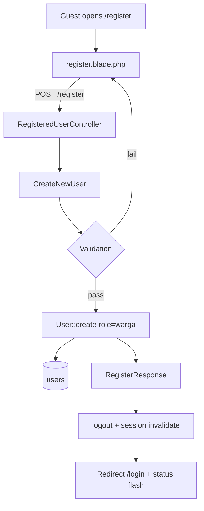
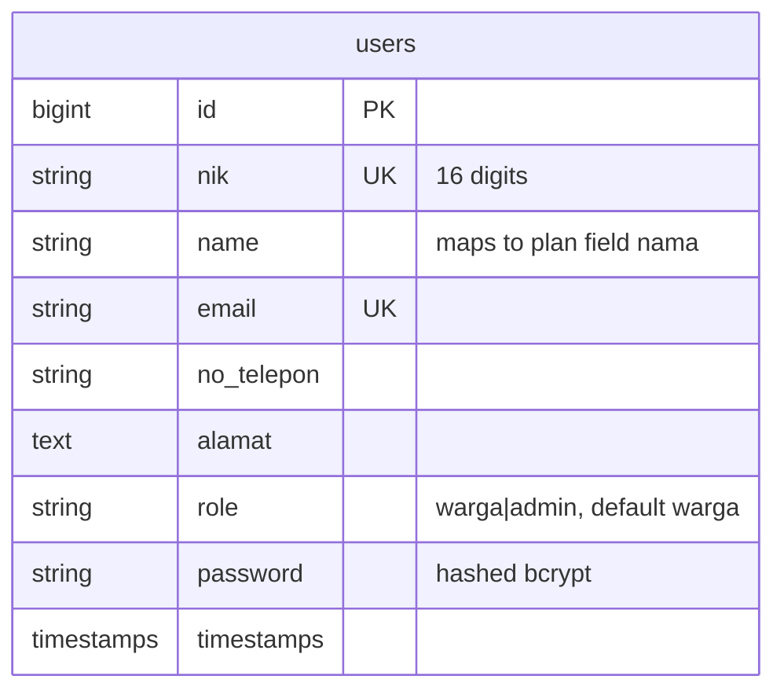

# Citizen Registration (US-1.1)

## Overview

Allows a village resident (*warga*) to create an account with NIK, name, phone, address, email, and password. New accounts always receive the `warga` role. After a successful registration the user is sent to the login page as a guest (not auto-authenticated).

## Architecture Diagram

## Data Model

## Key Files

| Layer | File | Purpose |
|-------|------|---------|
| Action | `app/Actions/Fortify/CreateNewUser.php` | Validation + user creation |
| Response | `app/Http/Responses/RegisterResponse.php` | Logout + redirect to login |
| Provider | `app/Providers/FortifyServiceProvider.php` | Binds RegisterResponse + register view |
| Model | `app/Models/User.php` | Fillable fields, default role, helpers |
| Validation | `app/Concerns/ProfileValidationRules.php` | NIK/email/phone/address rules |
| Migration | `database/migrations/0001_01_01_000000_create_users_table.php` | users schema termasuk nik, no_telepon, alamat, role |
| View | `resources/views/pages/auth/register.blade.php` | Registration form (Indonesian UI) |
| Feature tests | `tests/Feature/Auth/RegistrationTest.php` | Pest coverage |
| E2E | `e2e/registration.spec.ts` | Playwright coverage |

## Flow Explanation

1. **User triggers** — Guest visits `/register` and submits the form.
2. **Request handling** — Fortify `RegisteredUserController@store` calls `CreateNewUser`.
3. **Business logic** — Validates NIK (16 digits, unique), email (unique, valid), password (confirmed + hashed via cast), then creates user with `role = warga`.
4. **Response** — Fortify auto-logs the user in; custom `RegisterResponse` logs them out, invalidates the session, and redirects to `/login` with a success flash.

## API Endpoints (if applicable)

| Method | URI | Purpose | Auth |
|--------|-----|---------|------|
| GET | `/register` | Show registration form | guest |
| POST | `/register` | Create warga account | guest |

## Decisions & Trade-offs

- Kept Laravel column `name` instead of renaming to plan field `nama` — see [ADR-001](../decisions/001-registration-name-column-and-redirect.md).
- Role is a string column (not a PHP enum file) to match project architecture conventions.
- `role` is never taken from request input on registration; always forced to `warga`.

## Related

- Scrum: `scrum-planning/Phase 01 - Authentication & Role Management.md` (US-1.1)
- User guide: [../../user-docs/guides/citizen-registration.md](../../user-docs/guides/citizen-registration.md)
- ADR: [001-registration-name-column-and-redirect.md](../decisions/001-registration-name-column-and-redirect.md)
