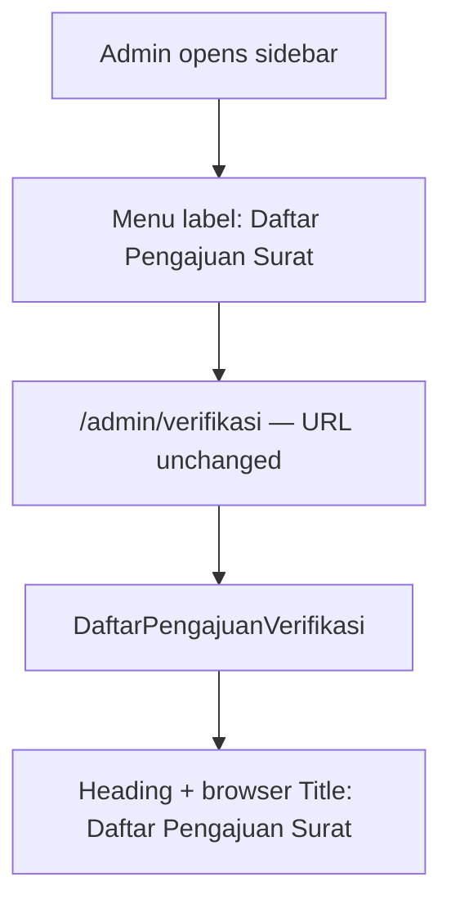

# Daftar Pengajuan Surat Rename (US-8.3)

## Overview

US-8.3 renames the admin submission-review UI label from **"Verifikasi Pengajuan"** to **"Daftar Pengajuan Surat"** so the menu and page heading describe a list of submissions rather than implying a form/action page. Routes and behavior are unchanged.

## Architecture Diagram

## Data Model

No schema changes. Label-only update across layout and list page.

## Key Files

| Layer | File | Purpose |
|-------|------|---------|
| Layout | `resources/views/layouts/app/sidebar.blade.php` | Desktop sidebar menu label |
| Layout | `resources/views/layouts/app/header.blade.php` | Mobile nav menu label |
| Livewire | `app/Livewire/Verifikasi/DaftarPengajuanVerifikasi.php` | `#[Title('Daftar Pengajuan Surat')]` |
| Blade | `resources/views/livewire/verifikasi/daftar-pengajuan-verifikasi.blade.php` | Page `<h1>` / Flux heading |
| Playwright | `e2e/verifikasi-pengajuan.spec.ts` | US-8.3 rename assertions |

## Flow Explanation

1. **User triggers** — admin opens the admin shell or `/admin/verifikasi`.
2. **Request handling** — same `verifikasi.index` route and Livewire component as before.
3. **Business logic** — none; text labels only.
4. **Response** — sidebar, mobile nav, page heading, and document title show **Daftar Pengajuan Surat**. Breadcrumbs are not used in this app.

## API Endpoints (if applicable)

None. Existing named routes `verifikasi.*` kept for backward compatibility.

## Decisions & Trade-offs

- URL `/admin/verifikasi` kept intentionally (AC: no route rename required).
- Mobile header nav updated together with sidebar so both chrome surfaces stay consistent (same menu item, two layout files).

## Related

- [verifikasi-pengajuan.md](verifikasi-pengajuan.md)
- [ADR-020: Setujui langsung diproses](../decisions/020-setujui-langsung-diproses-us-8-4.md)
- Phase 08 US-8.3 in scrum plan
