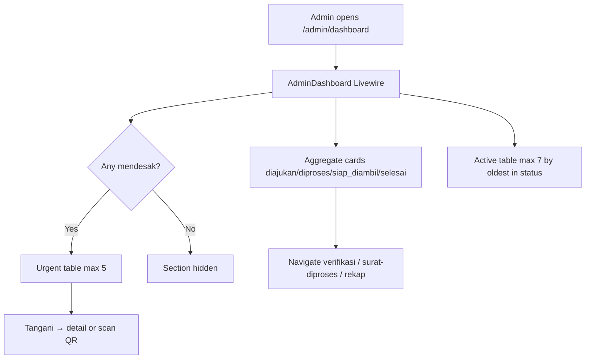
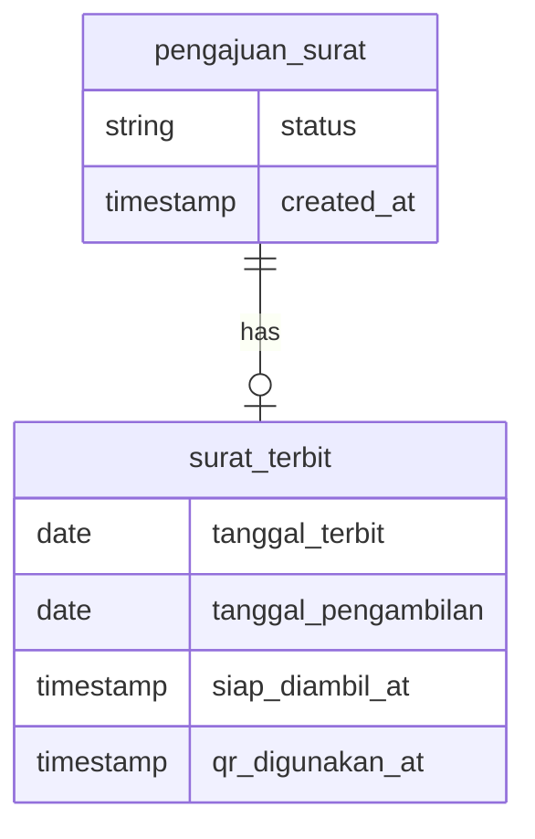

# Dashboard Admin (US-8.1)

## Overview

Admin dashboard surfaces aging and urgency across active submission stages (`diajukan`, `diproses`/`disetujui` historis, `siap_diambil`), not just raw counts. Color-coded cards, a conditional “Perlu Ditindaklanjuti Segera” queue (max 5), and an active-submissions table help staff notice stuck work before it ages further.

## Architecture Diagram

## Data Model

Aging sources: `diajukan` ← `created_at`; `diproses`/`disetujui` ← `surat_terbit.tanggal_terbit`; `siap_diambil` urgency ← `tanggal_pengambilan` vs today WIB; selesai bulan ini ← `qr_digunakan_at` in current calendar month.

## Key Files

| Layer | File | Purpose |
|-------|------|---------|
| Livewire | `app/Livewire/Dashboard/AdminDashboard.php` | Cards, aging const, urgent ranking, actions |
| Blade | `resources/views/livewire/dashboard/admin-dashboard.blade.php` | Cards + tables UI |
| Model | `app/Models/PengajuanSurat.php` | `waktuMasukStatusSaatIni`, `hariDiStatusSaatIni`, `statusBadgeColor` |
| Routes | `routes/web.php` | `dashboard.admin` → Livewire |
| Pest | `tests/Feature/DashboardAdminTest.php` | Feature coverage |
| Playwright | `e2e/dashboard.spec.ts` | E2E US-8.1 |

## Flow Explanation

1. **User triggers** — Admin lands on `/admin/dashboard` after login (`role:admin`).
2. **Request handling** — Full-page Livewire render; no static cache.
3. **Business logic** — Compute per-status totals + warning/urgent severity from thresholds (const on component); build urgent list by priority 1–5; sort active rows by oldest `waktuMasukStatusSaatIni`.
4. **Response** — Cards (full border/background tint by severity), optional urgent section, active table with row highlights; empty positive copy when all active cards are 0.

## API Endpoints (if applicable)

| Method | URI | Purpose | Auth |
|--------|-----|---------|------|
| GET | `/admin/dashboard` | Admin dashboard page | admin |

## Decisions & Trade-offs

- Thresholds as `public const` on the Livewire component (not config file) to stay flat and avoid magic numbers.
- Historical `disetujui` counted with `diproses` so leftover Phase 07 rows remain visible.
- No WebSocket/polling; refresh on navigation is enough for research scale.

## Related

- [Dashboard Warga (US-8.2)](dashboard-warga.md)
- [Surat Diproses (US-8.5/8.6)](surat-diproses.md)
- [ADR-022](../decisions/022-dashboard-aging-and-status-helpers.md)
