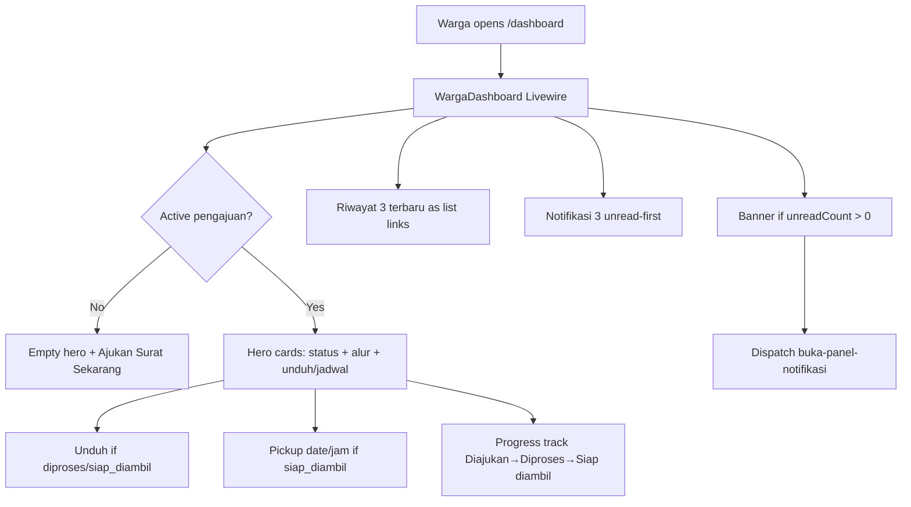
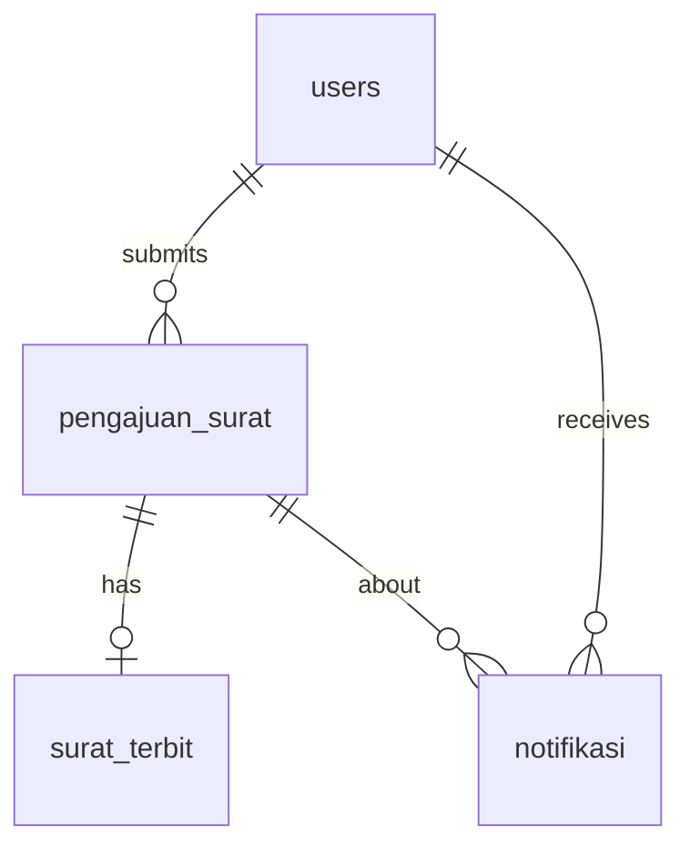

# Dashboard Warga (US-8.2)

## Overview

After login, warga land on a **status-first** home: the page answers “Sudah sampai mana surat saya?” before any menu-style chrome. Active submissions render as large tinted hero cards (jenis surat, large status badge, plain-language copy, elapsed days, optional Unduh Surat, prominent pickup schedule when `siap_diambil`, and a three-step progress track). Secondary blocks cover recent history (list, not admin table), notifications, and a non-dominant “Ajukan Surat Baru” CTA. Unread notifications also show a top banner that opens the bell panel.

## Architecture Diagram

## Data Model

Uses existing `pengajuan_surat`, `surat_terbit`, and `notifikasi`. No schema changes for US-8.2.

## Key Files

| Layer | File | Purpose |
|-------|------|---------|
| Livewire | `app/Livewire/Dashboard/WargaDashboard.php` | Hero data, penjelasan, alur steps, riwayat, notif |
| Blade | `resources/views/livewire/dashboard/warga-dashboard.blade.php` | Status-first layout |
| Panel | `resources/views/livewire/notifikasi/panel-notifikasi.blade.php` | Listens `buka-panel-notifikasi` |
| Routes | `routes/web.php` | `dashboard` → Livewire |
| Pest | `tests/Feature/DashboardWargaTest.php` | Feature coverage |
| Playwright | `e2e/dashboard.spec.ts` | E2E US-8.2 |

## Flow Explanation

1. **User triggers** — Warga opens `/dashboard` (`role:warga`).
2. **Request handling** — Livewire loads own active pengajuan (not selesai/ditolak), sorted oldest-in-status first.
3. **Business logic** — Map status → citizen-friendly copy; compute elapsed days; gate Unduh via `dapatUnduhSurat()`; map status → progress step index (`langkahAlur` / `indeksLangkahAktif`); prioritize unread notifs.
4. **Response** — Status-tinted hero cards with progress track; muted page label “Dashboard Warga” under a status-focused H1; banner + list for unread; list links to detail for riwayat; CTA Ajukan Surat Baru below hero (or primary CTA when empty).

## API Endpoints (if applicable)

| Method | URI | Purpose | Auth |
|--------|-----|---------|------|
| GET | `/dashboard` | Warga dashboard page | warga |

## Decisions & Trade-offs

- Page H1 is **status-focused** (“Status surat Anda” / empty-state copy); “Dashboard Warga” stays as a small label for orientation and existing tests/e2e selectors.
- Progress track is a UX aid on top of AC status copy — not a separate status enum.
- Historical `disetujui` maps to the “Diproses” step visually.
- “Lihat Semua Notifikasi” opens the existing bell panel (no dedicated notifikasi page in backlog).
- Riwayat uses a citizen-friendly list (same columns as AC: jenis, nomor, status, tanggal) instead of a dense admin table.
- Hero color per status uses left border + light background per Phase 08 UI notes.
- Elapsed > 7 days while still `diajukan` uses amber text as a soft nudge.

## Related

- [Dashboard Admin (US-8.1)](dashboard-admin.md)
- [Notifikasi & Riwayat](notifikasi-pengajuan.md)
- [Unduh Surat Warga](unduh-surat-warga.md)
- [ADR-022](../decisions/022-dashboard-aging-and-status-helpers.md)
- [ADR-025](../decisions/025-warga-dashboard-status-first-ux.md)
