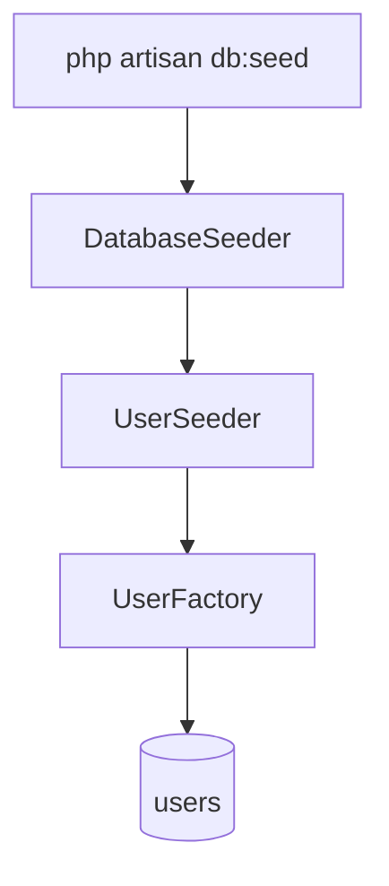
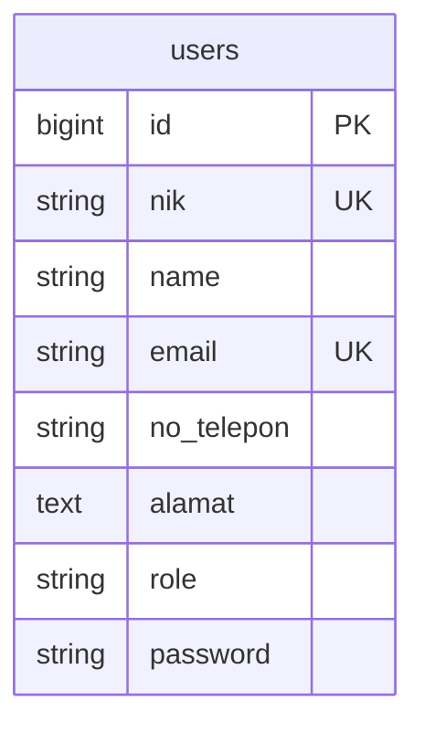

# Database Seeders (Phase 01)

## Overview

Provides deterministic test users aligned with the Phase 01 `users` schema (`nik`, `name`, `email`, `no_telepon`, `alamat`, `role`) so local development and manual QA can log in as admin or warga without registering first.

## Architecture Diagram

## Data Model

## Key Files

| Layer | File | Purpose |
|-------|------|---------|
| Seeder | `database/seeders/DatabaseSeeder.php` | Calls UserSeeder |
| Seeder | `database/seeders/UserSeeder.php` | Admin + warga baku + 5 warga |
| Factory | `database/factories/UserFactory.php` | Default warga + `admin()` state |
| Migration | `database/migrations/0001_01_01_000000_create_users_table.php` | users schema |
| Tests | `tests/Feature/DatabaseSeederTest.php` | Asserts seed accounts |
| Feature docs | `docs/user-docs/guides/public-pages.md` | Documents seed credentials for manual QA |

## Flow Explanation

1. **User triggers** — Developer runs `php artisan migrate:fresh --seed` or `php artisan db:seed` (dev/test DB only).
2. **Request handling** — Artisan boots `DatabaseSeeder`.
3. **Business logic** — `UserSeeder` creates fixed admin/warga, then five factory warga.
4. **Response** — Database ready for login with documented credentials.

## Seed accounts

| Email | Password | Role | NIK |
|-------|----------|------|-----|
| `admin@desa.test` | `password` | admin | `3201010101000001` |
| `warga@desa.test` | `password` | warga | `3201010101000002` |

Additional: 5 random warga via `User::factory()->count(5)`.

## Decisions & Trade-offs

- Credentials are intentionally simple and documented for local testing — never use these passwords in production.
- Seeder uses factory + explicit overrides so future Phase migrations can extend the same seeder pattern.
- `WithoutModelEvents` on `DatabaseSeeder` keeps seeding fast and free of listener side effects.

## Related

- Architecture: [../../architecture.md](../../architecture.md)
- User guide (testing accounts): [../../user-docs/guides/public-pages.md](../../user-docs/guides/public-pages.md)
