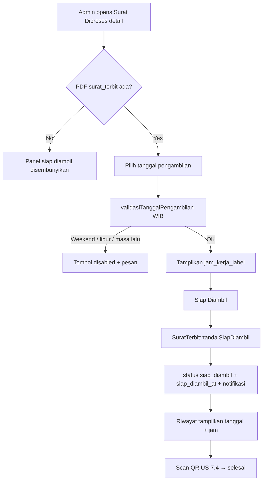
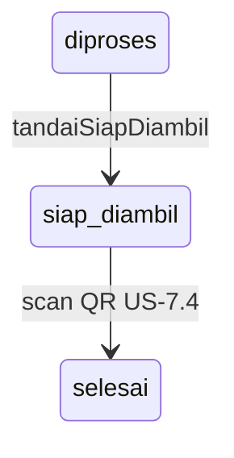
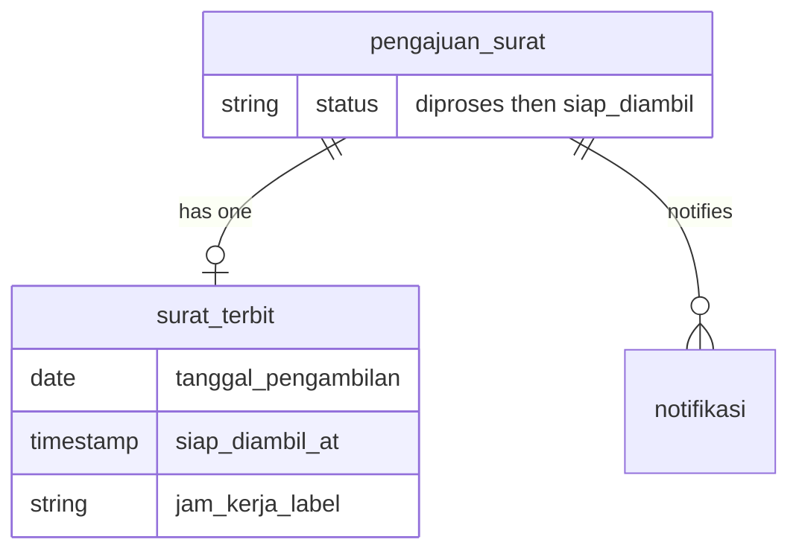

# Dokumen Siap Diambil + Notifikasi (US-7.5 → UI US-8.6)

## Overview

After a surat PDF exists (`pengajuan` status `diproses`), an admin picks a **pickup date** constrained to Indonesian government office hours (not a free time picker). On confirm, status becomes `siap_diambil`, `tanggal_pengambilan`, `jam_kerja_label`, and `siap_diambil_at` are stored on `surat_terbit`, and the warga receives an in-app notification. Riwayat shows status plus pickup date and hours. Scan QR (US-7.4) then completes pickup.

**UI location (US-8.6):** Admin UI lives on **Surat Diproses** detail (`/admin/surat-diproses/{id}`), not verifikasi detail. Domain logic remains `SuratTerbit::tandaiSiapDiambil`. See [surat-diproses.md](surat-diproses.md).

## Architecture Diagram

## Data Model

## Key Files

| Layer | File | Purpose |
|-------|------|---------|
| Config | `config/desa.php` | `jam_kerja` labels + `libur_nasional` date list |
| Model | `app/Models/SuratTerbit.php` | `validasiTanggalPengambilan`, `jamKerjaLabelUntuk`, `tandaiSiapDiambil` |
| Livewire | `app/Livewire/SuratDiproses/DetailSuratDiproses.php` | Admin date UI + action (US-8.6) |
| Blade | `resources/views/livewire/surat-diproses/detail-surat-diproses.blade.php` | Panel Siap Diambil |
| Livewire | `app/Livewire/Pengajuan/RiwayatPengajuan.php` | Eager-load suratTerbit pickup fields |
| Feature tests | `tests/Feature/DokumenSiapDiambilTest.php` | AC + edge cases |
| E2E | `e2e/dokumen-siap-diambil.spec.ts`, `e2e/surat-diproses.spec.ts` | Browser flows |

## Flow Explanation

1. **User triggers** — Admin opens Surat Diproses detail for a `diproses` pengajuan with `surat_terbit`.
2. **Request handling** — Chooses `tanggalPengambilan` (`wire:model.live`); `min` = today WIB; UI previews jam kerja.
3. **Business logic** — `tandaiSiapDiambil` validates `after_or_equal` WIB today + jam kerja, calls `SuratTerbit::tandaiSiapDiambil`: save tanggal + jam + `siap_diambil_at`; set status `siap_diambil`; create notifikasi (US-8.6 wording).
4. **Response** — Toast + redirect to surat-diproses index; warga sees notifikasi and riwayat pickup column.

## Decisions & Trade-offs

- Office hours are **labels by weekday**, not a free time picker (plan AC).
- Weekend / national holiday → **reject** (not warn-only).
- Date comparisons use **Asia/Jakarta** even though `app.timezone` is UTC.
- UI relocated to dedicated Surat Diproses pages (US-8.5/8.6) — see ADR-021.

## Related

- [Surat Diproses (US-8.5/8.6)](surat-diproses.md)
- [Generate Surat PDF (US-7.2)](generate-surat-pdf.md)
- [QR Code Sekali Pakai (US-7.4)](qr-sekali-pakai.md)
- [ADR-018](../decisions/018-jam-kerja-dan-libur-nasional-config.md)
- [ADR-021](../decisions/021-surat-diproses-page-and-siap-diambil-at.md)
