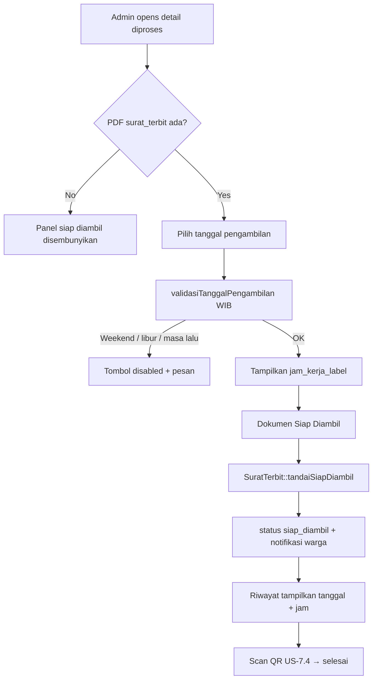
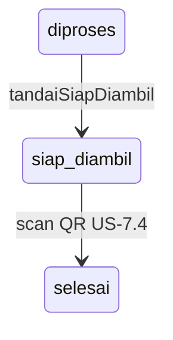
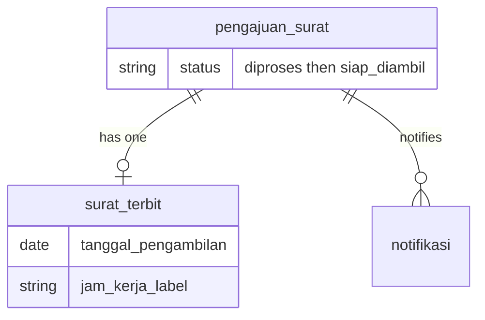

# Dokumen Siap Diambil + Notifikasi (US-7.5)

## Overview

After a surat PDF exists (`pengajuan` status `diproses`), an admin picks a **pickup date** constrained to Indonesian government office hours (not a free time picker). On confirm, status becomes `siap_diambil`, `tanggal_pengambilan` and `jam_kerja_label` are stored on `surat_terbit`, and the warga receives an in-app notification. Riwayat shows status plus pickup date and hours. Scan QR (US-7.4) then completes pickup.

## Architecture Diagram

## Data Model

## Key Files

| Layer | File | Purpose |
|-------|------|---------|
| Config | `config/desa.php` | `jam_kerja` labels + `libur_nasional` date list |
| Model | `app/Models/SuratTerbit.php` | `validasiTanggalPengambilan`, `jamKerjaLabelUntuk`, `tandaiSiapDiambil` |
| Livewire | `app/Livewire/Verifikasi/DetailPengajuanVerifikasi.php` | Admin date UI + action |
| Blade | `resources/views/livewire/verifikasi/detail-pengajuan-verifikasi.blade.php` | Panel Dokumen Siap Diambil |
| Livewire | `app/Livewire/Pengajuan/RiwayatPengajuan.php` | Eager-load suratTerbit pickup fields |
| Blade | `resources/views/livewire/pengajuan/riwayat-pengajuan.blade.php` | Pengambilan column |
| Feature tests | `tests/Feature/DokumenSiapDiambilTest.php` | AC + edge cases |
| E2E | `e2e/dokumen-siap-diambil.spec.ts` | Browser flows |

## Flow Explanation

1. **User triggers** — Admin opens detail of a `diproses` pengajuan that already has `surat_terbit`.
2. **Request handling** — Chooses `tanggalPengambilan` (`wire:model.live`); UI previews jam kerja or “kantor tutup”.
3. **Business logic** — `tandaiDokumenSiapDiambil` validates date, calls `SuratTerbit::tandaiSiapDiambil` inside a DB transaction (`lockForUpdate`): require `diproses` + PDF; save tanggal + jam label; set status `siap_diambil`; create `Notifikasi` with jenis surat, status, tanggal, jam kerja.
4. **Response** — Toast + redirect to verifikasi index; warga sees notifikasi and riwayat pickup column.

## API Endpoints (if applicable)

| Method | URI | Purpose | Auth |
|--------|-----|---------|------|
| GET | `/admin/verifikasi/{pengajuan}` | Detail including siap-diambil panel when applicable | admin + verified |

Marking ready is a Livewire action (`tandaiDokumenSiapDiambil`), not a separate JSON API.

## Decisions & Trade-offs

- Office hours are **labels by weekday**, not a free time picker (plan AC).
- Weekend / national holiday → **reject** (not warn-only), so the button stays disabled until a valid date.
- National holidays live in `config/desa.libur_nasional` (maintain yearly) — no third-party holiday package.
- Date comparisons use **Asia/Jakarta** even though `app.timezone` is UTC.
- Detail warga display of tanggal/jam remains **US-7.6**; rekap columns remain **US-7.7**.
- UI placed on existing verifikasi detail (no new route) — natural continuation of admin workflow.

## Related

- [Generate Surat PDF (US-7.2)](generate-surat-pdf.md)
- [QR Code Sekali Pakai (US-7.4)](qr-sekali-pakai.md)
- [Notifikasi & Riwayat Pengajuan](notifikasi-pengajuan.md)
- [ADR-018](../decisions/018-jam-kerja-dan-libur-nasional-config.md)
- Scrum: `scrum-planning/Phase 07 - Penerbitan Surat Keterangan.md` US-7.5
