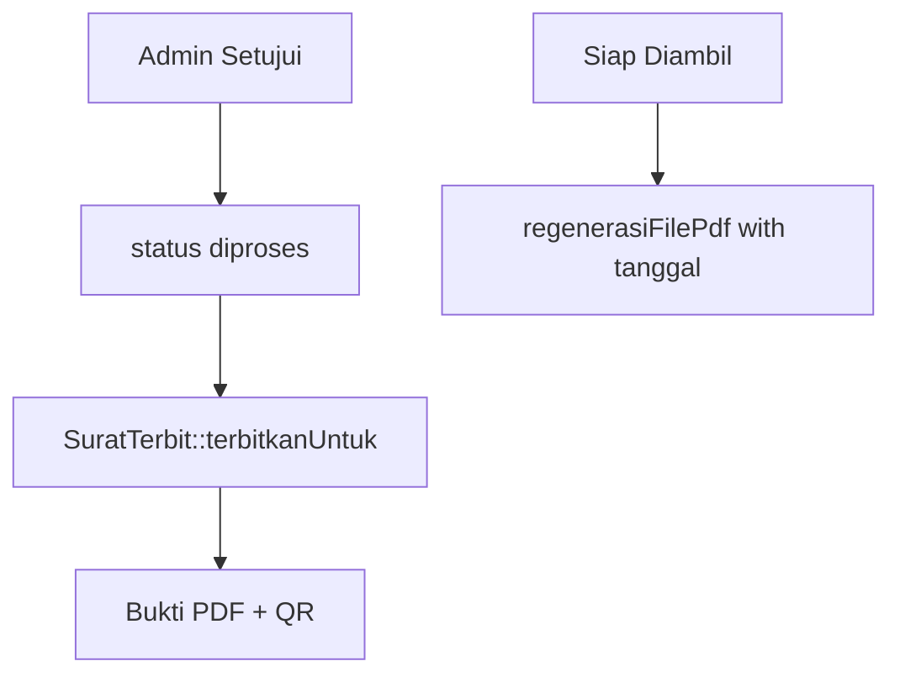

# Generate Bukti Pengambilan PDF (US-7.2)

## Overview

When an admin approves a submission (`diajukan` → `diproses`), the system creates `surat_terbit` with nomor resmi, one-time QR, and a **Bukti Pengambilan Berkas** PDF (not a surat keterangan). Rejection never creates a PDF. When status becomes siap diambil, the PDF is regenerated to include the pickup date/hours (same QR).

## Architecture Diagram

## Key Files

| Layer | File | Purpose |
|-------|------|---------|
| Model | `SuratTerbit.php` | terbitkanUntuk, regenerasiFilePdf, renderPdfBinary |
| View | `resources/views/pdf/surat/bukti-pengambilan.blade.php` | Single slip template |
| Config/DB | `PengaturanDesa::untukSurat()` | Kop + kode nomor |

## Related

- [ADR-025](../decisions/025-bukti-pengambilan-dan-pengaturan-desa.md)
- [Unduh Bukti Pengambilan](unduh-surat-warga.md)
