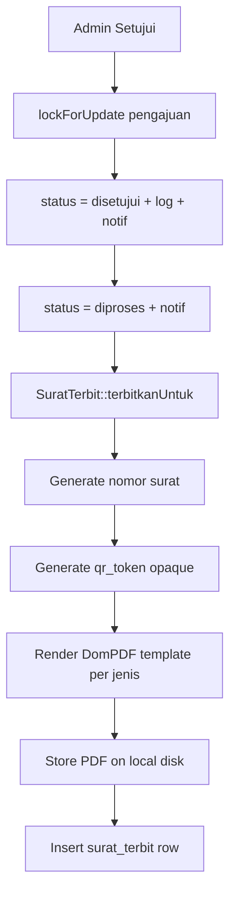
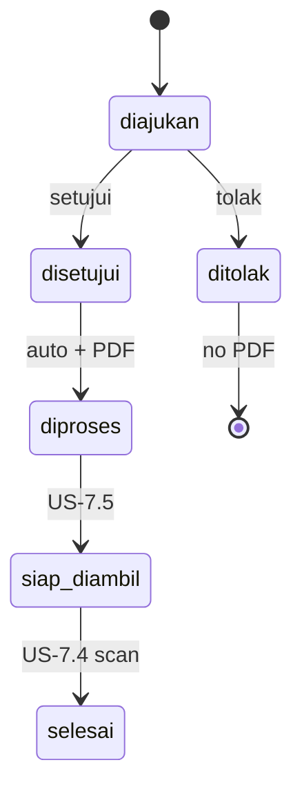
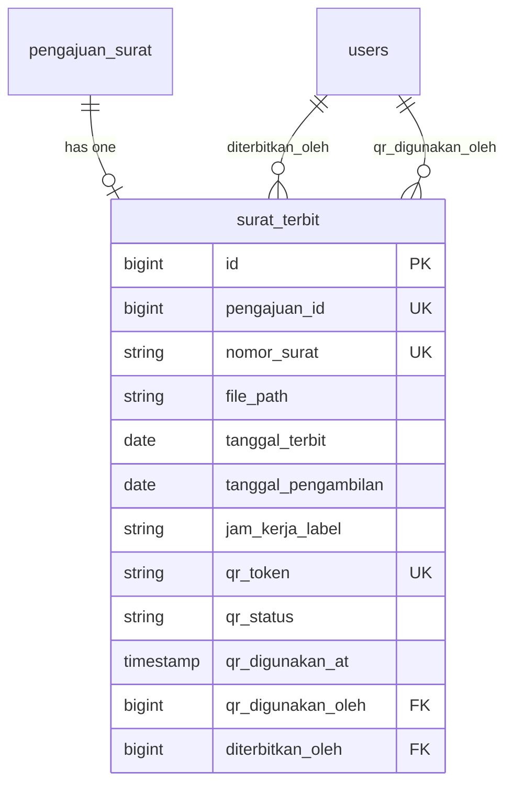

# Generate Surat PDF (US-7.2)

## Overview

When an admin approves a submission, the system advances `diajukan` → `disetujui` → `diproses` and immediately generates an official PDF surat keterangan. The PDF is stored on the private `local` disk, and metadata (official number, QR token, file path) is recorded on `surat_terbit`. Rejection never creates a PDF or QR.

## Architecture Diagram

## Data Model

## Key Files

| Layer | File | Purpose |
|-------|------|---------|
| Model | `app/Models/SuratTerbit.php` | Nomor, QR, DomPDF render, persist |
| Model | `app/Models/PengajuanSurat.php` | `suratTerbit()` relation |
| Livewire | `app/Livewire/Verifikasi/DetailPengajuanVerifikasi.php` | Calls `triggerGenerateSurat` on approve |
| Config | `config/desa.php` | Kop surat + penandatangan + kode nomor |
| Views | `resources/views/pdf/surat/*.blade.php` | Templates per jenis + default |
| Migration | `database/migrations/2026_08_06_172259_create_surat_terbit_table.php` | Schema |
| E2E | `e2e/generate-surat-pdf.spec.ts` | Browser coverage approve/reject |
| Feature tests | `tests/Feature/GenerateSuratPdfTest.php` | Pest coverage |

## Flow Explanation

1. **User triggers** — Admin clicks Setujui on a `diajukan` pengajuan.
2. **Request handling** — Livewire `setujui()` validates `canVerify`, locks the row.
3. **Business logic** — Writes `disetujui` + audit log + notification; sets `diproses` + notification; calls `SuratTerbit::terbitkanUntuk()` which:
   - Skips if `surat_terbit` already exists (idempotent)
   - Allocates sequential `nomor_surat` under a year-scoped cache lock
   - Creates opaque 64-char `qr_token` (`qr_status=valid`)
   - Renders a jenis-specific Blade PDF via DomPDF and embeds a PNG QR (Bacon QR + GD)
   - Stores file at `surat-terbit/{pengajuan_id}/surat.pdf` on the `local` disk
4. **Response** — Toast + redirect to verifikasi list.

## API Endpoints (if applicable)

No new HTTP API. Generation is an internal side effect of Livewire approve.

## Decisions & Trade-offs

- DomPDF (`barryvdh/laravel-dompdf`) chosen per Phase 07 risk mitigation note.
- Generation logic lives on the `SuratTerbit` model (no service class) to stay flat and reuseable for later unduh (US-7.6).
- Minimal nomor + QR generation implemented here because US-7.2 AC requires them on the PDF; scan UI remains US-7.4.
- Village letterhead/signatory come from `config/desa.php` / `.env` (no settings UI story in backlog).

## Related

- [Migrasi Alur Status (US-7.1)](migrasi-alur-status.md)
- [Verifikasi Pengajuan](verifikasi-pengajuan.md)
- [ADR-015](../decisions/015-dompdf-surat-terbit-on-approve.md)
- Scrum: `scrum-planning/Phase 07 - Penerbitan Surat Keterangan.md` US-7.2
