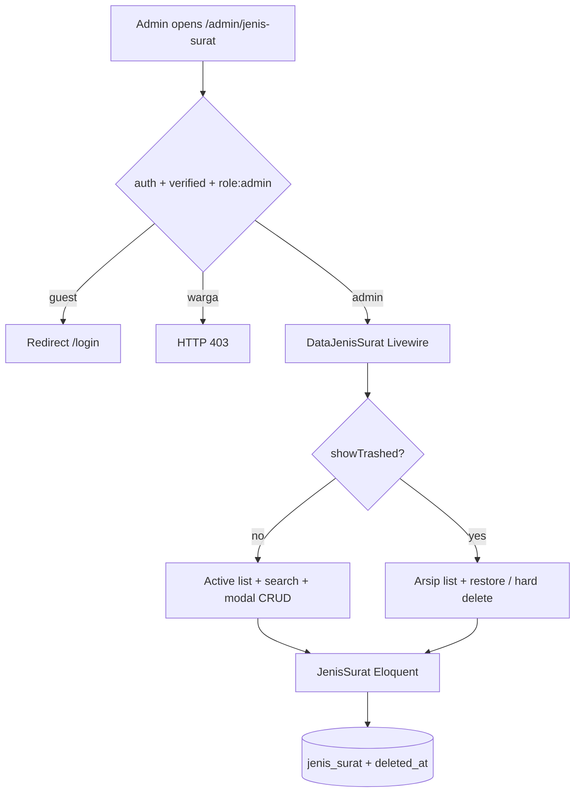
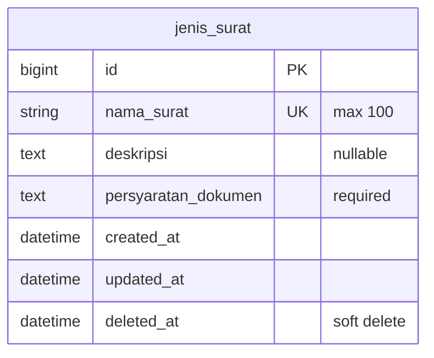

# Jenis Surat Management (US-2.1)

## Overview

Admin/petugas desa manage master data for letter types (`jenis_surat`): list with search, create/edit (Flux modal), soft delete (archive), restore, and hard delete from archive. Each record stores required `nama_surat` + `persyaratan_dokumen`, optional `deskripsi`. This reference data feeds Phase 03 pengajuan, the warga/public browse page (US-2.2 / US-2.3 — [persyaratan-dokumen.md](persyaratan-dokumen.md), [persyaratan-dokumen-publik.md](persyaratan-dokumen-publik.md)).

## Architecture Diagram

## Data Model

## Key Files

| Layer | File | Purpose |
|-------|------|---------|
| Migration | `database/migrations/2026_08_06_061348_create_jenis_surat_table.php` | Creates `jenis_surat` table |
| Migration | `database/migrations/2026_08_06_063547_add_soft_deletes_to_jenis_surat_table.php` | Adds `deleted_at` |
| Model | `app/Models/JenisSurat.php` | Eloquent + SoftDeletes (`$table = 'jenis_surat'`) |
| Factory | `database/factories/JenisSuratFactory.php` | Test/factory data |
| Livewire | `app/Livewire/JenisSurat/DataJenisSurat.php` | List, search, create/edit logic |
| Blade | `resources/views/livewire/jenis-surat/data-jenis-surat.blade.php` | Admin UI (Flux) |
| Routes | `routes/web.php` | `Route::livewire('jenis-surat', ...)` inside `role:admin` |
| Nav | `resources/views/layouts/app/sidebar.blade.php` | Admin-only sidebar link |
| Pest | `tests/Feature/DataJenisSuratTest.php`, `tests/Feature/JenisSuratTest.php` | Feature coverage |
| Playwright | `e2e/jenis-surat.spec.ts` | E2E AC + failure cases |

## Flow Explanation

1. **User triggers** — admin opens **Jenis Surat** from the sidebar or `/admin/jenis-surat`.
2. **Request handling** — `auth` → `verified` → `role:admin`. Guests redirect to login; warga get 403.
3. **Business logic** — `DataJenisSurat` paginates active or trashed records (`showTrashed`), filters by `search` (URL `?q=`), and opens a Flux modal for create/edit. `save()` validates `nama_surat` required + unique and `persyaratan_dokumen` required (`deskripsi` optional). Soft delete archives; restore/force-delete operate on arsip only.
4. **Response** — list re-renders; Flux toast confirms success; validation errors stay in the modal.

## API Endpoints (if applicable)

No JSON API. Session web route only:

| Method | URI | Purpose | Auth |
|--------|-----|---------|------|
| GET | `/admin/jenis-surat` | Admin CRUD page (Livewire) | auth + verified + role:admin |

## Decisions & Trade-offs

- **Table name `jenis_surat`** — matches Phase 02 data model literally (not Laravel’s default `jenis_surats`). See ADR-006.
- **Single page + modal** — AC asks for list + form tambah/ubah; modal keeps one route / one component (architecture convention).
- **Soft + hard delete** — **Arsipkan** soft-deletes; **Tampilkan arsip** lists trashed rows with **Pulihkan** / **Hapus Permanen** (confirm modal). Hard delete only from arsip.
- **Field rules** — `nama_surat` required + unique; `persyaratan_dokumen` required; `deskripsi` optional/nullable.
- **Unique vs soft delete** — DB unique on `nama_surat` still applies to soft-deleted rows (cannot reuse name until hard delete or restore+rename).
- **Class-based Livewire** — follows project architecture convention (`app/Livewire/...` + Blade view), not SFC settings pages.

## Related

- User guide: [../../user-docs/guides/jenis-surat.md](../../user-docs/guides/jenis-surat.md)
- ADR: [006-jenis-surat-table-and-admin-crud.md](../decisions/006-jenis-surat-table-and-admin-crud.md)
- Middleware: [role-middleware.md](role-middleware.md)
- Plan: `scrum-planning/Phase 02 - Jenis Surat & Persyaratan Dokumen.md` (US-2.1)
