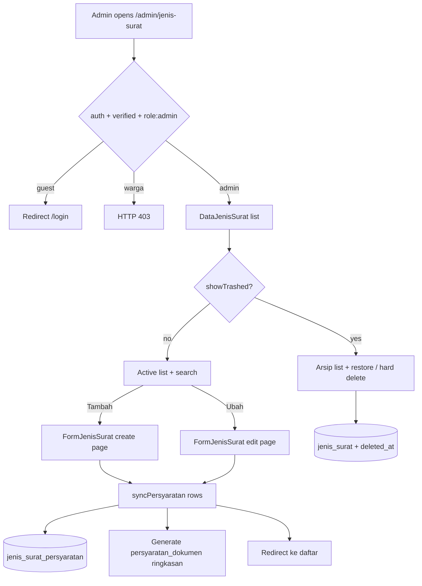
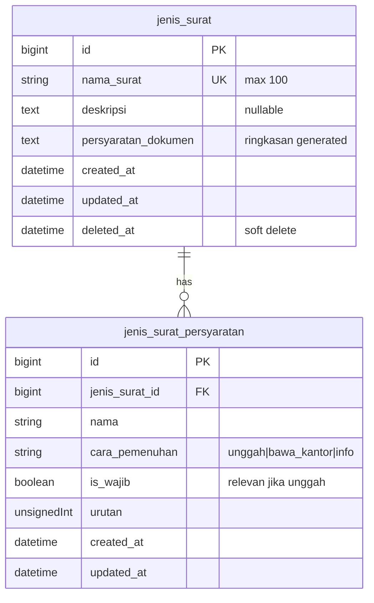

# Jenis Surat Management (US-2.1 + US-9.1 / US-9.2)

## Overview

Admin/petugas desa manage master data for letter types (`jenis_surat`): list with search, **dedicated create/edit pages** (not a modal), soft delete (archive), restore, and hard delete from archive. As of Phase 09, each jenis surat has **structured requirement rows** (`jenis_surat_persyaratan`) that control how warga fulfills each syarat (upload / bring to office / info only) and whether an upload is required. The free-text column `persyaratan_dokumen` remains as a **generated summary** for search and backward-compatible display. **Form pengajuan (US-9.3) consumes these rows** for badges, upload slots, and wajib/opsional validation — keyword detection is no longer used.

## Architecture Diagram

## Data Model

## Key Files

| Layer | File | Purpose |
|-------|------|---------|
| Migration | `database/migrations/2026_08_06_061348_create_jenis_surat_table.php` | Creates `jenis_surat` table |
| Migration | `database/migrations/2026_08_06_063547_add_soft_deletes_to_jenis_surat_table.php` | Adds `deleted_at` |
| Migration | `database/migrations/2026_08_07_041339_create_jenis_surat_persyaratan_table.php` | Creates structured rows table |
| Migration | `database/migrations/2026_08_07_041340_migrate_persyaratan_dokumen_to_structured_rows.php` | One-time free-text → rows backfill |
| Model | `app/Models/JenisSurat.php` | Eloquent + SoftDeletes + `syncPersyaratan()` |
| Model | `app/Models/JenisSuratPersyaratan.php` | Row model, parse/migrate helpers, badge labels |
| Factory | `database/factories/JenisSuratFactory.php` | Parses `persyaratan_dokumen` into rows after create |
| Factory | `database/factories/JenisSuratPersyaratanFactory.php` | Row factory + states |
| Seeder | `database/seeders/JenisSuratSeeder.php` | Seeds structured rows (not keyword-only text) |
| Livewire | `app/Livewire/JenisSurat/DataJenisSurat.php` | List, search, soft/hard delete |
| Livewire | `app/Livewire/JenisSurat/FormJenisSurat.php` | Dedicated create/edit form + persyaratan rows |
| Blade | `resources/views/livewire/jenis-surat/data-jenis-surat.blade.php` | Admin list UI |
| Blade | `resources/views/livewire/jenis-surat/form-jenis-surat.blade.php` | Create/edit form + pratinjau badge |
| Routes | `routes/web.php` | `jenis-surat.index` / `.create` / `.edit` inside `role:admin` |
| Pest | `tests/Feature/DataJenisSuratTest.php`, `FormJenisSuratTest.php`, `DataJenisSuratPersyaratanTerstrukturTest.php` | Feature coverage |
| Playwright | `e2e/jenis-surat.spec.ts` | E2E AC + failure cases |

## Flow Explanation

1. **User triggers** — admin opens **Jenis Surat** from the sidebar (`/admin/jenis-surat`), or navigates to create/edit pages.
2. **Request handling** — `auth` → `verified` → `role:admin`. Guests redirect to login; warga get 403. Soft-deleted records return 404 on edit.
3. **Business logic** — `DataJenisSurat` paginates active or trashed records (`showTrashed`) and filters by `search` (URL `?q=`). **Tambah** / **Ubah** open dedicated `FormJenisSurat` pages (`/admin/jenis-surat/create`, `/admin/jenis-surat/{id}/edit`). Admin adds/edits/removes/reorders requirement rows with **Cara memenuhi** (`unggah` / `bawa_kantor` / `info`) and, for upload rows, **Wajib** vs **Boleh dikosongkan**. `save()` validates ≥1 row, syncs via `JenisSurat::syncPersyaratan()`, regenerates `persyaratan_dokumen`, then redirects to the list. Soft delete archives; restore/force-delete operate on arsip only (force delete cascades rows).
4. **Response** — after save, redirect to list with Flux toast; validation errors stay on the form page. Pratinjau badge mirrors warga-facing labels.

## API Endpoints (if applicable)

No JSON API. Session web routes only:

| Method | URI | Purpose | Auth |
|--------|-----|---------|------|
| GET | `/admin/jenis-surat` | Admin list (Livewire) | auth + verified + role:admin |
| GET | `/admin/jenis-surat/create` | Create form page | auth + verified + role:admin |
| GET | `/admin/jenis-surat/{jenisSurat}/edit` | Edit form page | auth + verified + role:admin |

## Decisions & Trade-offs

- **Table name `jenis_surat`** — matches Phase 02 data model literally (not Laravel’s default `jenis_surats`). See ADR-006.
- **Dedicated create/edit pages** — supersedes the earlier single-page + modal UX (ADR-028). Structured persyaratan UI needs more vertical space; still one Livewire class per page, no service/repository layer.
- **Structured rows as source of truth** — admin chooses upload vs bring-to-office explicitly; keyword magic superseded for **rules** (ADR-026). Form warga consumes the same rows (US-9.3).
- **`persyaratan_dokumen` kept as generated summary** — search + public/warga pages that still show free text stay non-empty.
- **Default migrasi non-KTP/KK → `bawa_kantor`** — conservative; safer than forcing wrong uploads.
- **Soft + hard delete** — **Arsipkan** soft-deletes; hard delete from arsip cascades `jenis_surat_persyaratan`.
- **Class-based Livewire** — follows project architecture convention.

## Related

- User guide: [../../user-docs/guides/admin/04-jenis-surat.md](../../user-docs/guides/admin/04-jenis-surat.md)
- ADR-006: [006-jenis-surat-table-and-admin-crud.md](../decisions/006-jenis-surat-table-and-admin-crud.md)
- ADR-028: [028-jenis-surat-dedicated-form-pages.md](../decisions/028-jenis-surat-dedicated-form-pages.md)
- ADR-010 (superseded for upload rules): [010-dokumen-persyaratan-text-detection-and-storage.md](../decisions/010-dokumen-persyaratan-text-detection-and-storage.md)
- ADR-026: [026-persyaratan-terstruktur-supersede-keyword-upload.md](../decisions/026-persyaratan-terstruktur-supersede-keyword-upload.md)
- Plan: `scrum-planning/Phase 09 - Persyaratan Terstruktur & Aturan Unggah.md` (US-9.1 / US-9.2)
