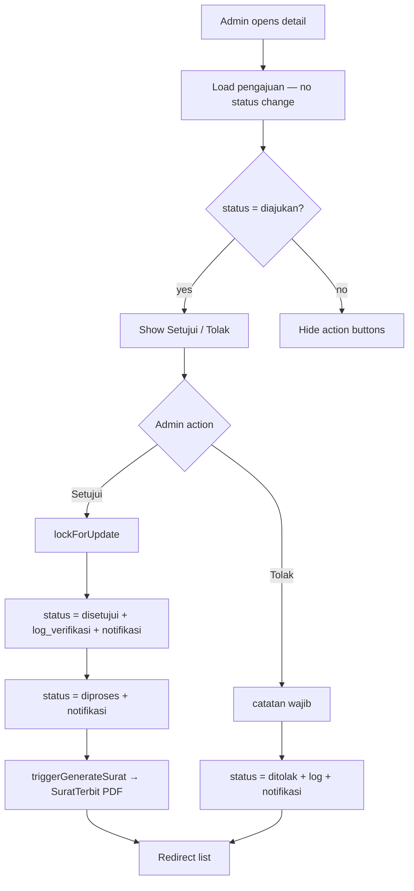
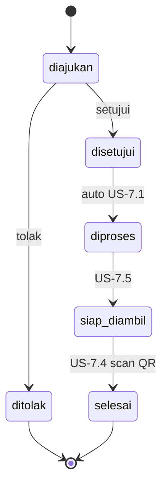
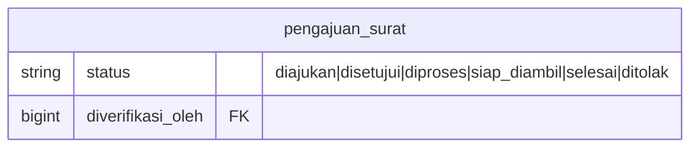

# Migrasi Alur Status Penerbitan (US-7.1)

## Overview

US-7.1 realigns `pengajuan_surat.status` so `diproses` means **letter preparation after approval**, not “admin opened the review page.” Opening detail no longer auto-transitions. Approve goes `diajukan` → `disetujui` → `diproses` (with a stub hook for PDF generation in US-7.2). Reject goes `diajukan` → `ditolak` (terminal). Filters and rekap ringkasan recognize `siap_diambil` and `selesai`.

## Architecture Diagram

## Data Model

Status column remains `string(20)`. New constants: `STATUS_SIAP_DIAMBIL`, `STATUS_SELESAI`. Helpers: `PengajuanSurat::statusLabel()`, `PengajuanSurat::statusOptions()`.

Legacy data migration resets `diproses` rows with `diverifikasi_oleh IS NULL` back to `diajukan` (old US-4.4 meaning).

## Key Files

| Layer | File | Purpose |
|-------|------|---------|
| Model | `app/Models/PengajuanSurat.php` | Status constants + labels |
| Livewire | `app/Livewire/Verifikasi/DetailPengajuanVerifikasi.php` | Mount without transition; approve/reject flow |
| Livewire | `app/Livewire/Verifikasi/DaftarPengajuanVerifikasi.php` | Status filter options |
| Livewire | `app/Livewire/Pengajuan/RiwayatPengajuan.php` | Warga filter options |
| Livewire | `app/Livewire/Rekap/RekapPengajuan.php` | Filter + ringkasan counts |
| Migration | `database/migrations/2026_08_06_165933_reset_legacy_diproses_to_diajukan_on_pengajuan_surat_table.php` | Legacy status reset |
| E2E | `e2e/verifikasi-pengajuan.spec.ts` | US-7.1 browser coverage |

## Flow Explanation

1. **Admin opens detail** — relations load; status stays `diajukan`; no notification.
2. **Setujui** — pessimistic lock; require `diajukan`; write `disetujui` + `log_verifikasi`; notify; immediately set `diproses`; notify; call `triggerGenerateSurat()` which creates `surat_terbit` + PDF (US-7.2).
3. **Tolak** — require catatan; set `ditolak`; never enters `diproses`.
4. **Filters/ringkasan** — Phase 05 riwayat and Phase 06 rekap include `siap_diambil` / `selesai`.

## API Endpoints (if applicable)

No new HTTP API. Existing Livewire routes under `/admin/verifikasi` unchanged.

## Decisions & Trade-offs

- PDF generation implemented in US-7.2 via `SuratTerbit::terbitkanUntuk()` (see [generate-surat-pdf.md](generate-surat-pdf.md)).
- Transient `disetujui` is intentional: AC requires the step, then auto-advance so the stable post-approve state is `diproses`.
- Legacy `diproses` without verifier reset to `diajukan` so admins can still decide them.

## Related

- [Verifikasi Pengajuan](verifikasi-pengajuan.md) (updated baseline)
- [ADR-014](../decisions/014-status-flow-migration-us-7-1.md)
- Scrum: `scrum-planning/Phase 07 - Penerbitan Surat Keterangan.md` US-7.1
