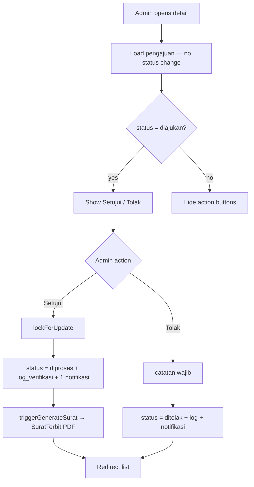
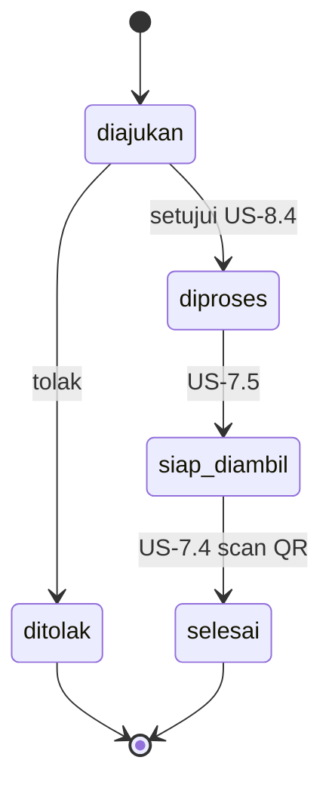
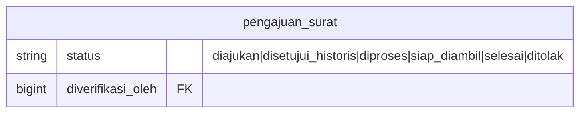

# Migrasi Alur Status Penerbitan (US-7.1 → US-8.4)

## Overview

US-7.1 realigned `pengajuan_surat.status` so `diproses` means **letter preparation after approval**, not “admin opened the review page.” Opening detail no longer auto-transitions.

**US-8.4 supersedes the approve path:** Setujui goes `diajukan` → `diproses` directly (no intermediate `disetujui` write). Reject remains `diajukan` → `ditolak`. Filters and rekap ringkasan still recognize `siap_diambil`, `selesai`, and historical `disetujui`.

## Architecture Diagram

## Data Model

Status column remains `string(20)`. Helpers: `PengajuanSurat::statusLabel()`, `PengajuanSurat::statusOptions()`. Historical `disetujui` displays as **Diproses** via `statusLabel`.

Legacy data migration (US-7.1) reset `diproses` rows with `diverifikasi_oleh IS NULL` back to `diajukan`.

## Key Files

| Layer | File | Purpose |
|-------|------|---------|
| Model | `app/Models/PengajuanSurat.php` | Status constants + labels |
| Livewire | `app/Livewire/Verifikasi/DetailPengajuanVerifikasi.php` | Mount without transition; approve/reject flow |
| Livewire | `app/Livewire/Verifikasi/DaftarPengajuanVerifikasi.php` | Status filter options |
| Livewire | `app/Livewire/Pengajuan/RiwayatPengajuan.php` | Warga filter options |
| Livewire | `app/Livewire/Rekap/RekapPengajuan.php` | Filter + ringkasan counts |
| Migration | `database/migrations/2026_08_06_165933_reset_legacy_diproses_to_diajukan_on_pengajuan_surat_table.php` | Legacy status reset |
| E2E | `e2e/verifikasi-pengajuan.spec.ts` | US-7.1 / US-8.4 browser coverage |

## Flow Explanation

1. **Admin opens detail** — relations load; status stays `diajukan`; no notification.
2. **Setujui (US-8.4)** — pessimistic lock; require `diajukan`; write `diproses` + `log_verifikasi`; one notifikasi; call `triggerGenerateSurat()`.
3. **Tolak** — require catatan; set `ditolak`; never enters `diproses`.
4. **Filters/ringkasan** — include `siap_diambil` / `selesai` / historical `disetujui`.

## API Endpoints (if applicable)

No new HTTP API. Existing Livewire routes under `/admin/verifikasi` unchanged.

## Decisions & Trade-offs

- PDF generation via `SuratTerbit::terbitkanUntuk()` (see [generate-surat-pdf.md](generate-surat-pdf.md)).
- Intermediate `disetujui` removed from the new path — see [ADR-020](../decisions/020-setujui-langsung-diproses-us-8-4.md).
- Legacy `diproses` without verifier reset to `diajukan` so admins can still decide them.

## Related

- [setujui-langsung-diproses.md](setujui-langsung-diproses.md)
- [verifikasi-pengajuan.md](verifikasi-pengajuan.md)
- [ADR-014](../decisions/014-status-flow-migration-us-7-1.md) (partially superseded by ADR-020)
