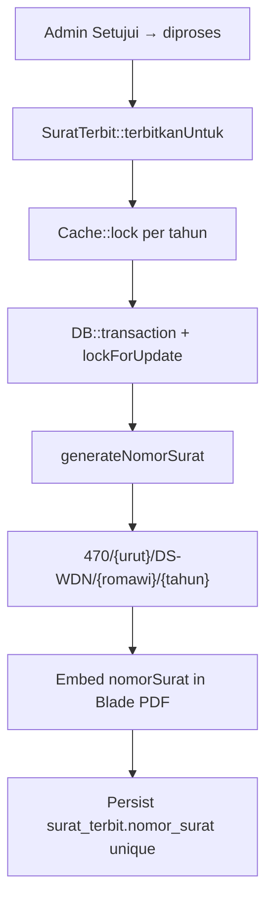
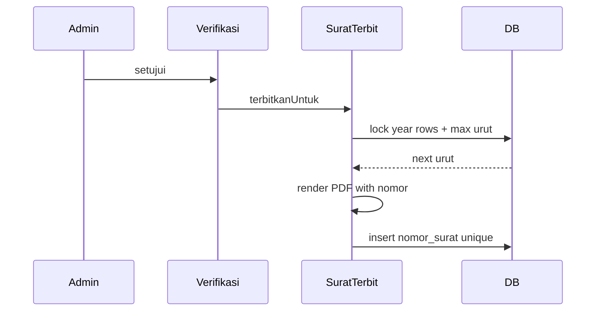
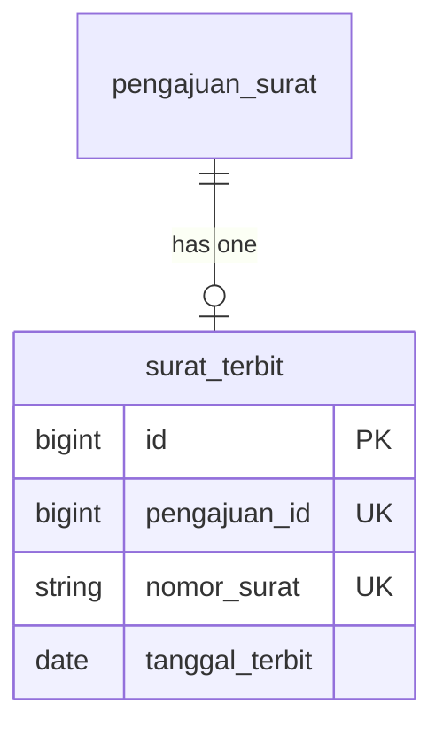

# Nomor Surat Resmi Otomatis (US-7.3)

## Overview

When a surat is issued into `diproses`, the system allocates an official village letter number (`nomor_surat`) that follows Desa Wadon administrative convention, is unique and sequential per calendar year, and is printed on the PDF. This sequence is independent of `nomor_pengajuan` (`PJ-YYYYMMDD-####`).

## Architecture Diagram

## Data Model

## Key Files

| Layer | File | Purpose |
|-------|------|---------|
| Model | `app/Models/SuratTerbit.php` | `generateNomorSurat`, `nomorSuratPattern`, allocation under lock |
| Config | `config/desa.php` | `kode_klasifikasi`, `kode_desa` |
| Views | `resources/views/pdf/surat/*.blade.php` | `Nomor: {{ $nomorSurat }}` |
| Migration | `database/migrations/2026_08_06_172259_create_surat_terbit_table.php` | `nomor_surat` unique |
| Feature tests | `tests/Feature/NomorSuratResmiTest.php` | Format, sequence, year reset, PDF print |
| E2E | `e2e/nomor-surat-resmi.spec.ts` | Browser approve/reject nomor flows |

## Flow Explanation

1. **User triggers** — Admin approves a `diajukan` pengajuan (US-7.1/7.2).
2. **Request handling** — `DetailPengajuanVerifikasi::setujui` advances status then calls `triggerGenerateSurat`.
3. **Business logic** — `SuratTerbit::terbitkanUntuk` acquires a year-scoped cache lock, opens a DB transaction, reads the max `{urut}` for the current `tanggal_terbit` year with `lockForUpdate`, builds `470/{urut}/DS-WDN/{bulanRomawi}/{tahun}`, embeds it in the PDF template, and stores it on `surat_terbit`.
4. **Response** — PDF exists with printed nomor; reject path never allocates a number.

## API Endpoints (if applicable)

No dedicated HTTP API. Number allocation is a side effect of approve → PDF issuance.

## Decisions & Trade-offs

- Format follows the plan example `470/{urut}/DS-WDN/{bulan romawi}/{tahun}` with codes overridable via `.env` (`DESA_KODE_KLASIFIKASI`, `DESA_KODE`).
- Sequence resets per calendar year (not per month); roman month is informational in the format.
- No zero-padding on `{urut}` (plan example does not require it).
- Display of `nomor_surat` on admin rekap remains US-7.7.
- Cache lock + DB transaction keep concurrent approves from colliding; unique index is the final safety net.

## Related

- [Generate Surat PDF (US-7.2)](generate-surat-pdf.md)
- [Migrasi Alur Status (US-7.1)](migrasi-alur-status.md)
- [ADR-016](../decisions/016-nomor-surat-resmi-format.md)
- Scrum: `scrum-planning/Phase 07 - Penerbitan Surat Keterangan.md` US-7.3
