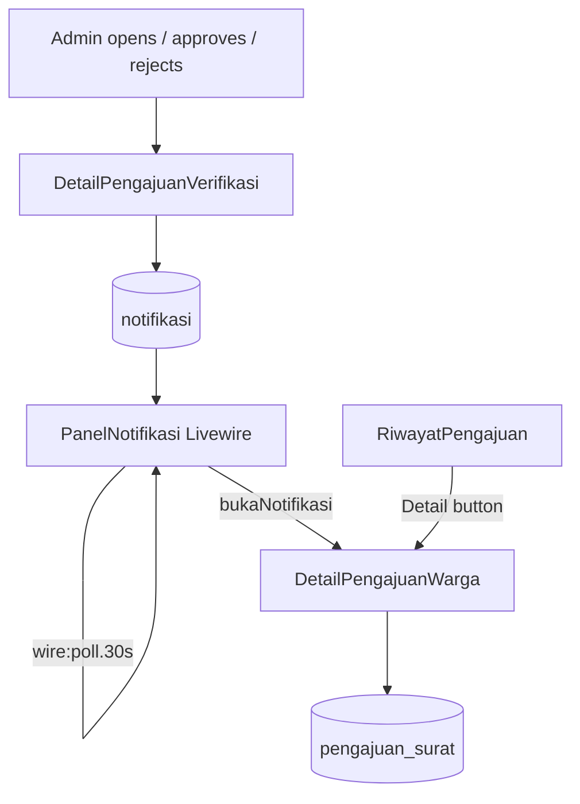
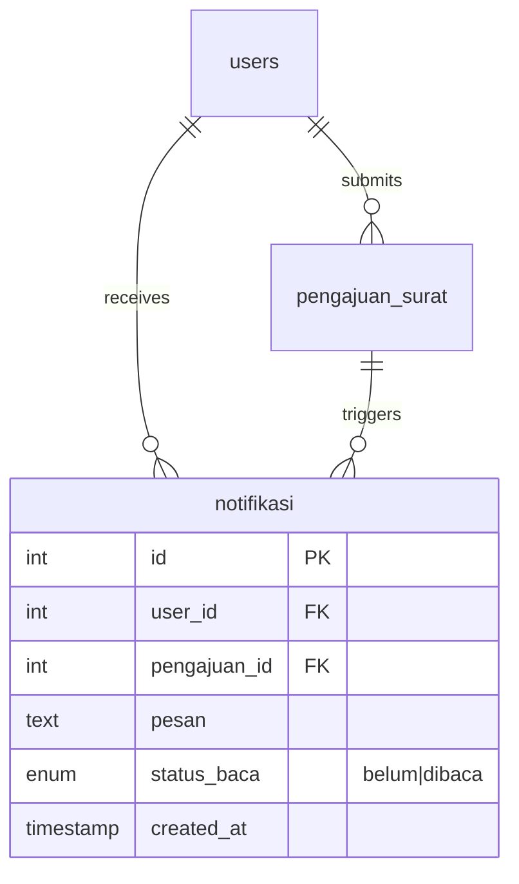

# Notifikasi In-App & Status/Riwayat Pengajuan (US-5.1 – US-5.3)

## Overview

Phase 05 closes the end-to-end loop between admin verification (Phase 04) and warga visibility. When an admin opens, approves, or rejects a submission, the system inserts an in-app notification for the owning warga. Warga see a bell dropdown with unread badge, can open notifications to mark them read and jump to submission detail, and can browse full history with status filter and per-row detail pages.

## Architecture Diagram

## Data Model

## Key Files

| Layer | File | Purpose |
|-------|------|---------|
| Migration | `database/migrations/2026_08_06_090335_create_notifikasis_table.php` | `notifikasi` table |
| Model | `app/Models/Notifikasi.php` | Eloquent model + status constants |
| Livewire | `app/Livewire/Verifikasi/DetailPengajuanVerifikasi.php` | Inserts notifications on diproses/setujui/tolak |
| Livewire | `app/Livewire/Notifikasi/PanelNotifikasi.php` | Bell dropdown, badge, mark-read + redirect |
| Livewire | `app/Livewire/Pengajuan/RiwayatPengajuan.php` | History table + status filter (US-5.3) |
| Livewire | `app/Livewire/Pengajuan/DetailPengajuanWarga.php` | Warga-facing submission detail |
| Blade | `resources/views/livewire/notifikasi/panel-notifikasi.blade.php` | Dropdown UI + Alpine toggle + wire:poll |
| Blade | `resources/views/livewire/pengajuan/riwayat-pengajuan.blade.php` | Table with Detail + Ajukan Ulang |
| Blade | `resources/views/livewire/pengajuan/detail-pengajuan-warga.blade.php` | Full info view for warga |
| Layout | `resources/views/layouts/app/sidebar.blade.php` | `@persist` panel for warga |
| Routes | `routes/web.php` | `pengajuan-surat.show`, existing `pengajuan-surat.riwayat` |
| Factory | `database/factories/NotifikasiFactory.php` | Test data |
| Pest | `tests/Feature/NotifikasiPengajuanTest.php` | Notification creation + panel behavior |
| Pest | `tests/Feature/DetailPengajuanWargaTest.php` | Detail page auth + content |
| Playwright | `e2e/notifikasi-pengajuan.spec.ts` | E2E US-5.1–5.3 |

## Flow Explanation

1. **User triggers** — admin opens verification detail (auto `diajukan` → `diproses`), clicks Setujui, or confirms Tolak with catatan.
2. **Request handling** — `DetailPengajuanVerifikasi` runs inside existing transaction/lock for approve/reject; `buatNotifikasiStatus()` inserts a row with `status_baca = belum`.
3. **Business logic** — message format: `Pengajuan {jenis surat} ({nomor}) {status label}.` Warga panel polls every 30s; unread count drives badge. Clicking a notification marks it `dibaca` and navigates to detail.
4. **Response** — warga sees updated badge/dropdown without full page reload; detail page shows status, keperluan, catatan_admin (if ditolak), uploaded doc list, and Ajukan Ulang when applicable.

## API Endpoints (if applicable)

| Method | URI | Purpose | Auth |
|--------|-----|---------|------|
| GET | `/riwayat-pengajuan` | Status & history table | auth + verified + role:warga |
| GET | `/pengajuan-surat/detail/{pengajuan}` | Submission detail | auth + verified + role:warga (owner only) |

Notification panel actions are Livewire methods (`bukaNotifikasi`, `refreshNotifikasi`), not REST endpoints.

## Decisions & Trade-offs

- **Custom `notifikasi` table** — not Laravel's built-in `notifications` channel; matches scrum data model and keeps messages Indonesian/plain-text.
- **Polling (30s) over WebSockets** — per plan risk mitigation; sufficient for research scale.
- **Single panel instance in sidebar** — avoids duplicate Livewire components on mobile/desktop; warga open sidebar on mobile to reach bell.
- **Diproses notifications included** — Phase 04 US-4.4 explicitly deferred this hook to Phase 05; implemented alongside disetujui/ditolak.
- **Detail as dedicated route** — supports both notification deep-link and riwayat row Detail button; owner-only 403.

## Related

- [Verifikasi Pengajuan (US-4.1 – US-4.4)](verifikasi-pengajuan.md)
- [Ajukan Ulang (US-3.4)](pengajuan-surat-ajukan-ulang.md)
- Phase 06 Rekap (downstream reporting — separate scope)
