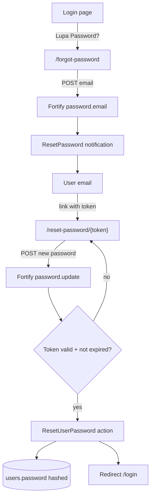
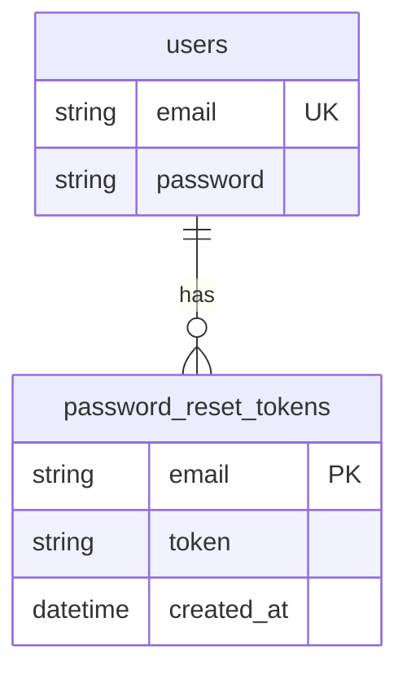

# Password Reset (US-1.5)

## Overview

Guests who forget their password can request a reset link from the login page. Laravel Fortify sends a time-limited token (60 minutes) to the user’s email. After submitting a new password with a valid token, the user can log in again without visiting the village office.

## Architecture Diagram

## Data Model

## Key Files

| Layer | File | Purpose |
|-------|------|---------|
| View | `resources/views/pages/auth/login.blade.php` | Link “Lupa Password?” |
| View | `resources/views/pages/auth/forgot-password.blade.php` | Request reset form |
| View | `resources/views/pages/auth/reset-password.blade.php` | Set new password form |
| Action | `app/Actions/Fortify/ResetUserPassword.php` | Validate + persist new password |
| Config | `config/fortify.php` | `Features::resetPasswords()` enabled |
| Config | `config/auth.php` | `passwords.users.expire = 60` |
| Feature tests | `tests/Feature/Auth/PasswordResetTest.php` | Pest coverage |
| E2E | `e2e/password-reset.spec.ts` | Playwright coverage |

## Flow Explanation

1. **User triggers** — Clicks “Lupa Password?” on `/login`.
2. **Request handling** — Submits email on `/forgot-password` (`password.email`).
3. **Business logic** — Fortify creates a broker token and emails the reset URL. Tokens expire after 60 minutes (`config/auth.php`).
4. **Reset** — User opens link, submits email + new password + confirmation (`password.update`). `ResetUserPassword` validates and hashes the password.
5. **Response** — Redirect to login; user signs in with the new password.

## API Endpoints (if applicable)

| Method | URI | Purpose | Auth |
|--------|-----|---------|------|
| GET | `/forgot-password` | Show request form | guest |
| POST | `/forgot-password` | Send reset link | guest |
| GET | `/reset-password/{token}` | Show reset form | guest |
| POST | `/reset-password` | Persist new password | guest |

## Decisions & Trade-offs

- Plan text mentions Laravel Breeze; this app uses Fortify (already the auth stack for US-1.1–1.3). Behavior matches the AC — see [ADR-004](../decisions/004-profile-password-reset-fortify.md).
- Token expiry uses Laravel’s default 60-minute broker setting, matching the plan example.

## Related

- Scrum: `scrum-planning/Phase 01 - Authentication & Role Management.md` (US-1.5)
- User guide: [../../user-docs/guides/password-reset.md](../../user-docs/guides/password-reset.md)
- ADR: [004-profile-password-reset-fortify.md](../decisions/004-profile-password-reset-fortify.md)
- Login feature: [role-based-login.md](role-based-login.md)
