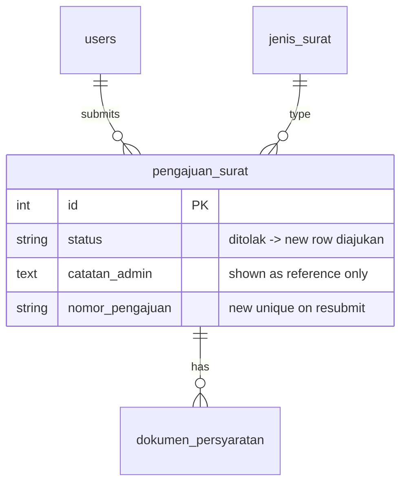

# Ajukan Ulang Setelah Ditolak (US-3.4)

## Overview

When a warga's submission is rejected (`status = ditolak`), they can resubmit from **Status & Riwayat Pengajuan** without re-entering all fields. The resubmit form pre-fills `jenis_surat_id` and `keperluan`, displays the previous `catatan_admin` as a reference callout, and requires fresh document uploads. Submit creates a **new** `pengajuan_surat` row with a new `nomor_pengajuan` and status `diajukan`; the original rejected record is unchanged.

This story also introduces a minimal **Riwayat Pengajuan** page (aligned with Phase 05 US-5.3 table requirements) because US-3.4 AC explicitly places the **Ajukan Ulang** button there.

## Architecture Diagram

```mermaid
flowchart TD
    A[Warga opens /riwayat-pengajuan] --> B[RiwayatPengajuan Livewire]
    B --> C[(pengajuan_surat owned by user)]
    C --> D{status ditolak?}
    D -->|yes| E[Ajukan Ulang link]
    E --> F[/pengajuan-surat/ajukan-ulang/{id}]
    F --> G[FormPengajuanSurat mount]
    G --> H[Pre-fill jenis_surat + keperluan + show catatan_admin]
    H --> I[Warga uploads docs + submit]
    I --> J[New pengajuan_surat + dokumen_persyaratan]
```

## Data Model

Uses existing `pengajuan_surat` and `dokumen_persyaratan` tables. Resubmit does **not** update the rejected row or copy old file paths — only field values are reused in the form.



## Key Files

| Layer | File | Purpose |
|-------|------|---------|
| Livewire | `app/Livewire/Pengajuan/RiwayatPengajuan.php` | Table, status filter, Ajukan Ulang button |
| Livewire | `app/Livewire/Pengajuan/FormPengajuanSurat.php` | `mount(PengajuanSurat)` pre-fill + resubmit submit |
| Blade | `resources/views/livewire/pengajuan/riwayat-pengajuan.blade.php` | Riwayat table UI |
| Blade | `resources/views/livewire/pengajuan/form-pengajuan-surat.blade.php` | Catatan admin reference callout |
| Routes | `routes/web.php` | `pengajuan-surat.riwayat`, `pengajuan-surat.resubmit` |
| Nav | `resources/views/layouts/app/sidebar.blade.php` | **Riwayat Pengajuan** sidebar item |
| Factory | `database/factories/PengajuanSuratFactory.php` | `ditolak()`, `disetujui()` states |
| Pest | `tests/Feature/RiwayatPengajuanTest.php` | Riwayat access, filter, button visibility |
| Pest | `tests/Feature/AjukanUlangPengajuanTest.php` | Resubmit auth, pre-fill, new record |
| Playwright | `e2e/pengajuan-ajukan-ulang.spec.ts` | E2E US-3.4 happy path + edge cases |

## Flow Explanation

1. **User triggers** — warga opens **Riwayat Pengajuan** (`/riwayat-pengajuan`) and sees their submissions. Rows with status `ditolak` show `catatan_admin` and an **Ajukan Ulang** button.
2. **Request handling** — clicking **Ajukan Ulang** navigates to `/pengajuan-surat/ajukan-ulang/{pengajuan}`. `mount()` enforces: owner only (403), status must be `ditolak` (404).
3. **Business logic** — form pre-fills `jenis_surat_id` and `keperluan`. Warning callout shows previous `nomor_pengajuan` and `catatan_admin`. Documents are **not** copied; US-3.3 validation still applies. `submit()` creates a new record with fresh `nomor_pengajuan` via existing generator.
4. **Response** — success callout with new nomor; original rejected pengajuan unchanged.

## API Endpoints (if applicable)

| Method | URI | Purpose | Auth |
|--------|-----|---------|------|
| GET | `/riwayat-pengajuan` | Status & riwayat table | auth + verified + role:warga |
| GET | `/pengajuan-surat/ajukan-ulang/{pengajuan}` | Resubmit form (pre-filled) | auth + verified + role:warga |

## Decisions & Trade-offs

- **Minimal riwayat page now (US-5.3 subset)** — US-3.4 AC requires the button on riwayat; full Phase 05 (notifications, detail modal, sort) deferred but table + filter + catatan_admin implemented.
- **Separate resubmit route** — clearer authorization vs query param on create form; `{pengajuan}` route model binding in `mount()`.
- **No document copy** — AC says warga may need to re-upload; avoids stale/invalid file references and keeps storage simple.
- **404 for non-ditolak resubmit URL** — prevents accidental resubmit of active pengajuan.

## Related

- [Form Pengajuan Surat (US-3.1)](pengajuan-surat-form.md)
- [Validasi Kelengkapan (US-3.3)](pengajuan-surat-kelengkapan.md)
- Phase 05 US-5.3 (full riwayat + detail — partial overlap)
- Phase 04 (admin sets `ditolak` + `catatan_admin`)
