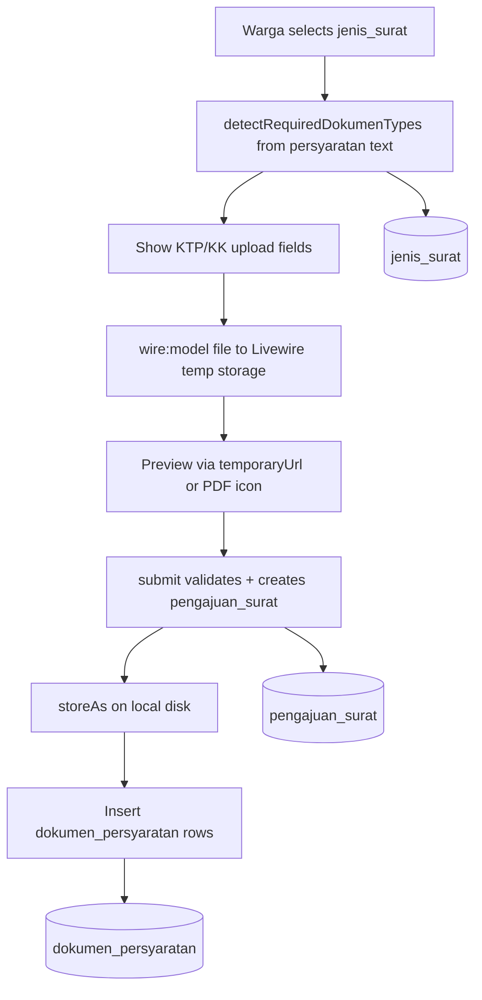
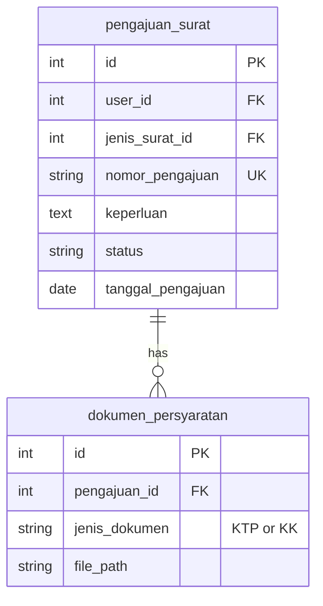

# Unggah Dokumen Persyaratan (US-3.2)

## Overview

Extends the warga submission form (`FormPengajuanSurat`) with conditional KTP/KK file upload areas derived from the selected `jenis_surat.persyaratan_dokumen` text. Uploaded files are validated (JPG/PNG/PDF, max 2MB), previewed before final submit, stored on the private `local` disk, and recorded in `dokumen_persyaratan` linked to the parent `pengajuan_surat` row.

Completeness enforcement (reject submit when required docs are missing) is owned by **US-3.3** and is intentionally not implemented here.

## Architecture Diagram

## Data Model

Unique constraint on `(pengajuan_id, jenis_dokumen)` prevents duplicate document type per submission.

## Key Files

| Layer | File | Purpose |
|-------|------|---------|
| Livewire | `app/Livewire/Pengajuan/FormPengajuanSurat.php` | `WithFileUploads`, detection, validation, storage |
| Blade | `resources/views/livewire/pengajuan/form-pengajuan-surat.blade.php` | Upload inputs, previews, loading state |
| Model | `app/Models/DokumenPersyaratan.php` | Eloquent model + `JENIS_KTP` / `JENIS_KK` constants |
| Model | `app/Models/PengajuanSurat.php` | `dokumenPersyaratan()` relationship |
| Migration | `database/migrations/2026_08_06_074402_create_dokumen_persyaratan_table.php` | Creates `dokumen_persyaratan` table |
| Factory | `database/factories/DokumenPersyaratanFactory.php` | Test data |
| Pest | `tests/Feature/FormPengajuanSuratTest.php` | Upload, validation, preview state tests |
| Playwright | `e2e/pengajuan-surat.spec.ts` | US-3.2 E2E flows + fixtures in `e2e/fixtures/` |

## Flow Explanation

1. **User triggers** — warga selects a `jenis_surat` (live wire model). Component computes `requiredDokumenTypes` by scanning `persyaratan_dokumen` for `KTP` and `KK` / `Kartu Keluarga`.
2. **Request handling** — conditional upload fields render. Files bind via `wire:model` to `$dokumenKtp` / `$dokumenKk`. Changing jenis surat resets uploads.
3. **Business logic** — on `submit()`, files validate with `mimes:jpg,jpeg,png,pdf` and `max:2048`. Inside DB transaction: create `pengajuan_surat`, then `storeAs('pengajuan-dokumen/{id}/', ...)` on default disk, then insert `dokumen_persyaratan` with relative path.
4. **Response** — image previews use `temporaryUrl()` before submit; PDF shows document icon + filename. Success flow unchanged from US-3.1.

## API Endpoints (if applicable)

No new routes. Upload is handled via Livewire on existing `GET /pengajuan-surat` (`pengajuan-surat.create`).

## Decisions & Trade-offs

- **Text-based requirement detection** — Phase 02 stores free-text `persyaratan_dokumen`; keyword scan avoids schema change. See ADR-010.
- **Private `local` disk** — identity documents must not be web-public; `storage/app/private` with `serve: true` for authorized access later (Phase 04).
- **Optional at submit (for now)** — US-3.3 will add required-doc blocking; US-3.2 only validates format/size when files are present.
- **Unique per pengajuan + jenis** — one KTP and one KK row max per submission.

## Related

- Form header fields: [pengajuan-surat-form.md](pengajuan-surat-form.md)
- Master data: [jenis-surat.md](jenis-surat.md)
- User guide: [../../user-docs/guides/pengajuan-surat-dokumen.md](../../user-docs/guides/pengajuan-surat-dokumen.md)
- ADR: [010-dokumen-persyaratan-text-detection-and-storage.md](../decisions/010-dokumen-persyaratan-text-detection-and-storage.md)
