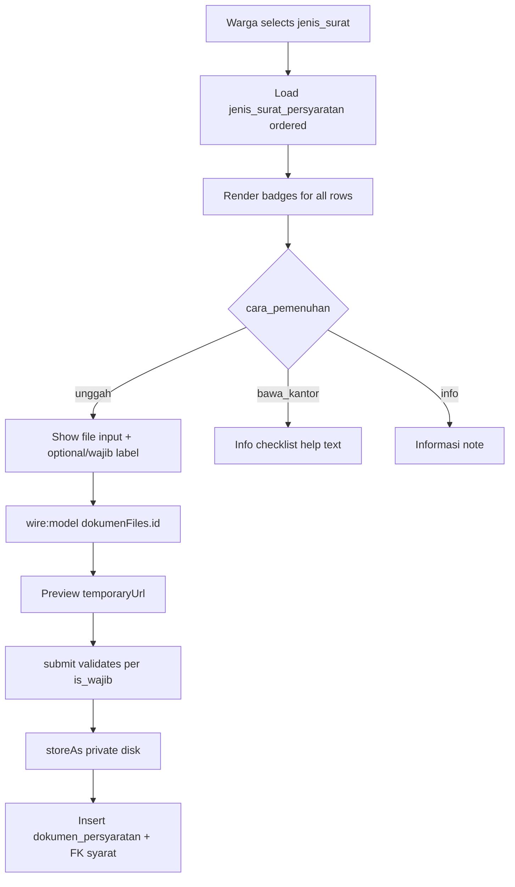
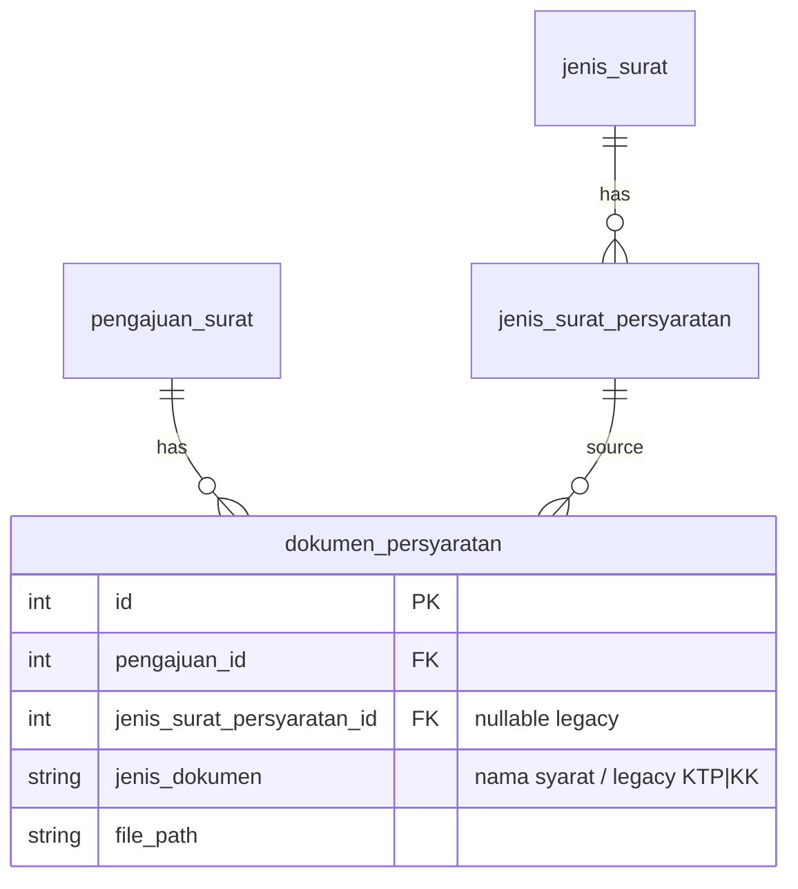

# Unggah Dokumen Persyaratan (US-3.2 + US-9.3)

## Overview

Extends the warga submission form (`FormPengajuanSurat`) with **dynamic upload slots** driven by structured `jenis_surat_persyaratan` rows (`cara_pemenuhan = unggah`). Labels follow each syarat’s `nama` (not hardcoded KTP/KK only). Files validate as JPG/PNG/PDF (max 2MB), preview before submit, store on the private `local` disk, and record in `dokumen_persyaratan` with `jenis_surat_persyaratan_id` plus `jenis_dokumen` = nama syarat.

Keyword scanning (`detectRequiredDokumenTypes`) is **removed**. Completeness uses `is_wajib` on unggah rows (US-3.3 / US-9.3).

## Architecture Diagram

## Data Model

Unique constraint: `(pengajuan_id, jenis_surat_persyaratan_id)`.

## Key Files

| Layer | File | Purpose |
|-------|------|---------|
| Livewire | `app/Livewire/Pengajuan/FormPengajuanSurat.php` | `dokumenFiles[]`, structured rules, storage |
| Blade | `resources/views/livewire/pengajuan/form-pengajuan-surat.blade.php` | Badges, slots, bawa/info help |
| Model | `app/Models/DokumenPersyaratan.php` | FK + `labelDokumen()` |
| Model | `app/Models/JenisSuratPersyaratan.php` | `badgeLabel()` / `badgeColor()` |
| Migration | `database/migrations/2026_08_07_055105_add_jenis_surat_persyaratan_id_to_dokumen_persyaratan_table.php` | FK + unique + widen `jenis_dokumen` |
| Pest | `tests/Feature/FormPengajuanSuratTest.php`, `FormPengajuanPersyaratanTerstrukturTest.php` | Structured upload AC |
| Playwright | `e2e/pengajuan-surat.spec.ts`, `e2e/pengajuan-persyaratan-terstruktur.spec.ts` | E2E US-3.2 / US-9.3 |

## Flow Explanation

1. **User triggers** — warga selects `jenis_surat` (live). Component loads `persyaratanRows` / `unggahPersyaratan`.
2. **Request handling** — list shows badges; file inputs only for `unggah`. Changing jenis resets `dokumenFiles`.
3. **Business logic** — `submit()` validates each unggah slot (`required` iff `is_wajib`). Persist file under `pengajuan-dokumen/{id}/` and create `dokumen_persyaratan` linked to the syarat row.
4. **Response** — preview before submit; success nomor unchanged from US-3.1.

## API Endpoints (if applicable)

No new routes. Livewire on `GET /pengajuan-surat` (`pengajuan-surat.create`).

## Decisions & Trade-offs

- **Structured rows as upload rules** — supersedes ADR-010 keyword detection (ADR-026 fully applied in US-9.3).
- **Dynamic `dokumenFiles.{id}`** — supports any syarat name, not only KTP/KK.
- **Private `local` disk** — unchanged from Phase 03.
- **Optional unggah** — `is_wajib = false` does not block submit; bawa_kantor/info never require files.

## Related

- Form header: [pengajuan-surat-form.md](pengajuan-surat-form.md)
- Completeness: [pengajuan-surat-kelengkapan.md](pengajuan-surat-kelengkapan.md)
- Master data: [jenis-surat.md](jenis-surat.md)
- User guide: [../../user-docs/guides/warga/06-pengajuan-surat-dokumen.md](../../user-docs/guides/warga/06-pengajuan-surat-dokumen.md)
- ADR-026: [026-persyaratan-terstruktur-supersede-keyword-upload.md](../decisions/026-persyaratan-terstruktur-supersede-keyword-upload.md)
