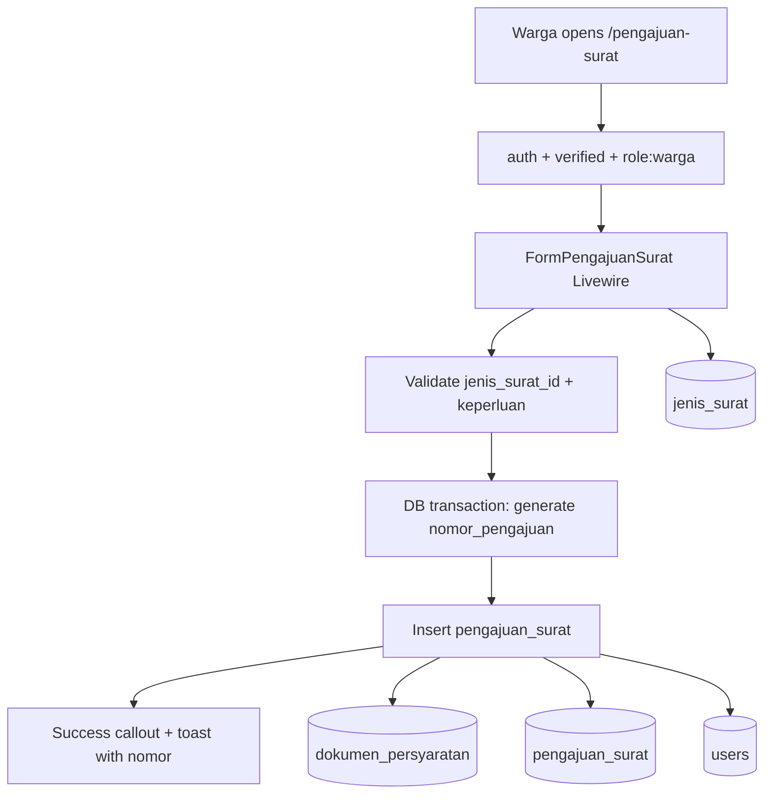
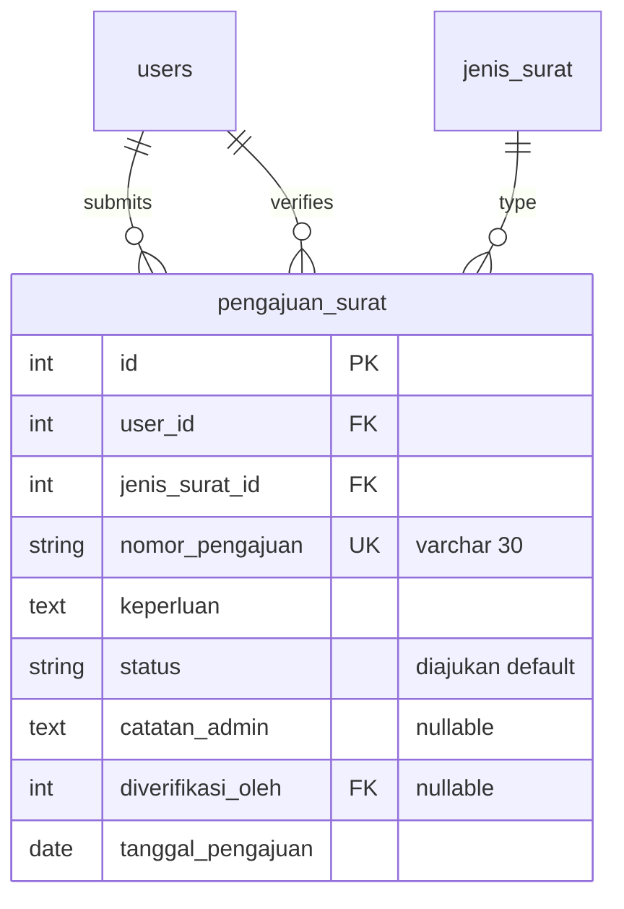

# Form Pengajuan Surat Keterangan (US-3.1)

## Overview

Warga (authenticated citizens) can submit a letter request by choosing a letter type from Phase 02 master data, describing the purpose, and uploading required KTP/KK documents when applicable. On successful submit, the system creates a `pengajuan_surat` record with auto-generated unique `nomor_pengajuan`, initial status `diajukan`, and `tanggal_pengajuan` set to the submit date. Uploaded files are stored in `dokumen_persyaratan` (US-3.2). Completeness validation (reject submit when required docs missing) is deferred to US-3.3.

## Architecture Diagram

## Data Model

Table name is `pengajuan_surat` (singular), matching Phase 03 data model — not Laravel's default pluralization.

## Key Files

| Layer | File | Purpose |
|-------|------|---------|
| Livewire | `app/Livewire/Pengajuan/FormPengajuanSurat.php` | Form state, validation, submit, nomor generation |
| Blade | `resources/views/livewire/pengajuan/form-pengajuan-surat.blade.php` | Flux form, success callout, sidebar link target |
| Model | `app/Models/PengajuanSurat.php` | Eloquent model + status constants |
| Migration | `database/migrations/2026_08_06_071935_create_pengajuan_surats_table.php` | Creates `pengajuan_surat` table + FKs |
| Factory | `database/factories/PengajuanSuratFactory.php` | Test/seed data |
| Routes | `routes/web.php` | `pengajuan-surat.create` under `role:warga` |
| Nav | `resources/views/layouts/app/sidebar.blade.php` | Warga sidebar item **Pengajuan Surat** |
| Pest | `tests/Feature/FormPengajuanSuratTest.php` | Auth, validation, nomor sequence, soft-deleted jenis guard |
| Playwright | `e2e/pengajuan-surat.spec.ts` | E2E US-3.1 + US-3.2 flows |

## Flow Explanation

1. **User triggers** — warga opens **Pengajuan Surat** from sidebar or `/pengajuan-surat`.
2. **Request handling** — route requires `auth`, `verified`, and `role:warga`; admin/guest get redirect or 403.
3. **Business logic** — dropdown loads active (non–soft-deleted) `jenis_surat` ordered by name. `submit()` validates required fields, then runs `generateNomorPengajuan()` inside a DB transaction with `lockForUpdate` on the day's last number. Format: `PJ-{Ymd}-{0001}`. Retries up to 3 times on unique constraint collision. Record saved with `status = diajukan`, `tanggal_pengajuan = today`, `user_id = auth id`.
4. **Response** — success callout displays `nomor_pengajuan`; toast confirms. **Ajukan Surat Lain** resets form.

## API Endpoints (if applicable)

| Method | URI | Purpose | Auth |
|--------|-----|---------|------|
| GET | `/pengajuan-surat` | Submission form (Livewire) | auth + verified + role:warga |

## Decisions & Trade-offs

- **Nomor format `PJ-YYYYMMDD-####`** — human-readable, fits varchar(30), daily sequence resets; separate from official letter number (Phase 07). See ADR-009.
- **Logic in Livewire component** — no service/repository layer per project architecture convention.
- **No completeness blocking yet** — US-3.3 owns required-doc submit rejection; US-3.2 owns upload UI, format/size validation, storage. See [pengajuan-surat-dokumen.md](pengajuan-surat-dokumen.md).
- **Soft-deleted jenis surat rejected** — validation uses `exists` with `whereNull('deleted_at')`.
- **FK restrict on jenis_surat** — prevents hard delete of referenced types; soft delete still allowed.

## Related

- Phase 02 master data: [jenis-surat.md](jenis-surat.md)
- Requirements browse: [persyaratan-dokumen.md](persyaratan-dokumen.md)
- Role middleware: [role-middleware.md](role-middleware.md)
- User guide: [../../user-docs/guides/pengajuan-surat-form.md](../../user-docs/guides/pengajuan-surat-form.md)
- Document upload (US-3.2): [pengajuan-surat-dokumen.md](pengajuan-surat-dokumen.md)
- ADR: [009-pengajuan-surat-table-and-nomor-format.md](../decisions/009-pengajuan-surat-table-and-nomor-format.md)
