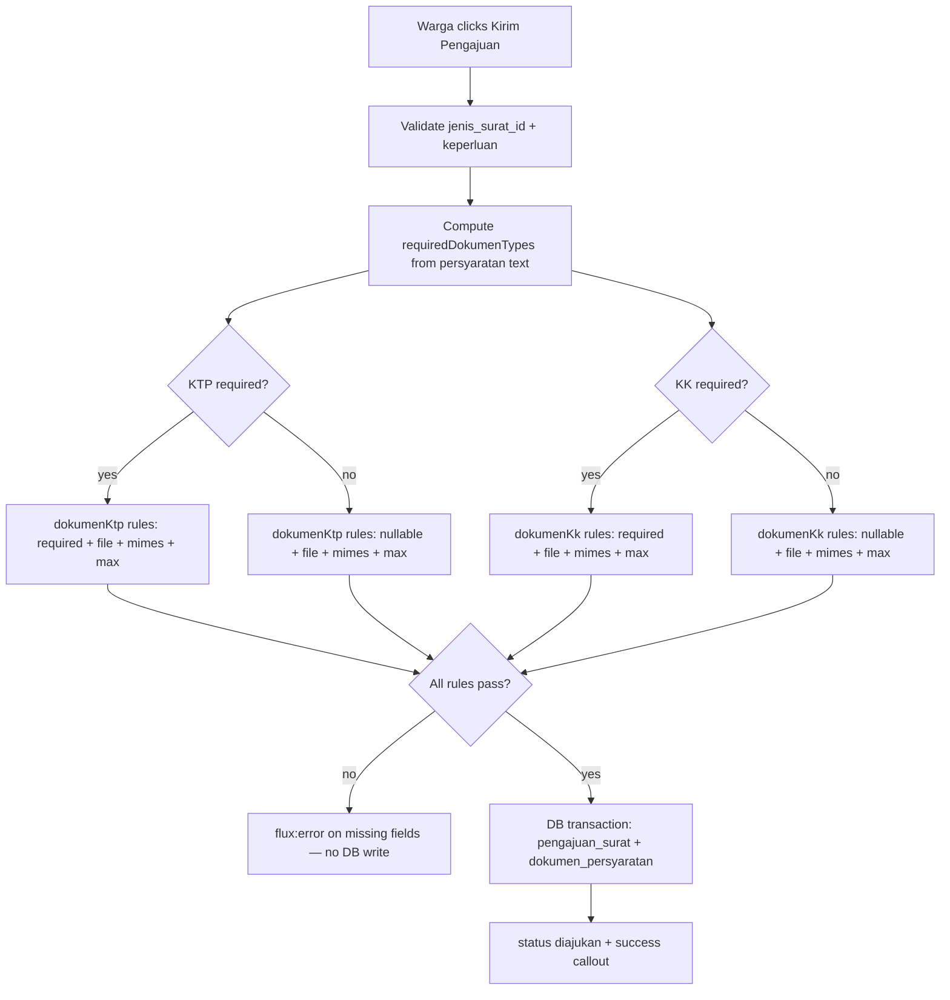
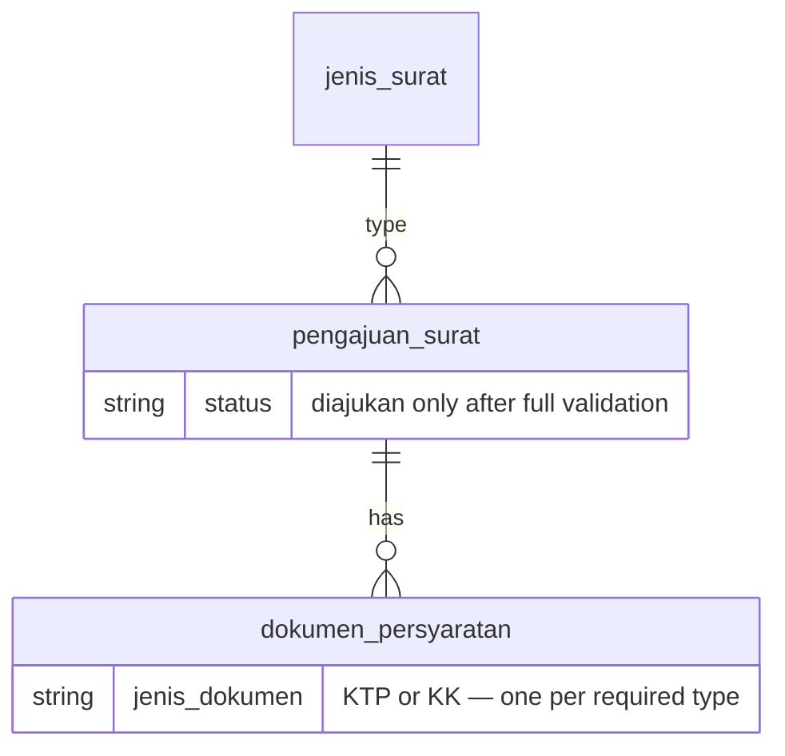

# Validasi Kelengkapan Pengajuan (US-3.3)

## Overview

Extends `FormPengajuanSurat` submit validation so warga cannot save a `pengajuan_surat` record unless every document type detected as required for the selected `jenis_surat` has been uploaded. Missing required KTP or KK files produce field-specific error messages in Bahasa Indonesia; no database write occurs until all validations pass, and successful submissions retain status `diajukan`.

## Architecture Diagram

## Data Model

No schema changes. Validation reuses existing `requiredDokumenTypes` computed property (same keyword detection as US-3.2) and existing `dokumen_persyaratan` rows created on successful submit.

## Key Files

| Layer | File | Purpose |
|-------|------|---------|
| Livewire | `app/Livewire/Pengajuan/FormPengajuanSurat.php` | Dynamic `rules()` — `required` vs `nullable` per detected doc type |
| Blade | `resources/views/livewire/pengajuan/form-pengajuan-surat.blade.php` | `<flux:error>` displays per-field messages (unchanged markup) |
| Pest | `tests/Feature/FormPengajuanSuratTest.php` | Missing KTP/KK, partial upload, full success, no DB on failure |
| Playwright | `e2e/pengajuan-surat.spec.ts` | US-3.3 describe block — missing doc errors + happy path with all docs |

## Flow Explanation

1. **User triggers** — warga fills form and clicks **Kirim Pengajuan**.
2. **Request handling** — `submit()` calls `$this->validate($this->rules(), $this->messages())`. `rules()` inspects `$this->requiredDokumenTypes` (computed from selected `jenis_surat.persyaratan_dokumen`).
3. **Business logic** — if KTP is in `requiredDokumenTypes`, `dokumenKtp` gets `required|file|mimes:jpg,jpeg,png,pdf|max:2048`; otherwise stays `nullable`. Same pattern for KK. Validation failure stops before any `DB::transaction`. On success, existing US-3.1/US-3.2 flow creates `pengajuan_surat` with `status = diajukan` and persists uploaded files.
4. **Response** — validation errors render via `<flux:error name="dokumenKtp" />` / `dokumenKk` with messages such as "Fotokopi KTP wajib diunggah." Success flow unchanged.

## API Endpoints (if applicable)

No new routes. Validation runs on Livewire action `submit` on existing `GET /pengajuan-surat` (`pengajuan-surat.create`).

## Decisions & Trade-offs

- **Conditional rules in `rules()` method** — Livewire `#[Validate]` attributes cannot express dynamic required/optional per jenis surat; centralized `rules()` matches existing pattern for `Rule::exists` and file rules.
- **Reuse US-3.2 detection** — same `detectRequiredDokumenTypes()` keyword scan; no duplicate business logic or schema change.
- **Fail before transaction** — Laravel validation runs before `DB::transaction`, guaranteeing no partial `pengajuan_surat` row when docs are missing.
- **Jenis surat without KTP/KK keywords** — upload fields hidden and files remain optional; submit works with jenis + keperluan only.

## Related

- Form fields: [pengajuan-surat-form.md](pengajuan-surat-form.md)
- Upload UI & storage: [pengajuan-surat-dokumen.md](pengajuan-surat-dokumen.md)
- User guide: [../../user-docs/guides/pengajuan-surat-kelengkapan.md](../../user-docs/guides/pengajuan-surat-kelengkapan.md)
- ADR: [010-dokumen-persyaratan-text-detection-and-storage.md](../decisions/010-dokumen-persyaratan-text-detection-and-storage.md)
