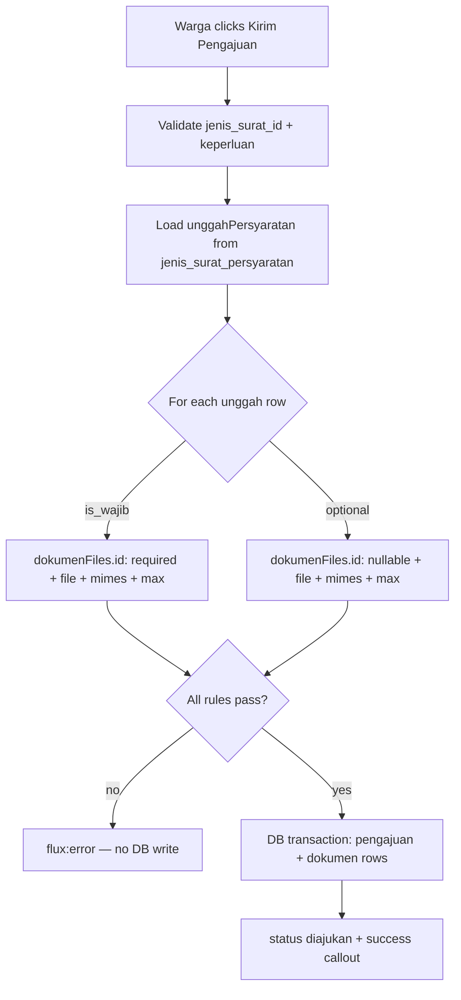
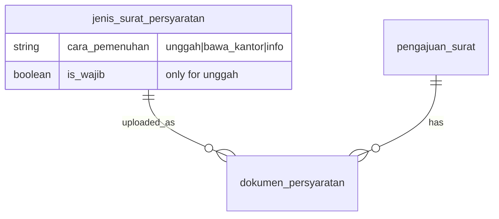

# Validasi Kelengkapan Pengajuan (US-3.3 + US-9.3)

## Overview

Extends `FormPengajuanSurat` submit validation so warga cannot save a `pengajuan_surat` unless every **unggah + is_wajib** requirement for the selected jenis surat has a file. Optional unggah (`is_wajib = false`) and non-upload cara (`bawa_kantor`, `info`) never block submit. Errors use the syarat `nama` in Bahasa Indonesia; no DB write until validation passes.

## Architecture Diagram

## Data Model

Uses structured rows + `dokumen_persyaratan.jenis_surat_persyaratan_id` (US-9.3 migration).

## Key Files

| Layer | File | Purpose |
|-------|------|---------|
| Livewire | `app/Livewire/Pengajuan/FormPengajuanSurat.php` | Dynamic `rules()` / `validationAttributes()` per syarat id |
| Blade | `resources/views/livewire/pengajuan/form-pengajuan-surat.blade.php` | Per-slot `<flux:error>` |
| Pest | `FormPengajuanSuratTest.php`, `FormPengajuanPersyaratanTerstrukturTest.php` | Wajib / opsional / bawa kantor |
| Playwright | `e2e/pengajuan-surat.spec.ts`, `e2e/pengajuan-persyaratan-terstruktur.spec.ts` | E2E kelengkapan + mixed rules |

## Flow Explanation

1. **User triggers** — **Kirim Pengajuan**.
2. **Request handling** — `validate()` with rules built from `unggahPersyaratan`.
3. **Business logic** — required only when `cara = unggah` and `is_wajib`. Failures stop before `DB::transaction`.
4. **Response** — message like “Dokumen Fotokopi KTP wajib diunggah.”

## API Endpoints (if applicable)

No new routes.

## Decisions & Trade-offs

- **Structured `is_wajib`** — replaces keyword-based always-required KTP/KK.
- **Fail before transaction** — no partial pengajuan when docs missing.
- **Bawa kantor alone** — submit allowed with zero files.

## Related

- Upload UI & storage: [pengajuan-surat-dokumen.md](pengajuan-surat-dokumen.md)
- User guide: [../../user-docs/guides/warga/07-pengajuan-surat-kelengkapan.md](../../user-docs/guides/warga/07-pengajuan-surat-kelengkapan.md)
- ADR-026: [026-persyaratan-terstruktur-supersede-keyword-upload.md](../decisions/026-persyaratan-terstruktur-supersede-keyword-upload.md)
