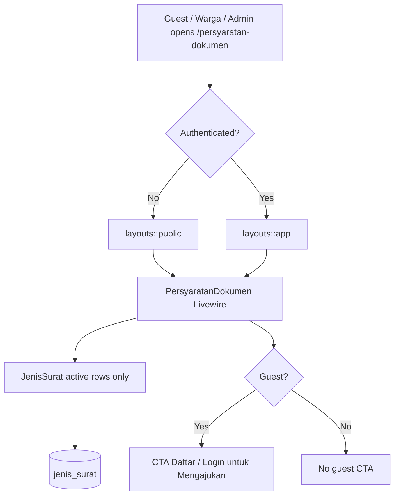
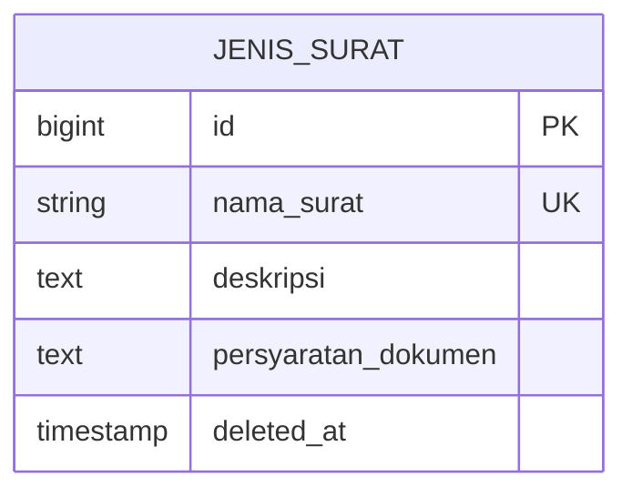

# Public Persyaratan Dokumen Access (US-2.3)

## Overview

Guests (calon pemohon without an account) can browse letter types and document requirements at `/persyaratan-dokumen` without logging in. The same Livewire page used by authenticated warga (US-2.2) is now a public route outside the auth middleware group. Guests see a **Daftar/Login untuk Mengajukan** CTA; the page remains read-only (no pengajuan submit — Phase 03).

## Architecture Diagram

## Data Model

Same `jenis_surat` master data as US-2.1 / US-2.2. Soft-deleted rows stay hidden via Eloquent SoftDeletes.

## Key Files

| Layer | File | Purpose |
|-------|------|---------|
| Livewire | `app/Livewire/JenisSurat/PersyaratanDokumen.php` | List, search, detail; dynamic public vs app layout |
| Blade | `resources/views/livewire/jenis-surat/persyaratan-dokumen.blade.php` | Cards, modal, guest CTA |
| Layout | `resources/views/layouts/public.blade.php` | Guest chrome (logo + Masuk/Daftar) |
| Welcome | `resources/views/welcome.blade.php` | Link **Lihat Persyaratan Dokumen** |
| Routes | `routes/web.php` | Public `persyaratan-dokumen.index` (no auth middleware) |
| Pest | `tests/Feature/PersyaratanDokumenTest.php` | Guest/admin/warga access + read-only |
| Playwright | `e2e/persyaratan-dokumen-public.spec.ts` | E2E US-2.3 AC + edges |

## Flow Explanation

1. **User triggers** — guest opens `/persyaratan-dokumen` (or welcome CTA).
2. **Request handling** — route has no `auth` / `role` middleware; Livewire renders with `layouts::public`.
3. **Business logic** — paginate active `JenisSurat`, optional `?q=` search, detail modal via `openDetail`. Guest CTA links to register/login; no pengajuan actions exist.
4. **Response** — read-only list/detail. Authenticated users get `layouts::app` and no guest CTA.

## API Endpoints (if applicable)

| Method | URI | Purpose | Auth |
|--------|-----|---------|------|
| GET | `/persyaratan-dokumen` | Browse requirements (Livewire) | Public |

## Decisions & Trade-offs

- **Same URL as US-2.2** — one page for guests and logged-in users avoids duplicate components; see ADR-008.
- **Public layout for guests** — app sidebar calls `auth()->user()`; guests need a separate layout.
- **Admin may view** — once public, role:warga gate is removed; admin can read the same info (still cannot manage from this page).
- **Pengajuan deferred** — CTA only invites register/login; submit belongs to Phase 03.

## Related

- Feature (warga browse): [persyaratan-dokumen.md](persyaratan-dokumen.md)
- Admin master data: [jenis-surat.md](jenis-surat.md)
- Role middleware: [role-middleware.md](role-middleware.md)
- User guide: [../../user-docs/guides/persyaratan-dokumen-publik.md](../../user-docs/guides/persyaratan-dokumen-publik.md)
- ADR: [008-public-persyaratan-dokumen-access.md](../decisions/008-public-persyaratan-dokumen-access.md)
