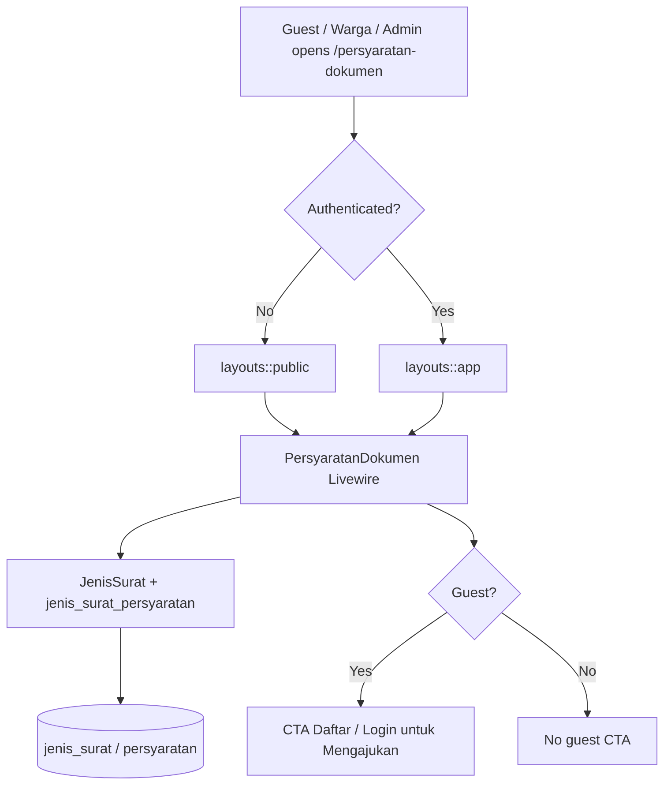
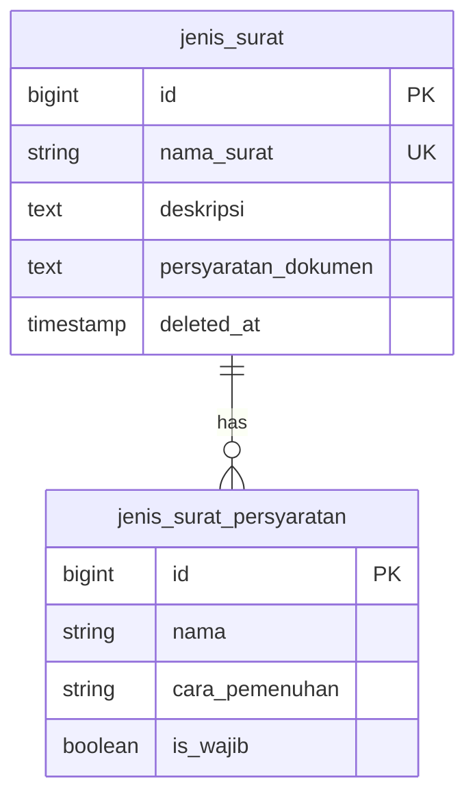

# Public Persyaratan Dokumen Access (US-2.3 + US-9.4 Badges)

## Overview

Guests (calon pemohon without an account) can browse letter types and **structured document requirements with badges** at `/persyaratan-dokumen` without logging in. The same Livewire page used by authenticated warga (US-2.2 / US-9.4) is a public route outside the auth middleware group. Guests see a **Daftar/Login untuk Mengajukan** CTA; the page remains read-only (no pengajuan submit).

## Architecture Diagram

## Data Model

Same master data as US-2.1 / US-9.1. Soft-deleted rows stay hidden via Eloquent SoftDeletes.

## Key Files

| Layer | File | Purpose |
|-------|------|---------|
| Livewire | `app/Livewire/JenisSurat/PersyaratanDokumen.php` | List, search, detail; dynamic public vs app layout |
| Blade | `resources/views/livewire/jenis-surat/persyaratan-dokumen.blade.php` | Cards with badges, modal, guest CTA |
| Layout | `resources/views/layouts/public.blade.php` | Guest chrome (logo + Masuk/Daftar) |
| Welcome | `resources/views/welcome.blade.php` | Link **Lihat Persyaratan Dokumen** |
| Routes | `routes/web.php` | Public `persyaratan-dokumen.index` |
| Pest | `tests/Feature/PersyaratanDokumenTest.php`, `PersyaratanDokumenBadgeTest.php` | Guest/admin/warga + badges |
| Playwright | `e2e/persyaratan-dokumen-public.spec.ts`, `e2e/persyaratan-badge.spec.ts` | E2E public + US-9.4 |

## Flow Explanation

1. **User triggers** — guest opens `/persyaratan-dokumen` (or welcome CTA).
2. **Request handling** — no `auth` / `role` middleware; Livewire uses `layouts::public`.
3. **Business logic** — paginate active types with structured rows; badges match warga/admin preview. Soft-deleted hidden. Search still works.
4. **Response** — read-only list/detail with badges. Authenticated users get `layouts::app` without guest CTA.

## API Endpoints (if applicable)

| Method | URI | Purpose | Auth |
|--------|-----|---------|------|
| GET | `/persyaratan-dokumen` | Browse requirements (Livewire) | Public |

## Decisions & Trade-offs

- **Same URL as US-2.2** — one page for guests and logged-in users (ADR-008).
- **Badges for guests too** — US-9.4 applies to public/warga surfaces so calon pemohon knows what to scan vs bring before registering.
- **Pengajuan deferred** — CTA only invites register/login.

## Related

- Feature (warga browse): [persyaratan-dokumen.md](persyaratan-dokumen.md)
- Admin master data: [jenis-surat.md](jenis-surat.md)
- User guide: [../../user-docs/guides/publik/02-persyaratan-dokumen-publik.md](../../user-docs/guides/publik/02-persyaratan-dokumen-publik.md)
- ADR: [008](../decisions/008-public-persyaratan-dokumen-access.md), [027](../decisions/027-persyaratan-badge-display-and-verifikasi-checklist.md)
