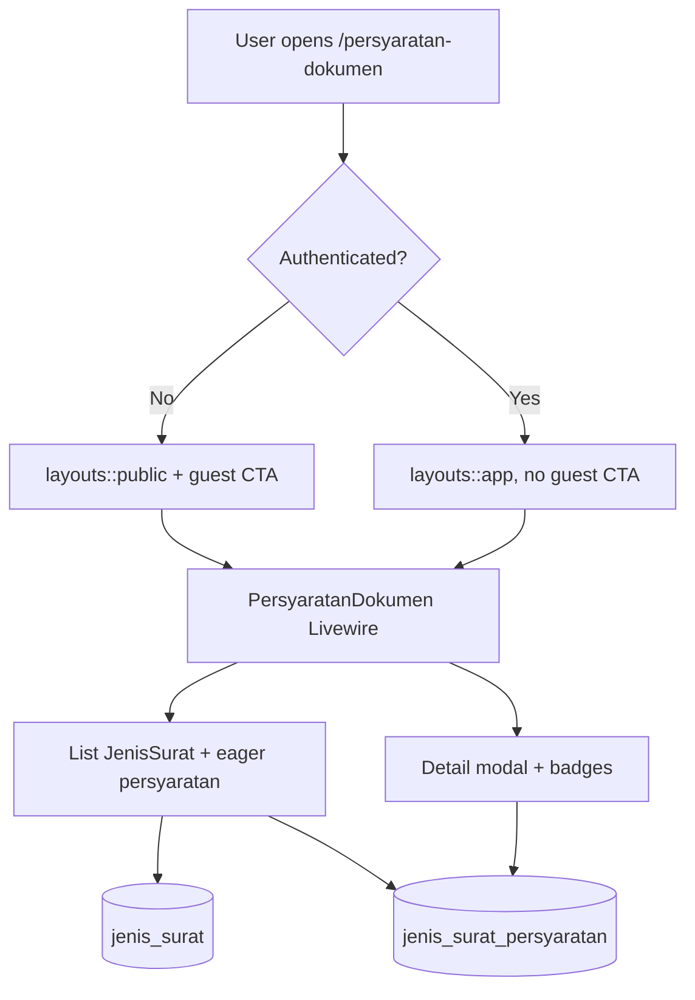
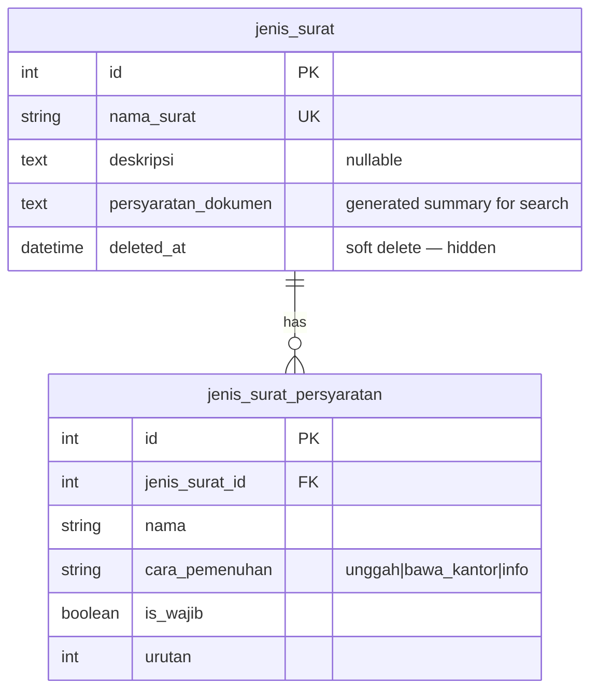

# Persyaratan Dokumen (Warga View + US-9.4 Badges)

## Overview

Authenticated warga (and guests via US-2.3) browse active letter types (`jenis_surat`) with description and **structured requirement rows** shown as an item list with Flux badges (`Wajib diunggah` / `Boleh dikosongkan` / `Bawa ke kantor` / `Informasi`). Soft-deleted types stay hidden. Submission remains on Phase 03 `/pengajuan-surat`.

## Architecture Diagram

## Data Model

## Key Files

| Layer | File | Purpose |
|-------|------|---------|
| Livewire | `app/Livewire/JenisSurat/PersyaratanDokumen.php` | List, search (incl. nama syarat), detail + layout switch |
| Blade | `resources/views/livewire/jenis-surat/persyaratan-dokumen.blade.php` | Card grid + badge lists + Flux modal |
| Model | `app/Models/JenisSuratPersyaratan.php` | `badgeLabel()` / `badgeColor()` |
| Routes | `routes/web.php` | Public `persyaratan-dokumen.index` |
| Pest | `tests/Feature/PersyaratanDokumenTest.php`, `PersyaratanDokumenBadgeTest.php` | Access + US-9.4 badges |
| Playwright | `e2e/persyaratan-dokumen.spec.ts`, `e2e/persyaratan-badge.spec.ts` | E2E warga + badge AC |

## Flow Explanation

1. **User triggers** — warga opens **Persyaratan Dokumen** from the sidebar or `/persyaratan-dokumen`.
2. **Request handling** — public route; authenticated users get `layouts::app`, guests get `layouts::public`.
3. **Business logic** — paginate active `JenisSurat` with `persyaratan` eager-loaded (9/page). Search matches nama/deskripsi/`persyaratan_dokumen` **or** `jenis_surat_persyaratan.nama`. Detail modal loads structured rows with the same badges as admin pratinjau / form pengajuan.
4. **Response** — card grid shows itemized syarat + badges (not raw textarea block). Modal repeats full list with helper text per cara.

## API Endpoints (if applicable)

| Method | URI | Purpose | Auth |
|--------|-----|---------|------|
| GET | `/persyaratan-dokumen` | Requirements browse page (Livewire) | Public |

## Decisions & Trade-offs

- **Structured rows as display source** — US-9.4 replaces free-text-only preview; summary column remains for search/backward compat (ADR-026 + ADR-027).
- **Same badges as form admin/warga** — reuse `badgeLabel()` / `badgeColor()` on the model; no duplicate maps.
- **Search includes row `nama`** — AC “teks syarat” covers structured names via `orWhereHas`.
- **Pengajuan CTA** — modal callout points warga to **Pengajuan Surat**; guests still get daftar/login CTA.

## Related

- Public access (US-2.3): [persyaratan-dokumen-publik.md](persyaratan-dokumen-publik.md)
- Admin CRUD + structured rows: [jenis-surat.md](jenis-surat.md)
- Form pengajuan badges/slots: [pengajuan-surat-dokumen.md](pengajuan-surat-dokumen.md)
- User guide: [../../user-docs/guides/warga/04-persyaratan-dokumen.md](../../user-docs/guides/warga/04-persyaratan-dokumen.md)
- ADR: [007](../decisions/007-warga-persyaratan-dokumen-view.md), [008](../decisions/008-public-persyaratan-dokumen-access.md), [026](../decisions/026-persyaratan-terstruktur-supersede-keyword-upload.md), [027](../decisions/027-persyaratan-badge-display-and-verifikasi-checklist.md)
