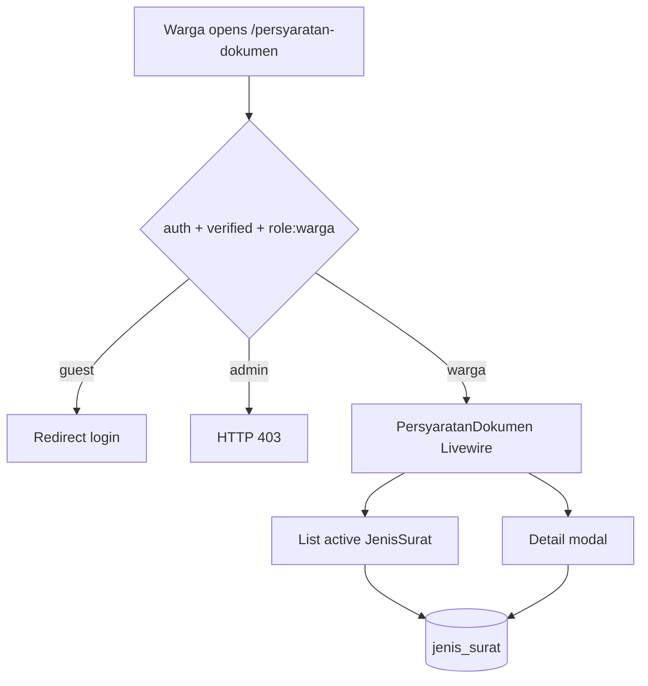
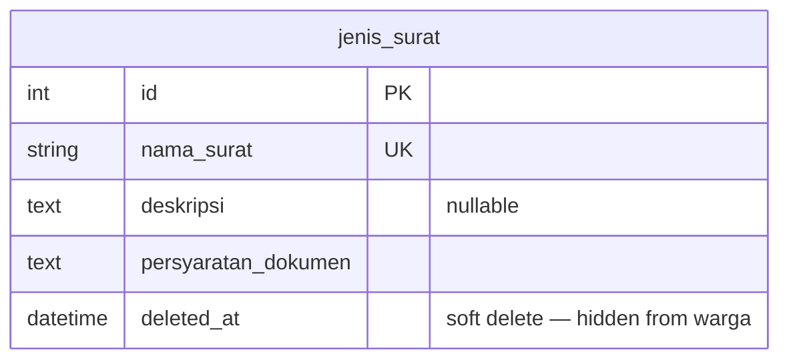

# Persyaratan Dokumen (Warga View)

## Overview

Authenticated warga can browse active letter types (`jenis_surat`) with description and document requirements, then open a detail modal before preparing to apply. This is the warga-facing read-only surface for Phase 02 US-2.2. Public (guest) access is owned by US-2.3; actual submission is owned by Phase 03.

## Architecture Diagram

## Data Model

Same table as admin CRUD (US-2.1). Soft-deleted rows are excluded by Eloquent SoftDeletes defaults.

## Key Files

| Layer | File | Purpose |
|-------|------|---------|
| Livewire | `app/Livewire/JenisSurat/PersyaratanDokumen.php` | List, search, detail modal state |
| Blade | `resources/views/livewire/jenis-surat/persyaratan-dokumen.blade.php` | Responsive card grid + Flux modal |
| Routes | `routes/web.php` | `persyaratan-dokumen.index` under `role:warga` |
| Nav | `resources/views/layouts/app/sidebar.blade.php`, `header.blade.php` | Warga sidebar/header link |
| Model | `app/Models/JenisSurat.php` | Shared master data |
| Pest | `tests/Feature/PersyaratanDokumenTest.php` | Auth, list, detail, search, soft-delete |
| Playwright | `e2e/persyaratan-dokumen.spec.ts` | E2E AC + edge cases |

## Flow Explanation

1. **User triggers** — warga opens **Persyaratan Dokumen** from the sidebar or `/persyaratan-dokumen`.
2. **Request handling** — `auth` → `verified` → `role:warga`. Guests redirect to login; admin get 403.
3. **Business logic** — `PersyaratanDokumen` paginates active `JenisSurat` (9 per page), optional `?q=` search across nama/deskripsi/persyaratan. `openDetail($id)` loads an active row into a Flux modal; archived IDs raise `ModelNotFoundException`.
4. **Response** — responsive card grid (1/2/3 columns) with nama, deskripsi, persyaratan preview; modal shows full text. No pengajuan submit (Phase 03).

## API Endpoints (if applicable)

| Method | URI | Purpose | Auth |
|--------|-----|---------|------|
| GET | `/persyaratan-dokumen` | Warga requirements browse page (Livewire) | auth + verified + role:warga |

## Decisions & Trade-offs

- **Warga-only route** — story is “As a warga”; public access deferred to US-2.3.
- **Single route + detail modal** — matches architecture (1 page = 1 Livewire component) and admin modal pattern.
- **Hide soft-deleted** — archived types must not appear as apply-ready options.
- **Search included** — not in AC wording but low-cost and consistent with admin list UX.
- **Pengajuan CTA deferred** — Phase 03 owns submission; modal shows informational callout only.

## Related

- Admin CRUD: [jenis-surat.md](jenis-surat.md)
- Role middleware: [role-middleware.md](role-middleware.md)
- User guide: [../../user-docs/guides/persyaratan-dokumen.md](../../user-docs/guides/persyaratan-dokumen.md)
- ADR: [007-warga-persyaratan-dokumen-view.md](../decisions/007-warga-persyaratan-dokumen-view.md)
