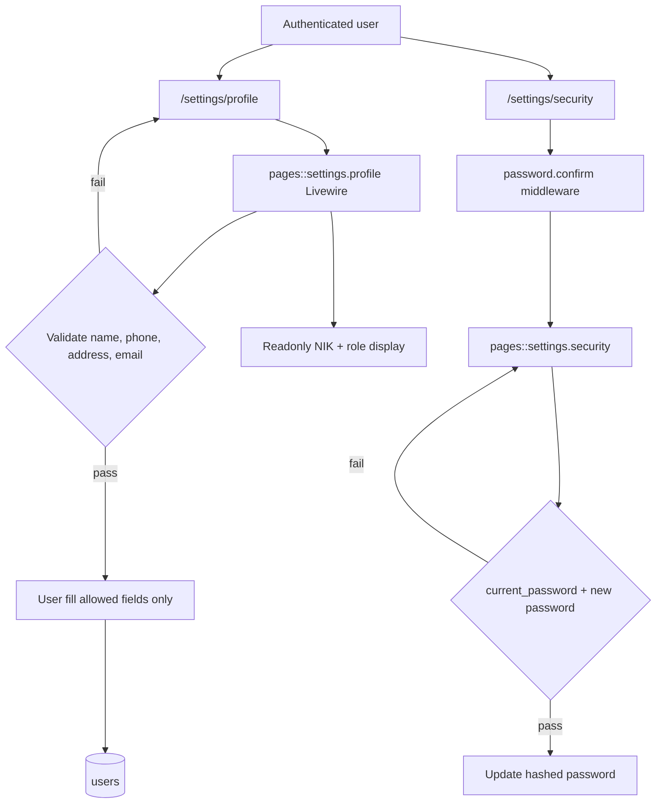
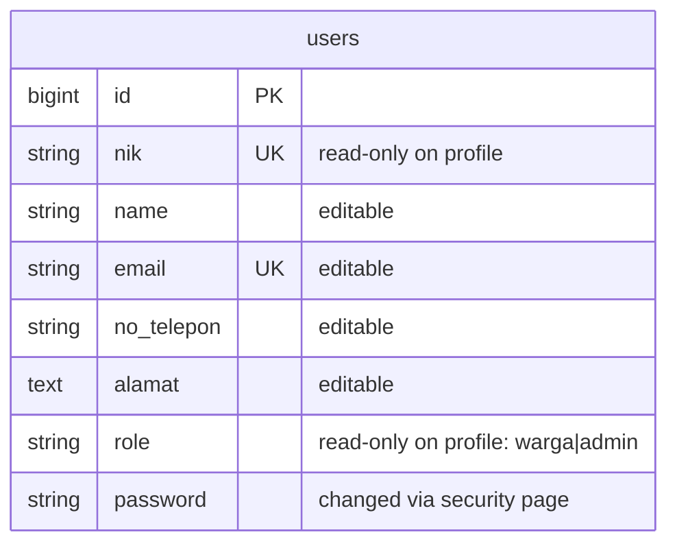

# Profile Management (US-1.4)

## Overview

Authenticated warga and admin users can view and update basic contact profile data (name, phone, address, email) from a shared settings page. NIK and role are displayed but locked so users cannot change them themselves. Password changes live on the security settings page and require the current password.

## Architecture Diagram

## Data Model

## Key Files

| Layer | File | Purpose |
|-------|------|---------|
| Livewire | `resources/views/pages/settings/⚡profile.blade.php` | Profile view/edit (NIK/role locked) |
| Livewire | `resources/views/pages/settings/⚡security.blade.php` | Change password + 2FA/passkeys scaffold |
| Validation | `app/Concerns/ProfileValidationRules.php` | `profileRules()` excludes NIK/role |
| Routes | `routes/settings.php` | `profile.edit`, `security.edit` |
| Layout | `resources/views/pages/settings/layout.blade.php` | Settings nav (Profil / Keamanan / Tampilan) |
| Feature tests | `tests/Feature/Settings/ProfileUpdateTest.php` | Pest coverage |
| Feature tests | `tests/Feature/Settings/SecurityTest.php` | Password update + confirmation |
| E2E | `e2e/profile.spec.ts` | Playwright coverage |

## Flow Explanation

1. **User triggers** — Opens Settings → Profil from the sidebar user menu.
2. **Request handling** — Livewire page component mounts current user fields; NIK/role use `#[Locked]` properties and readonly inputs.
3. **Business logic** — `updateProfileInformation()` validates editable fields only and fills those columns. Email changes clear `email_verified_at`.
4. **Password change** — User opens Keamanan (may confirm password first), submits current + new password; `current_password` rule enforces old-password verification.
5. **Response** — Flux toast success message; data persists on reload.

## API Endpoints (if applicable)

| Method | URI | Purpose | Auth |
|--------|-----|---------|------|
| GET | `/settings/profile` | Profile page | auth |
| GET | `/settings/security` | Password / security page | auth + verified + password.confirm |

Livewire actions handle updates in-page (no separate REST API).

## Decisions & Trade-offs

- NIK/role shown as readonly fields so the “cannot change yourself” rule is visible — see [ADR-004](../decisions/004-profile-password-reset-fortify.md).
- Password change kept on the existing security page (starter-kit pattern) rather than embedding it on the profile form.
- Delete-account / Appearance / 2FA / Passkeys remain from the starter kit; they are outside US-1.4 acceptance criteria and were left as-is.

## Related

- Scrum: `scrum-planning/Phase 01 - Authentication & Role Management.md` (US-1.4)
- User guide: [../../user-docs/guides/profile-management.md](../../user-docs/guides/profile-management.md)
- ADR: [004-profile-password-reset-fortify.md](../decisions/004-profile-password-reset-fortify.md)
- Role middleware note: settings/profile stay shared without `role:` middleware
