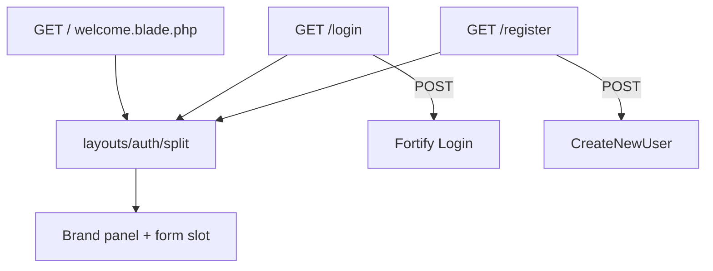

# Public Pages (Welcome, Login, Register)

## Overview

Guest-facing entry pages for **Pelayanan Surat Desa**: a branded welcome landing page plus Fortify login/register forms that share a split auth layout. Replaces the default Laravel welcome and generic dark auth shells with village-service branding.

## Architecture Diagram

## Data Model

No dedicated tables — uses existing `users` (see [citizen-registration.md](citizen-registration.md)).

## Key Files

| Layer | File | Purpose |
|-------|------|---------|
| View | `resources/views/welcome.blade.php` | Full-bleed branded landing |
| Layout | `resources/views/layouts/auth.blade.php` | Points to split layout |
| Layout | `resources/views/layouts/auth/split.blade.php` | Brand panel + form column |
| Views | `resources/views/pages/auth/login.blade.php` | Login form (Indonesian UI) |
| Views | `resources/views/pages/auth/register.blade.php` | Registration form |
| Theme | `resources/css/app.css` | Brand tokens + motion utilities |
| Fonts | `vite.config.js` | Instrument Sans + Fraunces |
| Icon | `resources/views/components/app-logo-icon.blade.php` | Document/seal mark |
| Tests | `tests/Feature/WelcomePageTest.php` | Guest/auth welcome assertions |
| E2E | `e2e/smoke.spec.ts` | Brand + login/register smoke |
| E2E | `e2e/public-pages.spec.ts` | Beranda ↔ login/register navigation |

## Flow Explanation

1. **User triggers** — Guest opens `/`, `/login`, or `/register`.
2. **Request handling** — Welcome is a Blade view route; login/register are Fortify views.
3. **Business logic** — Unchanged Fortify actions; only presentation redesign.
4. **Response** — Branded UI; login/register still keep e2e-tested copy (`Masuk ke akun Anda`, `Registrasi Akun Warga`). Covered by Pest `WelcomePageTest` and Playwright `smoke` + `public-pages`.

## API Endpoints (if applicable)

| Method | URI | Purpose | Auth |
|--------|-----|---------|------|
| GET | `/` | Welcome / beranda | guest or auth |
| GET | `/login` | Login form | guest |
| GET | `/register` | Register form | guest |

## Decisions & Trade-offs

- Forest green + saffron brand chosen over Laravel default red/dark shells — see [ADR-005](../decisions/005-public-pages-brand-redesign.md).
- Forced `class="dark"` removed from auth layouts so warga see a light, readable form.
- `APP_NAME` set to `Pelayanan Surat Desa` for brand-first hero copy.

## Related

- [Citizen registration](citizen-registration.md)
- [Role-based login](role-based-login.md)
- User guide: [../../user-docs/guides/public-pages.md](../../user-docs/guides/public-pages.md)
- ADR: [005-public-pages-brand-redesign.md](../decisions/005-public-pages-brand-redesign.md)
