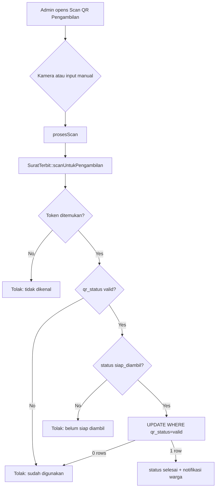
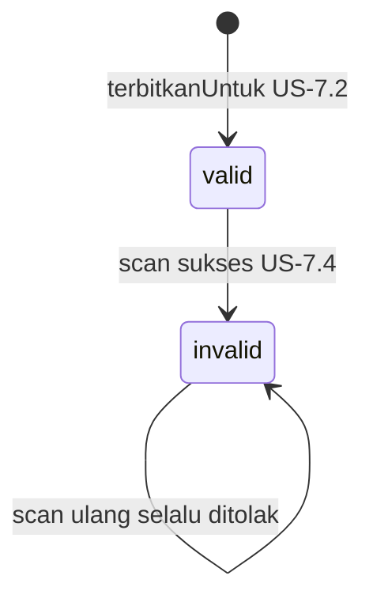
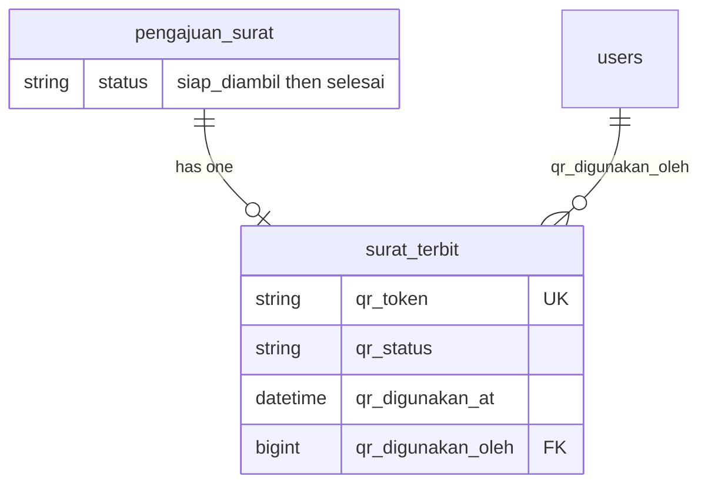

# QR Code Sekali Pakai (US-7.4)

## Overview

Each issued surat carries an opaque one-time `qr_token`. After the first successful pickup scan (pengajuan must be `siap_diambil` and `qr_status=valid`), the QR becomes permanently `invalid`, the pengajuan moves to `selesai`, and the warga receives an in-app notification. Re-scans always fail for every admin. There is no time-based TTL.

## Architecture Diagram

## Data Model

## Key Files

| Layer | File | Purpose |
|-------|------|---------|
| Model | `app/Models/SuratTerbit.php` | `scanUntukPengambilan`, token generate, no regenerate on re-issue |
| Livewire | `app/Livewire/Verifikasi/ScanQrPengambilan.php` | Admin scan page logic |
| Blade | `resources/views/livewire/verifikasi/scan-qr-pengambilan.blade.php` | Camera + manual token UI |
| Routes | `routes/web.php` | `scan-qr-pengambilan.index` under `role:admin` |
| Nav | `resources/views/layouts/app/sidebar.blade.php` | Sidebar link Scan QR Pengambilan |
| Feature tests | `tests/Feature/QrSekaliPakaiTest.php` | Success, rescan, unknown, not ready, concurrency, no TTL |
| E2E | `e2e/qr-sekali-pakai.spec.ts` | Browser flows for AC |

## Flow Explanation

1. **User triggers** — Admin opens **Scan QR Pengambilan**, scans via camera (`BarcodeDetector`) or pastes the opaque token manually.
2. **Request handling** — `ScanQrPengambilan::prosesScan` validates token length and calls the model.
3. **Business logic** — Inside a DB transaction: lock surat + pengajuan; reject unknown / already invalid / not `siap_diambil`; conditional `UPDATE ... WHERE qr_status = valid` sets `invalid`, `qr_digunakan_at`, `qr_digunakan_oleh`; set pengajuan `selesai`; create warga `Notifikasi`.
4. **Response** — Success/error toast + result panel; QR never returns to `valid` (including if PDF is re-issued via idempotent `terbitkanUntuk`).

## API Endpoints (if applicable)

| Method | URI | Purpose | Auth |
|--------|-----|---------|------|
| GET | `/admin/scan-qr-pengambilan` | Full-page Livewire scan UI | admin + verified |

Scan itself is a Livewire action (`prosesScan`), not a separate JSON API.

## Decisions & Trade-offs

- Conditional `WHERE qr_status = valid` is required by the plan for two-admin race safety (also uses `lockForUpdate`).
- No TTL: validity is scan-based only.
- Camera uses native `BarcodeDetector` (no new npm dependency); manual input always available for browsers without camera support and for E2E.
- Marking `siap_diambil` is US-7.5 (`SuratTerbit::tandaiSiapDiambil` + detail verifikasi UI).
- Token is opaque `Str::random(64)`, never plain NIK.

## Related

- [Generate Surat PDF (US-7.2)](generate-surat-pdf.md) — creates `qr_token` + PDF embedding
- [Migrasi Alur Status (US-7.1)](migrasi-alur-status.md)
- [Notifikasi & Riwayat Pengajuan](notifikasi-pengajuan.md)
- [ADR-017](../decisions/017-qr-sekali-pakai-conditional-update.md)
- Scrum: `scrum-planning/Phase 07 - Penerbitan Surat Keterangan.md` US-7.4
