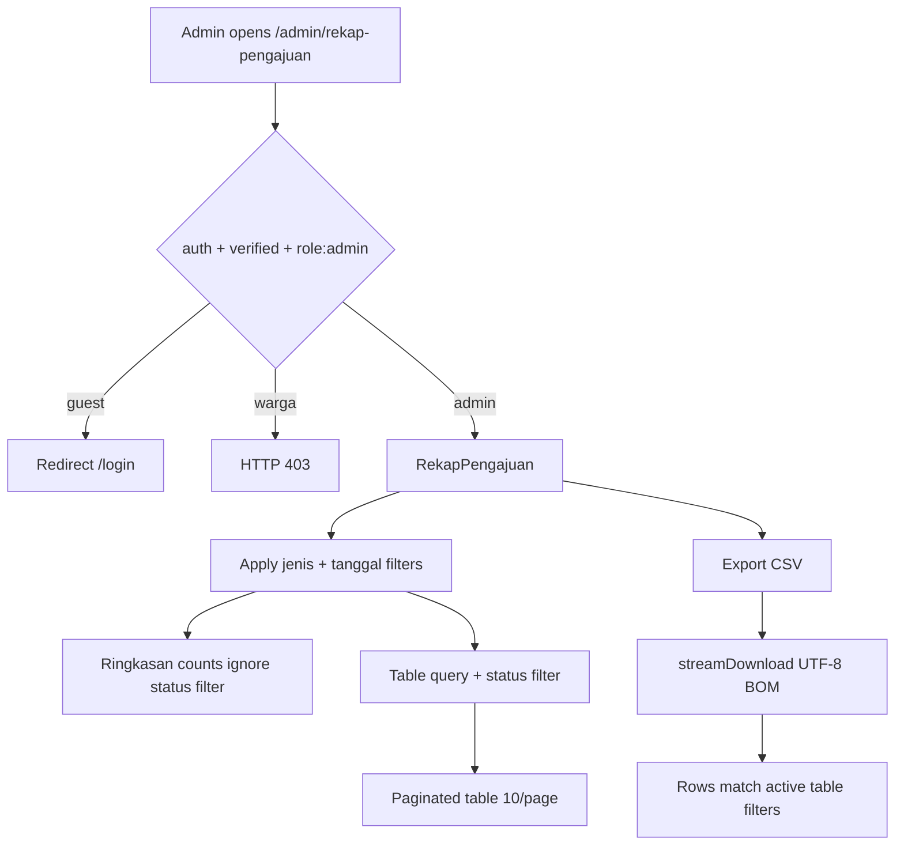
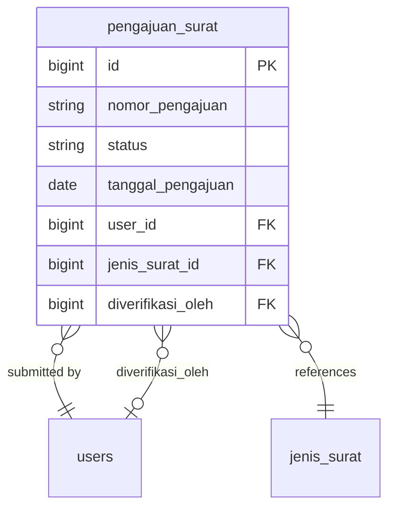

# Rekap Pengajuan & Reporting (US-6.1 – US-6.2)

## Overview

Admin/petugas desa view a filterable recap of all letter submissions (`pengajuan_surat`) as a digital replacement for the manual register book. US-6.1 provides summary counts, filters (jenis surat, status, date range), paginated table, and columns including the verifying admin. US-6.2 exports the currently filtered rows as CSV (UTF-8 with BOM).

US-7.1 extended status filters and ringkasan cards with `siap_diambil` and `selesai`. Columns `nomor_surat` / `tanggal_terbit` / QR remain for US-7.7.

## Architecture Diagram

## Data Model

No new tables for Phase 06. Indexes added for filter performance: `status`, composite `(jenis_surat_id, status, tanggal_pengajuan)`.

## Key Files

| Layer | File | Purpose |
|-------|------|---------|
| Livewire | `app/Livewire/Rekap/RekapPengajuan.php` | Filters, summary, pagination, CSV export |
| Blade | `resources/views/livewire/rekap/rekap-pengajuan.blade.php` | Admin rekap UI |
| Route | `routes/web.php` | `rekap-pengajuan.index` under `role:admin` |
| Migration | `database/migrations/2026_08_06_153014_add_rekap_indexes_to_pengajuan_surat_table.php` | Rekap filter indexes |
| Feature tests | `tests/Feature/RekapPengajuanTest.php` | Auth, filters, summary, export |
| E2E | `e2e/rekap-pengajuan.spec.ts` | Playwright coverage for US-6.1/6.2 |

## Flow Explanation

1. **User triggers** — Admin opens sidebar **Rekap Pengajuan** (`/admin/rekap-pengajuan`).
2. **Request handling** — Middleware `auth` + `verified` + `role:admin`.
3. **Business logic** — `filteredQuery()` applies jenis, status, and date range to the table; `summaryQuery()` applies jenis + date only for ringkasan cards (status filter ignored). Invalid date range (`sampai` < `dari`) shows a validation error and empty results.
4. **Response** — Paginated Flux table with nomor, nama warga, jenis surat, tanggal, status badge, admin verifikator. **Export CSV** streams filtered rows with a UTF-8 BOM header.

## API Endpoints (if applicable)

| Method | URI | Purpose | Auth |
|--------|-----|---------|------|
| GET | `/admin/rekap-pengajuan` | Full-page Livewire rekap | admin |
| — | Livewire `exportCsv` | Stream CSV download | admin (same page) |

No public JSON API.

## Decisions & Trade-offs

- Ringkasan ignores status filter so changing status still shows volume by jenis/date — see [ADR-013](../decisions/013-rekap-summary-filters-and-csv-bom.md).
- Ringkasan cards include `siap_diambil` and `selesai` (US-7.1).
- CSV via Livewire `streamDownload` (no separate controller) to keep 1 route = 1 component.
- `nomor_surat` / `tanggal_terbit` columns deferred to Phase 07 US-7.7.

## Related

- [Verifikasi Pengajuan](verifikasi-pengajuan.md) — source of status + `diverifikasi_oleh`
- [Migrasi Alur Status (US-7.1)](migrasi-alur-status.md)
- [Form Pengajuan Surat](pengajuan-surat-form.md) — data source
- [Rekap Timeline Detail (US-8.7)](rekap-timeline.md) — detail page + process timeline
- [ADR-013](../decisions/013-rekap-summary-filters-and-csv-bom.md)
- [ADR-014](../decisions/014-status-flow-migration-us-7-1.md)
- Phase 07 — penerbitan surat columns on this page
- Phase 08 US-8.7 — detail timeline extension (does not change list table columns)