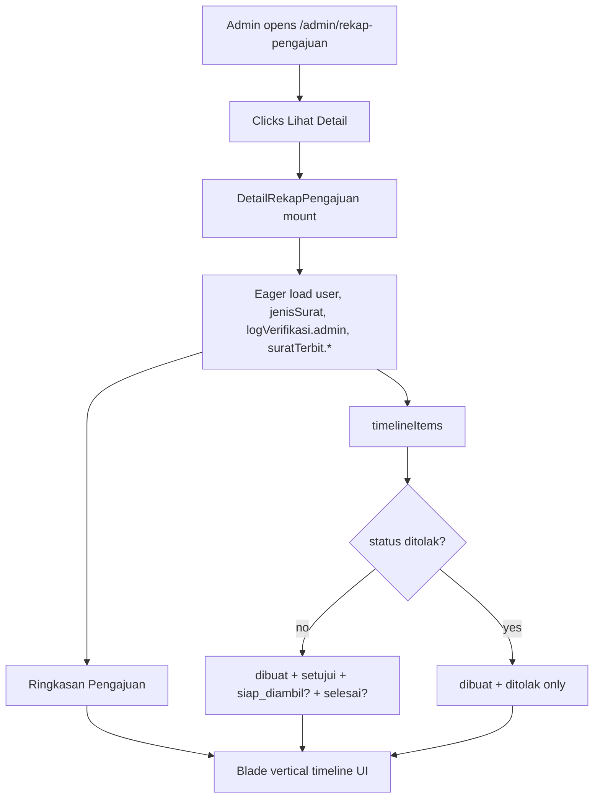
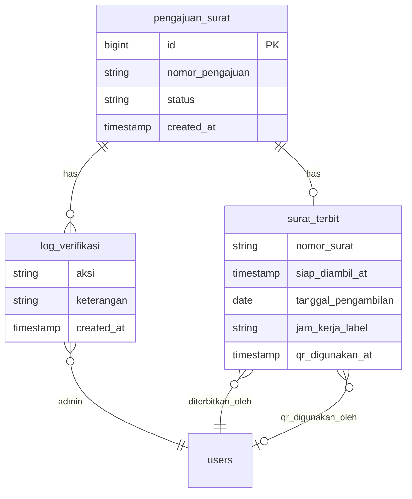

# Rekap Timeline Detail (US-8.7)

## Overview

Admin can open any row in Rekap Pengajuan and view a courier-style chronological process timeline for that submission — from creation through approval/rejection, ready-for-pickup, and QR completion. Only events that have already occurred are shown (future steps are omitted, not greyed out).

## Architecture Diagram

## Data Model

No new tables. Timeline is reconstructed from existing relations. Legacy rows without `siap_diambil_at` fall back to `surat_terbit.updated_at` (marked as estimasi).

## Key Files

| Layer | File | Purpose |
|-------|------|---------|
| Livewire | `app/Livewire/Rekap/DetailRekapPengajuan.php` | Detail page + `timelineItems()` builder |
| Blade | `resources/views/livewire/rekap/detail-rekap-pengajuan.blade.php` | Ringkasan + vertical timeline UI |
| Blade (list) | `resources/views/livewire/rekap/rekap-pengajuan.blade.php` | Adds **Lihat Detail** column |
| Route | `routes/web.php` | `rekap-pengajuan.show` → `/admin/rekap-pengajuan/{pengajuan}` |
| Feature tests | `tests/Feature/DetailRekapPengajuanTest.php` | Auth, timeline cases, PDF gate |
| E2E | `e2e/rekap-timeline.spec.ts` | Playwright coverage for US-8.7 |

## Flow Explanation

1. **User triggers** — Admin clicks **Lihat Detail** on a rekap table row.
2. **Request handling** — `auth` + `verified` + `role:admin`; route model binding loads `PengajuanSurat`.
3. **Business logic** — `timelineItems()` builds only occurred steps:
   - Created (`pengajuan_surat.created_at`, aktor: Sistem)
   - Approved & processed (`log_verifikasi` aksi=setujui + nomor surat)
   - Rejected (`log_verifikasi` aksi=tolak) — stops here when rejected
   - Ready for pickup (`siap_diambil_at` or `updated_at` fallback)
   - Completed (`qr_digunakan_at` + `qr_digunakan_oleh`)
4. **Response** — Ringkasan + vertical timeline; **Unduh PDF Surat** when `surat_terbit` exists and `pastikanFilePdf()` succeeds (lazy regen if file missing); **Kembali ke Rekap**.

## API Endpoints (if applicable)

| Method | URI | Purpose | Auth |
|--------|-----|---------|------|
| GET | `/admin/rekap-pengajuan/{pengajuan}` | Full-page detail + timeline | admin |
| GET | `/admin/surat-diproses/{pengajuan}/pdf/unduh` | PDF download (reused) | admin |

No public JSON API.

## Decisions & Trade-offs

- Route uses `/admin/rekap-pengajuan/{pengajuan}` (existing naming) rather than the plan’s literal `/admin/rekap/{id}` — see [ADR-023](../decisions/023-rekap-timeline-detail-page.md).
- Siap-diambil actor uses `diterbitkan_oleh` (fallback `diverifikasi_oleh`) because the plan’s data model does not add `siap_diambil_oleh`.
- Timeline logic lives in the Livewire component (no service class) per project architecture convention.

## Related

- [Rekap Pengajuan & Reporting](rekap-pengajuan.md)
- [Surat Diproses](surat-diproses.md)
- [QR Sekali Pakai](qr-sekali-pakai.md)
- [Unduh/Cetak Surat Warga](unduh-surat-warga.md)
- [ADR-023](../decisions/023-rekap-timeline-detail-page.md)
- [ADR-024](../decisions/024-hybrid-pdf-lazy-regenerate.md)
- Phase 08 US-8.7
