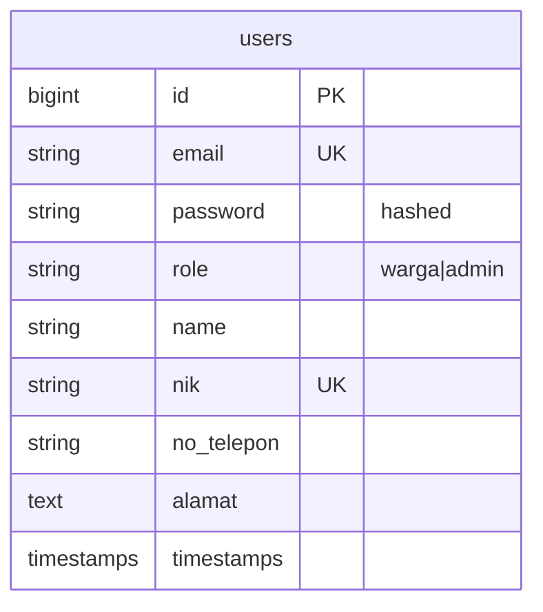

# Role-Based Login (US-1.2)

## Overview

Authenticates warga and admin users with email/password via Laravel Fortify, then redirects each user to a role-specific dashboard. Failed attempts show a generic credential error (email bag only). Logout is available from both dashboards through the shared app layout.

## Architecture Diagram

```mermaid
flowchart TD
    A[Guest opens /login] --> B[login.blade.php]
    B -->|POST /login| C[Fortify AuthenticatedSessionController]
    C --> D{Credentials valid?}
    D -->|no| E[Generic error on email field]
    E --> B
    D -->|yes| F[LoginResponse]
    F --> G{User role}
    G -->|warga| H[/dashboard Dashboard Warga]
    G -->|admin| I[/admin/dashboard Dashboard Admin]
    H --> J[Logout via POST /logout]
    I --> J
    J --> K[Redirect /]
```

## Data Model



Login does not alter the schema; it reads `email`, `password`, and `role` from `users`.

## Key Files

| Layer | File | Purpose |
|-------|------|---------|
| Response | `app/Http/Responses/LoginResponse.php` | Role-based redirect after login |
| Provider | `app/Providers/FortifyServiceProvider.php` | Binds LoginResponse |
| Model | `app/Models/User.php` | `isWarga()`, `isAdmin()`, `homeRouteName()` |
| Bootstrap | `bootstrap/app.php` | Authenticated-user redirect by role |
| Routes | `routes/web.php` | `dashboard` + `dashboard.admin` |
| View | `resources/views/pages/auth/login.blade.php` | Login form (Indonesian UI) |
| Layout | `resources/views/layouts/auth/split.blade.php` | Shared branded auth shell |
| View | `resources/views/dashboard.blade.php` | Dashboard Warga |
| View | `resources/views/admin/dashboard.blade.php` | Dashboard Admin |
| Feature tests | `tests/Feature/Auth/AuthenticationTest.php` | Pest coverage |
| E2E | `e2e/login.spec.ts` | Playwright coverage |

## Flow Explanation

1. **User triggers** — Guest visits `/login` and submits email + password.
2. **Request handling** — Fortify authenticates against the `web` guard (email username).
3. **Business logic** — On success, `LoginResponse` resolves `User::homeRouteName()` (`dashboard` for warga, `dashboard.admin` for admin) and redirects via `intended()`.
4. **Response** — On failure, Fortify returns a generic `auth.failed` message on the `email` field (does not reveal which field was wrong). Logout uses Fortify `POST /logout` from the layout menu.

## API Endpoints (if applicable)

| Method | URI | Purpose | Auth |
|--------|-----|---------|------|
| GET | `/login` | Show login form | guest |
| POST | `/login` | Authenticate | guest |
| POST | `/logout` | End session | auth |
| GET | `/dashboard` | Dashboard Warga | auth |
| GET | `/admin/dashboard` | Dashboard Admin | auth |

## Decisions & Trade-offs

- Custom `LoginResponse` instead of a single `fortify.home` path — see [ADR-002](../decisions/002-role-based-login-redirect.md).
- Route name `dashboard` kept for warga (not renamed to `dashboard.warga`) to limit churn in existing links/tests.
- Cross-role route blocking is implemented in **US-1.3** — see [role-middleware.md](role-middleware.md).

## Related

- Scrum: `scrum-planning/Phase 01 - Authentication & Role Management.md` (US-1.2)
- User guide: [../../user-docs/guides/role-based-login.md](../../user-docs/guides/role-based-login.md)
- Prior feature: [citizen-registration.md](citizen-registration.md)
- ADR: [002-role-based-login-redirect.md](../decisions/002-role-based-login-redirect.md)
