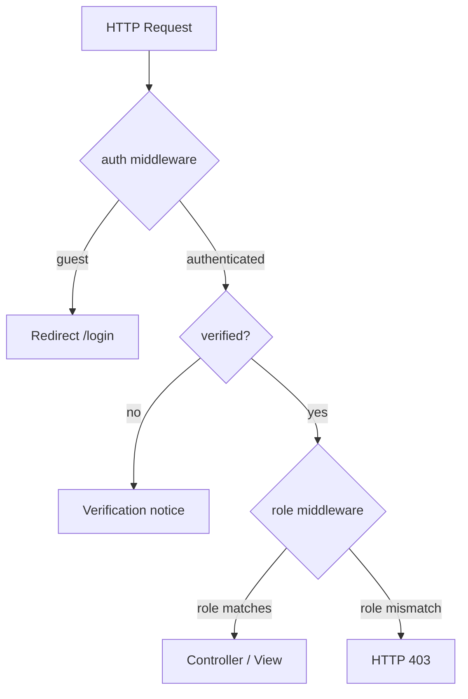
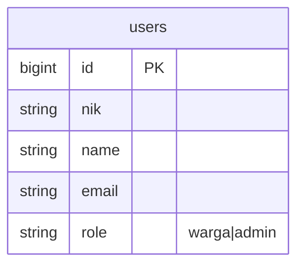

# Role-Based Middleware (US-1.3)

## Overview

Protects authenticated routes by user `role` (`warga` | `admin`). Warga cannot open admin pages; admin cannot open the warga-only dashboard. Guests hitting auth-protected routes are redirected to login by Laravel’s `auth` middleware. Unauthorized authenticated users receive HTTP **403**.

## Architecture Diagram

## Data Model

Role checks read `users.role` only; no new tables.

## Key Files

| Layer | File | Purpose |
|-------|------|---------|
| Middleware | `app/Http/Middleware/EnsureUserHasRole.php` | Abort 403 unless user role is allowed |
| Bootstrap | `bootstrap/app.php` | Registers alias `role` |
| Routes | `routes/web.php` | `role:warga` on `/dashboard`; `role:admin` group under `/admin`; `/persyaratan-dokumen` is public (US-2.3) |
| Settings | `routes/settings.php` | Shared auth routes — **no** role middleware |
| Model helpers | `app/Models/User.php` | `isWarga()`, `isAdmin()`, `homeRouteName()` |
| Pest | `tests/Feature/RoleMiddlewareTest.php` | Feature coverage |
| Playwright | `e2e/role-middleware.spec.ts` | E2E role gate + guest + shared profile |

## Flow Explanation

1. **User triggers** — navigates to `/dashboard` or `/admin/dashboard` (or a future admin route in the `role:admin` group).
2. **Request handling** — `auth` runs first (guests → login). Then `verified` if applied. Then `role:{allowed}`.
3. **Business logic** — `EnsureUserHasRole` compares `$user->role` to the middleware parameters (supports comma-separated roles).
4. **Response** — matching role continues to the view; mismatch aborts with **403**.

## API Endpoints (if applicable)

No JSON API. Session web routes only:

| Method | URI | Purpose | Auth |
|--------|-----|---------|------|
| GET | `/dashboard` | Dashboard Warga | auth + verified + role:warga |
| GET | `/persyaratan-dokumen` | Persyaratan dokumen (US-2.2 + US-2.3) | Public (no auth) |
| GET | `/admin/dashboard` | Dashboard Admin | auth + verified + role:admin |
| GET | `/admin/jenis-surat` | Kelola jenis surat (US-2.1) | auth + verified + role:admin |
| GET | `/settings/profile` | Profil bersama | auth (no role gate) |

## Decisions & Trade-offs

- **403 over redirect** — clearer authorization failure; chosen explicitly for US-1.3 (see ADR-003).
- **Admin feature routes join `role:admin`** — US-2.1 `/admin/jenis-surat` is in the same group as dashboard admin (no parallel auth pattern).
- **Settings stay shared** — profile/security/appearance usable by both roles (US-1.4).
- **Public persyaratan list** — `/persyaratan-dokumen` is excluded from auth middleware (US-2.3 / ADR-008).

## Related

- Feature: [role-based-login.md](role-based-login.md)
- User guide: [../../user-docs/guides/role-middleware.md](../../user-docs/guides/role-middleware.md)
- ADR: [003-role-middleware-403.md](../decisions/003-role-middleware-403.md)
- Plan: `scrum-planning/Phase 01 - Authentication & Role Management.md` (US-1.3)
