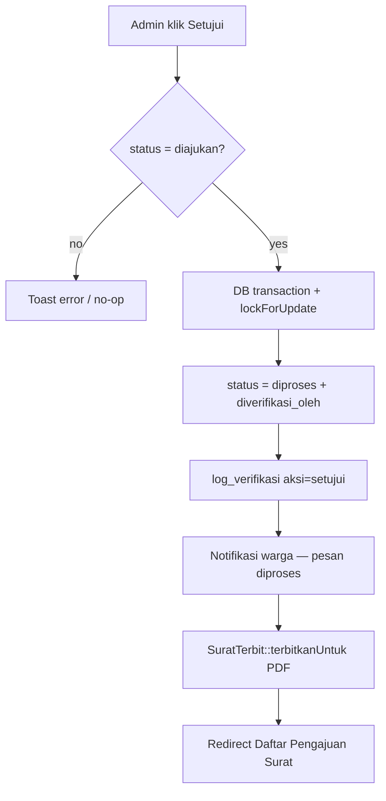
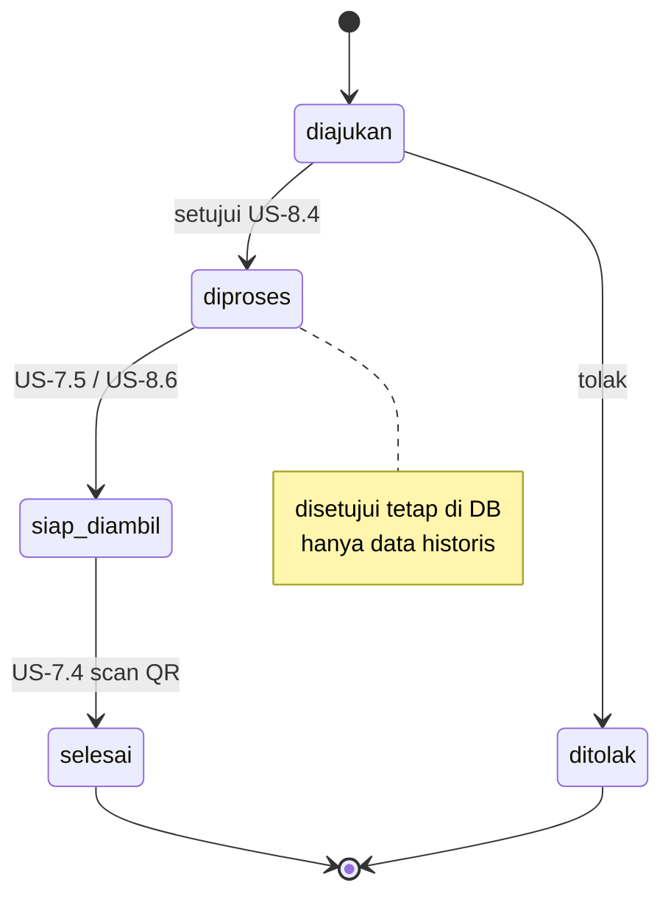
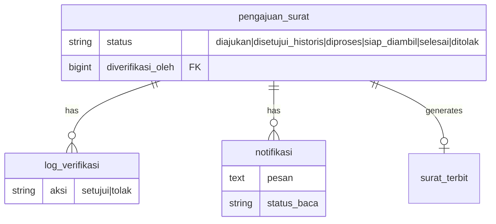

# Alur Setujui Langsung Diproses (US-8.4)

## Overview

US-8.4 collapses the Phase 07 intermediate approve flow. Clicking **Setujui** sets `pengajuan_surat.status` to **`diproses` in one atomic transaction** (no write of `disetujui`), writes `log_verifikasi` with `aksi=setujui`, generates the PDF via US-7.2, and sends a **single** in-app notification to the warga. Enum value `disetujui` remains in the database for historical rows only.

## Architecture Diagram





## Data Model



`PengajuanSurat::statusLabel('disetujui')` returns **"Diproses"** so warga/admin badges never surface the intermediate label on legacy rows. Filter option keeps **"Disetujui (historis)"** for admin/rekap filtering.

## Key Files

| Layer | File | Purpose |
|-------|------|---------|
| Livewire | `app/Livewire/Verifikasi/DetailPengajuanVerifikasi.php` | `setujui()` atomic diproses + notif + PDF |
| Model | `app/Models/PengajuanSurat.php` | Status constants, label mapping for historis |
| Pest | `tests/Feature/VerifikasiPengajuanTest.php` | Approve → diproses + rename heading |
| Pest | `tests/Feature/NotifikasiPengajuanTest.php` | Single diproses notification message |
| Playwright | `e2e/verifikasi-pengajuan.spec.ts` | US-8.4 E2E + edge case |
| Playwright | `e2e/notifikasi-pengajuan.spec.ts` | Unread count = 1 + pesan AC |

## Flow Explanation

1. **User triggers** — admin clicks **Setujui** on `/admin/verifikasi/{id}` while status is `diajukan`.
2. **Request handling** — Livewire `setujui()`; `canVerify()` gates non-`diajukan`.
3. **Business logic** — under `lockForUpdate`: set `diproses`, log `setujui`, create one `Notifikasi` with AC message, call `triggerGenerateSurat()`.
4. **Response** — toast success; redirect to daftar (default filter `diajukan` so the row disappears). Listing on future **Surat Diproses** page is owned by US-8.5.

### Notification message (diproses)

```
Pengajuan {jenis_surat} Anda (#{nomor_pengajuan}) sedang diproses. Surat Anda sedang disiapkan.
```

Reject notification wording is unchanged from Phase 05/07.

## API Endpoints (if applicable)

No new HTTP API. Same Livewire routes.

## Decisions & Trade-offs

- Intermediate `disetujui` write removed to match Phase 08 target flow and avoid double notifications.
- Historical `disetujui` rows keep the DB value; UI label maps to Diproses (risk mitigation in Phase 08 plan).
- Appearance in dedicated **Surat Diproses** page is owned by US-8.5/8.6 — see [surat-diproses.md](surat-diproses.md).

## Related

- [migrasi-alur-status.md](migrasi-alur-status.md) (superseded flow details)
- [verifikasi-pengajuan.md](verifikasi-pengajuan.md)
- [notifikasi-pengajuan.md](notifikasi-pengajuan.md)
- [generate-surat-pdf.md](generate-surat-pdf.md)
- [ADR-020](../decisions/020-setujui-langsung-diproses-us-8-4.md) (supersedes ADR-014 approve path)
