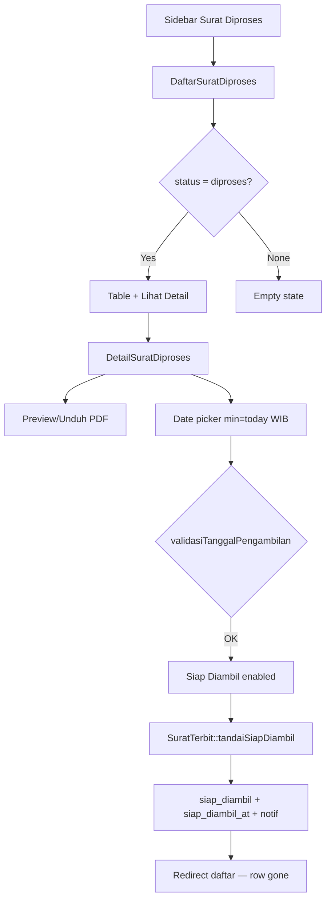
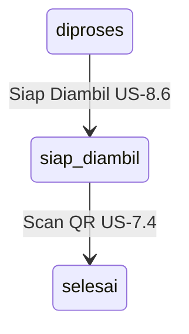
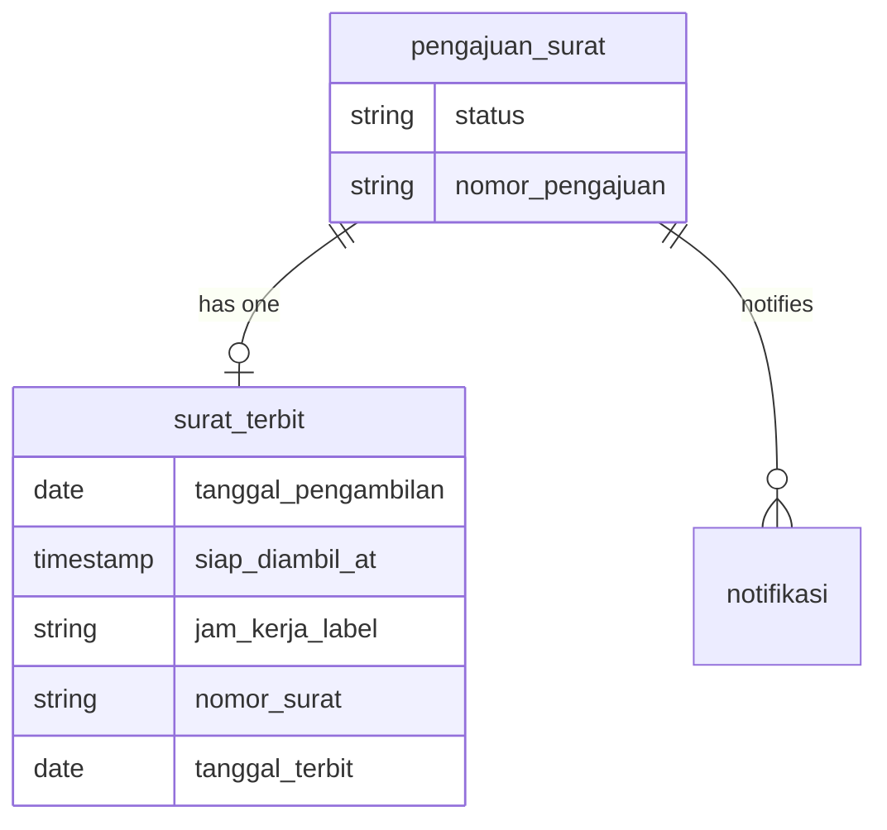

# Surat Diproses — Daftar & Detail (US-8.5 & US-8.6)

## Overview

Admin gets a dedicated **Surat Diproses** menu for submissions already in `diproses` (PDF generated). From the detail page they set a pickup date (today or future, weekday, not national holiday), mark **Siap Diambil**, which writes `tanggal_pengambilan`, `jam_kerja_label`, and `siap_diambil_at`, notifies the warga, and removes the row from this list. This relocates the US-7.5 UI off verifikasi detail.

## Architecture Diagram

## Data Model

## Key Files

| Layer | File | Purpose |
|-------|------|---------|
| Livewire | `app/Livewire/SuratDiproses/DaftarSuratDiproses.php` | List `diproses` only + pagination |
| Livewire | `app/Livewire/SuratDiproses/DetailSuratDiproses.php` | Detail, date validation, Siap Diambil |
| Blade | `resources/views/livewire/surat-diproses/*.blade.php` | List + detail UI |
| Model | `app/Models/SuratTerbit.php` | `tandaiSiapDiambil` + `siap_diambil_at` |
| Migration | `database/migrations/2026_08_06_195429_add_siap_diambil_at_to_surat_terbit_table.php` | New column |
| Routes | `routes/web.php` | `/admin/surat-diproses` + PDF routes |
| Layout | `resources/views/layouts/app/sidebar.blade.php` | Menu under Daftar Pengajuan Surat |
| Pest | `tests/Feature/SuratDiprosesTest.php`, `DetailSuratDiprosesTest.php`, `SiapDiambilAtTest.php` | Feature coverage |
| Playwright | `e2e/surat-diproses.spec.ts` | E2E US-8.5/8.6 |

## Flow Explanation

1. **User triggers** — Admin opens **Surat Diproses** from sidebar (`role:admin`).
2. **List** — Query `pengajuan_surat` where `status=diproses`, eager-load warga, jenis, `suratTerbit`; paginate 10.
3. **Detail** — Shows warga/NIK/jenis/nomor surat/keperluan; iframe PDF via `surat-diproses.pdf.show` (calls `pastikanFilePdf()` so missing files are regenerated without a new QR).
4. **Date** — Client `min` = today Asia/Jakarta; server `after_or_equal` WIB today + `validasiTanggalPengambilan` (weekend/holiday/past).
5. **Siap Diambil** — Atomic update status → `siap_diambil`, store pickup fields + `siap_diambil_at`, create notifikasi with AC US-8.6 message, redirect to list.
6. **Post-status** — If already `siap_diambil`/`selesai`, form hidden; status info shown.

## API Endpoints (if applicable)

| Method | URI | Purpose | Auth |
|--------|-----|---------|------|
| GET | `/admin/surat-diproses` | List Livewire page | admin |
| GET | `/admin/surat-diproses/{id}` | Detail Livewire page | admin |
| GET | `/admin/surat-diproses/{id}/pdf` | Inline PDF preview (hybrid) | admin |
| GET | `/admin/surat-diproses/{id}/pdf/unduh` | PDF download (hybrid) | admin |

## Decisions & Trade-offs

- Relocate siap-diambil UI from verifikasi detail so “review new” and “finish in-progress” stay separate (Phase 08 goal).
- `after_or_equal` uses explicit WIB date string because `APP_TIMEZONE` is UTC.
- `siap_diambil_at` added now for US-8.7 timeline accuracy.
- PDF preview/download shares `SuratTerbit::pastikanFilePdf()` with warga unduh (ADR-024).

## Related

- [Dokumen Siap Diambil (US-7.5)](dokumen-siap-diambil.md) — domain logic retained; UI relocated here
- [Setujui Langsung Diproses (US-8.4)](setujui-langsung-diproses.md) — feeds this list
- [Unduh/Cetak Surat Warga (US-7.6)](unduh-surat-warga.md)
- [ADR-021](../decisions/021-surat-diproses-page-and-siap-diambil-at.md)
- [ADR-024](../decisions/024-hybrid-pdf-lazy-regenerate.md)
