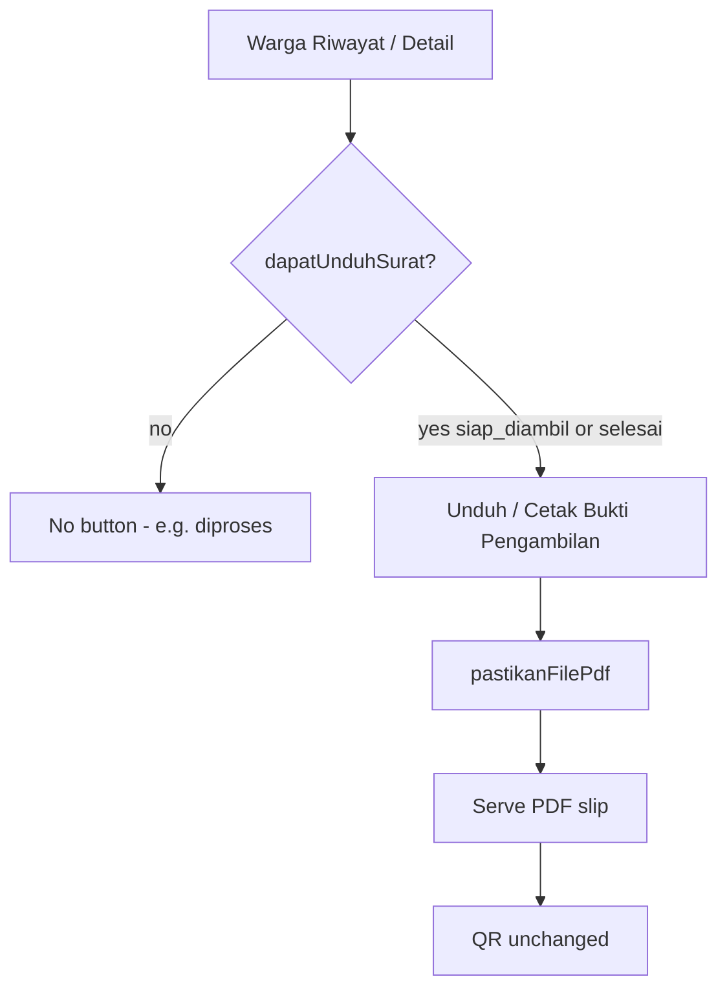

# Unduh/Cetak Bukti Pengambilan (US-7.6)

## Overview

After admin marks a submission **Siap Diambil**, warga can download or print a **Bukti Pengambilan Berkas** PDF (pickup slip with QR). This is **not** an official surat keterangan. Re-download keeps the same QR token. Unduh is **not** available while status is still `diproses`.

## Architecture Diagram

## Key Files

| Layer | File | Purpose |
|-------|------|---------|
| Model | `PengajuanSurat` | `statusBolehUnduhSurat()` = siap_diambil, selesai |
| Model | `SuratTerbit` | bukti template, `regenerasiFilePdf`, `pastikanFilePdf` |
| Model | `PengaturanDesa` | Kop identitas for PDF |
| Routes | `pengajuan-surat.unduh-surat` / `cetak-surat` | Warga download/inline |
| E2E | `e2e/unduh-surat-warga.spec.ts` | Browser coverage |

## Flow Explanation

1. Admin approves → PDF slip generated (jadwal “Belum ditetapkan”) for office preview.
2. Admin Siap Diambil → PDF regenerated with tanggal/jam; warga may unduh.
3. Warga clicks Unduh/Cetak Bukti Pengambilan → owner + status gate → hybrid serve/regen.

## Related

- [ADR-025](../decisions/025-bukti-pengambilan-dan-pengaturan-desa.md)
- [ADR-024](../decisions/024-hybrid-pdf-lazy-regenerate.md)
- [Generate Surat PDF](generate-surat-pdf.md) (now bukti slip on approve)
