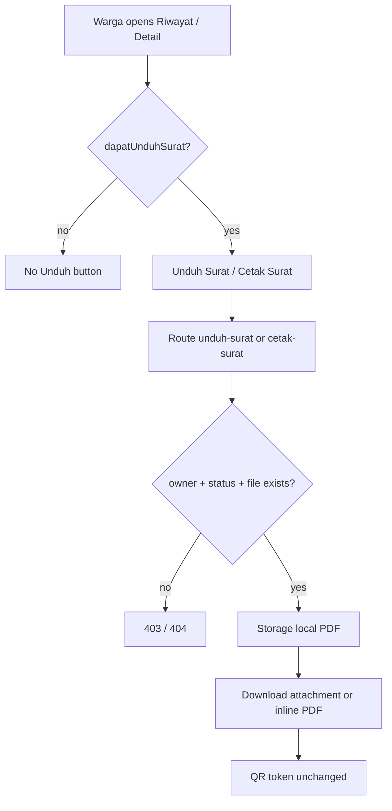
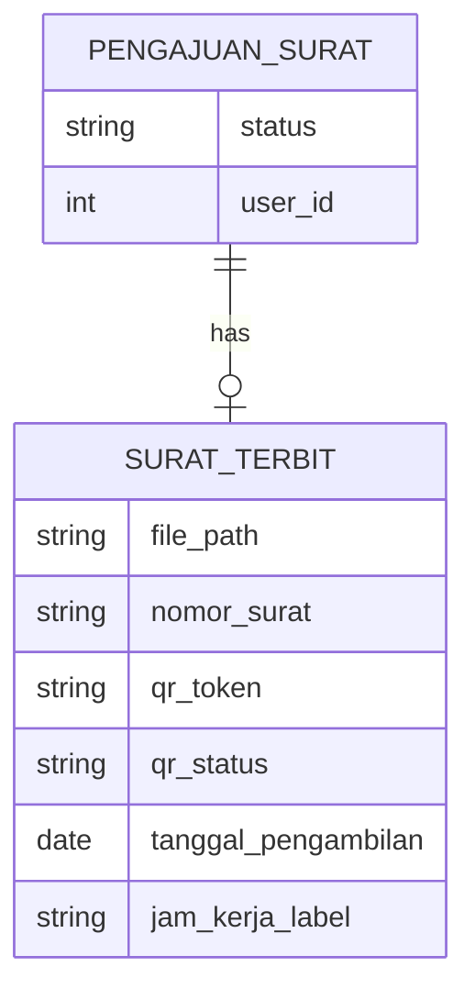

# Unduh/Cetak Surat oleh Warga (US-7.6)

## Overview

After a submission reaches `diproses` (PDF already generated), warga can download or print the issued surat PDF from riwayat and detail pages. Re-download always serves the same stored file and **does not** regenerate the one-time QR token. When pickup has been scheduled (US-7.5), the warga detail page also shows `tanggal_pengambilan` and `jam_kerja_label`.

## Architecture Diagram

## Data Model

## Key Files

| Layer | File | Purpose |
|-------|------|---------|
| Model | `app/Models/PengajuanSurat.php` | `dapatUnduhSurat()` / `statusBolehUnduhSurat()` |
| Routes | `routes/web.php` | `pengajuan-surat.unduh-surat`, `pengajuan-surat.cetak-surat` |
| Livewire | `app/Livewire/Pengajuan/RiwayatPengajuan.php` | Eager-load suratTerbit for Unduh button |
| Blade | `resources/views/livewire/pengajuan/riwayat-pengajuan.blade.php` | Unduh Surat on allowed rows |
| Livewire | `app/Livewire/Pengajuan/DetailPengajuanWarga.php` | Load suratTerbit for detail UI |
| Blade | `resources/views/livewire/pengajuan/detail-pengajuan-warga.blade.php` | Tanggal/jam + Unduh/Cetak |
| Pest | `tests/Feature/UnduhSuratWargaTest.php` | Auth, status, re-download, UI |
| E2E | `e2e/unduh-surat-warga.spec.ts` | Browser download + edge 403 |

## Flow Explanation

1. **User triggers** — Warga clicks **Unduh Surat** on riwayat (status `diproses` / `siap_diambil` / `selesai`) or **Unduh Surat** / **Cetak Surat** on detail.
2. **Request handling** — Route under `auth` + `verified` + `role:warga`. Abort unless `user_id` matches and `dapatUnduhSurat()`; abort 404 if PDF missing on `local` disk.
3. **Business logic** — Stream existing `surat_terbit.file_path` only. No write to `qr_token` / `qr_status`.
4. **Response** — Unduh: `Storage::download` (attachment). Cetak: `Storage::response` with `application/pdf` (inline, new tab).

## API Endpoints (if applicable)

| Method | URI | Purpose | Auth |
|--------|-----|---------|------|
| GET | `/pengajuan-surat/{pengajuan}/unduh-surat` | Download PDF attachment | warga (owner) |
| GET | `/pengajuan-surat/{pengajuan}/cetak-surat` | Inline PDF for print | warga (owner) |

## Decisions & Trade-offs

- Route closures mirror admin dokumen download (US-4.2) — flat, no controller/service layer.
- Cetak is a separate inline response (story title Unduh/Cetak); no future story owned print-only UX.
- Detail also exposes Unduh/Cetak even though AC text highlights riwayat rows — needed for tanggal/jam AC on the same page and no later story owns detail download.
- Admin surat PDF download remains out of warga routes; rekap columns stay US-7.7.

## Related

- [Generate Surat PDF (US-7.2)](generate-surat-pdf.md)
- [Dokumen Siap Diambil (US-7.5)](dokumen-siap-diambil.md)
- [QR Code Sekali Pakai (US-7.4)](qr-sekali-pakai.md)
- [ADR-019: Warga unduh/cetak existing PDF](../decisions/019-warga-unduh-cetak-existing-pdf.md)
