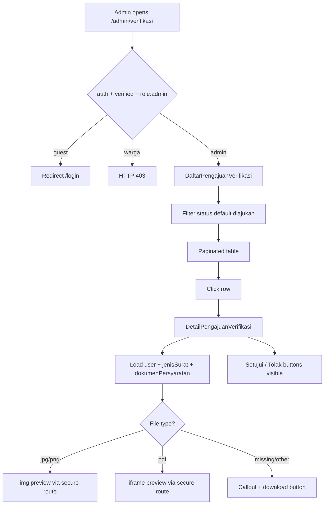
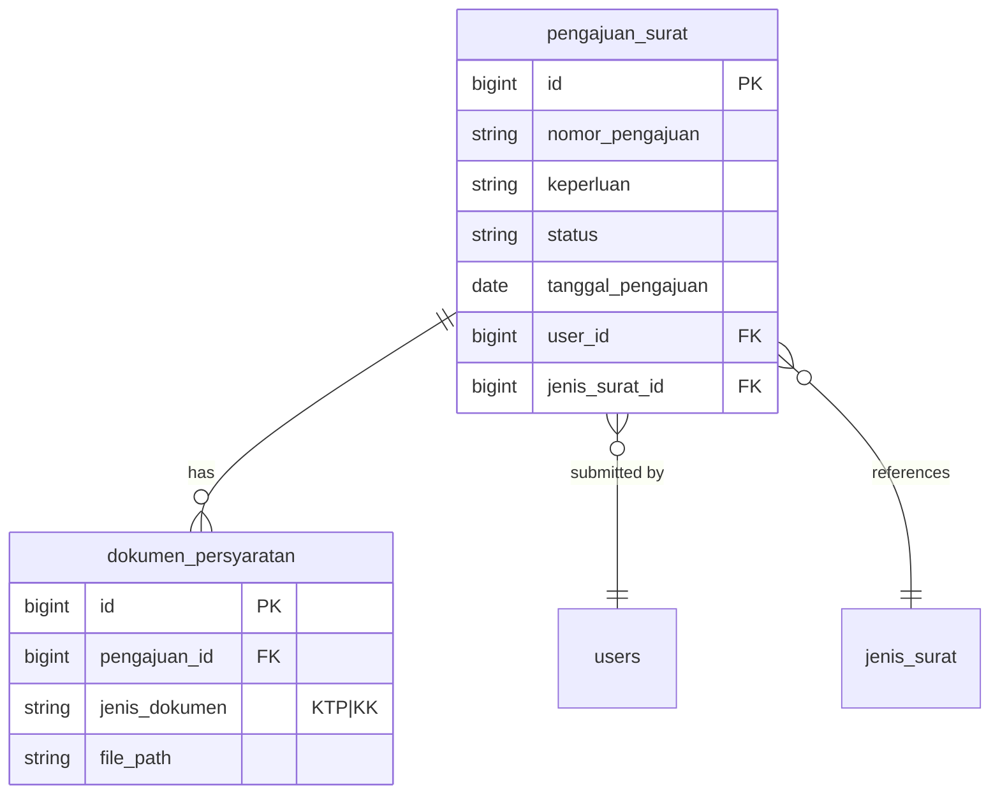

# Verifikasi Pengajuan (US-4.1 & US-4.2)

## Overview

Admin/petugas desa review submitted letter requests (`pengajuan_surat`) with status `diajukan`. US-4.1 provides a filterable list (default `diajukan`) with nomor, warga name, jenis surat, and tanggal. US-4.2 provides a detail page with full submission data, inline KTP/KK preview (image/PDF), download fallback, and visible Setujui/Tolak buttons (action logic deferred to US-4.3).

## Architecture Diagram

## Data Model

## Key Files

| Layer | File | Purpose |
|-------|------|---------|
| Livewire | `app/Livewire/Verifikasi/DaftarPengajuanVerifikasi.php` | List + status filter + row navigation |
| Blade | `resources/views/livewire/verifikasi/daftar-pengajuan-verifikasi.blade.php` | Admin list UI |
| Livewire | `app/Livewire/Verifikasi/DetailPengajuanVerifikasi.php` | Detail data + preview helpers |
| Blade | `resources/views/livewire/verifikasi/detail-pengajuan-verifikasi.blade.php` | Detail UI + document preview |
| Routes | `routes/web.php` | `verifikasi.index`, `verifikasi.show`, dokumen show/download |
| Nav | `resources/views/layouts/app/sidebar.blade.php` | Admin sidebar link |
| Pest | `tests/Feature/VerifikasiPengajuanTest.php` | Feature coverage |
| Playwright | `e2e/verifikasi-pengajuan.spec.ts` | E2E AC + failure cases |

## Flow Explanation

1. **User triggers** — admin opens **Verifikasi Pengajuan** from sidebar or `/admin/verifikasi`.
2. **Request handling** — `auth` → `verified` → `role:admin`. Guests redirect to login; warga get 403.
3. **Business logic (list)** — `DaftarPengajuanVerifikasi` paginates `pengajuan_surat` filtered by `statusFilter` (URL `?status=`, default `diajukan`), eager-loads `user` and `jenisSurat`. Row click redirects to detail via `openDetail()`.
4. **Business logic (detail)** — `DetailPengajuanVerifikasi` receives route-model-bound `PengajuanSurat`, loads relations, renders preview for each `dokumen_persyaratan`. Images use ``, PDFs use `<iframe>`, both point to `verifikasi.dokumen.show`. Missing/unpreviewable files show Flux callout + download link.
5. **Response** — full-page Livewire render inside `layouts::app`. Document routes stream from `Storage::disk('local')` (private disk).

## API Endpoints (if applicable)

No JSON API. Session web routes only:

| Method | URI | Purpose | Auth |
|--------|-----|---------|------|
| GET | `/admin/verifikasi` | List pengajuan menunggu verifikasi | auth + verified + role:admin |
| GET | `/admin/verifikasi/{pengajuan}` | Detail pengajuan + preview | auth + verified + role:admin |
| GET | `/admin/verifikasi/dokumen/{dokumen}` | Inline preview (stream) | auth + verified + role:admin |
| GET | `/admin/verifikasi/dokumen/{dokumen}/unduh` | Force download | auth + verified + role:admin |

Document routes are registered **before** `{pengajuan}` to avoid route collision.

## Decisions & Trade-offs

- **Two Livewire pages** — follows architecture convention (1 route = 1 component); list and detail are separate routes.
- **Secure document routes** — files stay on private `local` disk; admin-only middleware serves via `Storage::response()` / `download()`.
- **Preview fallback** — if file missing or extension unsupported, show callout + download button (Phase 04 risk mitigation).
- **Setujui/Tolak UI only** — buttons rendered on detail page (US-4.2 AC); approve/reject persistence, `log_verifikasi`, and `diverifikasi_oleh` belong to US-4.3.
- **Status auto-transition to diproses** — explicitly owned by US-4.4; not implemented here.

## Related

- User guide: [../../user-docs/guides/verifikasi-pengajuan.md](../../user-docs/guides/verifikasi-pengajuan.md)
- Phase 03 pengajuan: [pengajuan-surat-form.md](pengajuan-surat-form.md), [pengajuan-surat-dokumen.md](pengajuan-surat-dokumen.md)
- ADR: [011-verifikasi-dokumen-secure-route.md](../decisions/011-verifikasi-dokumen-secure-route.md)
