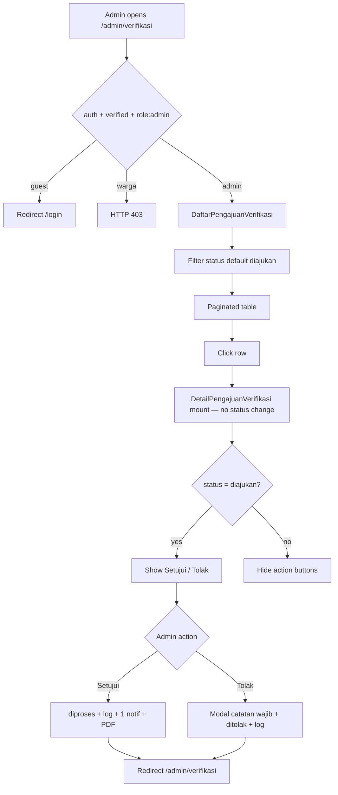
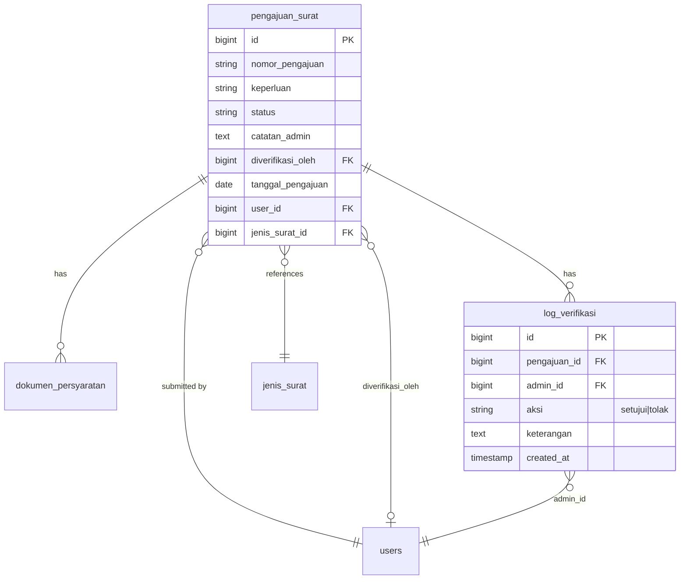

# Verifikasi Pengajuan (US-4.1 – US-4.3 + US-7.1 + US-8.3/8.4)

## Overview

Admin/petugas desa review submitted letter requests (`pengajuan_surat`). US-4.1 provides a filterable list (default `diajukan`). US-4.2 provides detail with KTP/KK preview. US-4.3 implements approve/reject with mandatory rejection note, audit log, and `diverifikasi_oleh`.

**US-7.1** removed auto-transition on open detail. **US-8.3** renames UI labels to **Daftar Pengajuan Surat**. **US-8.4** makes **Setujui** set `diproses` directly (no intermediate `disetujui` write) with a single warga notification + PDF generation. See [setujui-langsung-diproses.md](setujui-langsung-diproses.md) and [daftar-pengajuan-surat-rename.md](daftar-pengajuan-surat-rename.md).

## Architecture Diagram

## Data Model

Status values: `diajukan | disetujui (historis) | diproses | siap_diambil | selesai | ditolak`.

## Key Files

| Layer | File | Purpose |
|-------|------|---------|
| Livewire | `app/Livewire/Verifikasi/DaftarPengajuanVerifikasi.php` | List + status filter + Title rename |
| Blade | `resources/views/livewire/verifikasi/daftar-pengajuan-verifikasi.blade.php` | Admin list UI |
| Livewire | `app/Livewire/Verifikasi/DetailPengajuanVerifikasi.php` | Detail, setujui/tolak, US-8.4 flow |
| Blade | `resources/views/livewire/verifikasi/detail-pengajuan-verifikasi.blade.php` | Detail UI, preview, tolak modal |
| Layout | `resources/views/layouts/app/sidebar.blade.php` | Menu label Daftar Pengajuan Surat |
| Model | `app/Models/LogVerifikasi.php` | Audit log entity |
| Model | `app/Models/PengajuanSurat.php` | Status constants + labels |
| Routes | `routes/web.php` | `verifikasi.index`, `verifikasi.show`, dokumen show/download |
| Pest | `tests/Feature/VerifikasiPengajuanTest.php` | Feature coverage |
| Playwright | `e2e/verifikasi-pengajuan.spec.ts` | E2E AC + failure cases |

## Flow Explanation

1. **User triggers** — admin opens **Daftar Pengajuan Surat** (`/admin/verifikasi`).
2. **List** — default filter `diajukan`; open row → detail without status change.
3. **Setujui (US-8.4)** — atomic `diajukan` → `diproses`, log, one notification, PDF.
4. **Tolak** — require catatan; `ditolak`; notification; never enters `diproses`.

## API Endpoints (if applicable)

| Method | URI | Purpose | Auth |
|--------|-----|---------|------|
| GET | `/admin/verifikasi` | List | admin |
| GET | `/admin/verifikasi/{pengajuan}` | Detail | admin |
| GET | `/admin/verifikasi/dokumen/{dokumen}` | Preview | admin |
| GET | `/admin/verifikasi/dokumen/{dokumen}/download` | Download | admin |

## Decisions & Trade-offs

- See [ADR-020](../decisions/020-setujui-langsung-diproses-us-8-4.md) for the approve-path change.
- URL kept as `/admin/verifikasi` (US-8.3 AC).

## Related

- [daftar-pengajuan-surat-rename.md](daftar-pengajuan-surat-rename.md)
- [setujui-langsung-diproses.md](setujui-langsung-diproses.md)
- [migrasi-alur-status.md](migrasi-alur-status.md)
- [generate-surat-pdf.md](generate-surat-pdf.md)
- [notifikasi-pengajuan.md](notifikasi-pengajuan.md)
