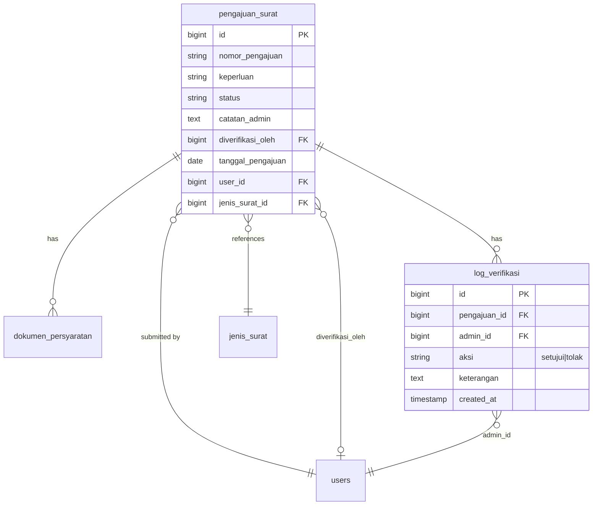

# Verifikasi Pengajuan (US-4.1 – US-4.3 + US-7.1)

## Overview

Admin/petugas desa review submitted letter requests (`pengajuan_surat`). US-4.1 provides a filterable list (default `diajukan`). US-4.2 provides detail with KTP/KK preview. US-4.3 implements approve/reject with mandatory rejection note, audit log, and `diverifikasi_oleh`.

**US-7.1** supersedes the old US-4.4 auto-transition: opening detail no longer changes status. Approve runs `diajukan` → `disetujui` → `diproses` (PDF hook deferred to US-7.2). Reject runs `diajukan` → `ditolak`. See [migrasi-alur-status.md](migrasi-alur-status.md).

## Architecture Diagram

## Data Model

Status values (Phase 07): `diajukan | disetujui | diproses | siap_diambil | selesai | ditolak`.

## Key Files

| Layer | File | Purpose |
|-------|------|---------|
| Livewire | `app/Livewire/Verifikasi/DaftarPengajuanVerifikasi.php` | List + status filter + row navigation |
| Blade | `resources/views/livewire/verifikasi/daftar-pengajuan-verifikasi.blade.php` | Admin list UI |
| Livewire | `app/Livewire/Verifikasi/DetailPengajuanVerifikasi.php` | Detail, setujui/tolak, US-7.1 status flow |
| Blade | `resources/views/livewire/verifikasi/detail-pengajuan-verifikasi.blade.php` | Detail UI, preview, tolak modal |
| Model | `app/Models/LogVerifikasi.php` | Audit log entity |
| Model | `app/Models/PengajuanSurat.php` | Status constants + labels |
| Routes | `routes/web.php` | `verifikasi.index`, `verifikasi.show`, dokumen show/download |
| Pest | `tests/Feature/VerifikasiPengajuanTest.php` | Feature coverage |
| Playwright | `e2e/verifikasi-pengajuan.spec.ts` | E2E AC + failure cases |

## Flow Explanation

1. **User triggers** — admin opens **Verifikasi Pengajuan** (`/admin/verifikasi`).
2. **Request handling** — `auth` → `verified` → `role:admin`.
3. **List** — paginate by `statusFilter` (default `diajukan`).
4. **Detail mount (US-7.1)** — load relations only; **no** auto status change.
5. **Preview (US-4.2)** — image/PDF via secure admin routes; missing file → callout + download.
6. **Setujui (US-7.1 / US-7.2)** — only when `diajukan`. Transaction + `lockForUpdate`. Write `disetujui` + log, notify, then `diproses` + notify, then `triggerGenerateSurat()` → `SuratTerbit` PDF.
7. **Tolak** — catatan wajib; `ditolak` only (never `diproses`).
8. **Response** — toast + redirect to list.

## API Endpoints (if applicable)

| Method | URI | Purpose | Auth |
|--------|-----|---------|------|
| GET | `/admin/verifikasi` | List | auth + verified + role:admin |
| GET | `/admin/verifikasi/{pengajuan}` | Detail + actions | auth + verified + role:admin |
| GET | `/admin/verifikasi/dokumen/{dokumen}` | Preview stream | auth + verified + role:admin |
| GET | `/admin/verifikasi/dokumen/{dokumen}/unduh` | Download | auth + verified + role:admin |

## Decisions & Trade-offs

- See [ADR-014](../decisions/014-status-flow-migration-us-7-1.md) for status-flow migration.
- Pessimistic locking retained from ADR-012.
- Notifications on approve/reject (and post-approve `diproses`); not on detail open.

## Related

- [migrasi-alur-status.md](migrasi-alur-status.md)
- User guide: [../../user-docs/guides/verifikasi-pengajuan.md](../../user-docs/guides/verifikasi-pengajuan.md)
- ADR: [011](../decisions/011-verifikasi-dokumen-secure-route.md), [012](../decisions/012-verifikasi-log-and-concurrent-lock.md), [014](../decisions/014-status-flow-migration-us-7-1.md)
