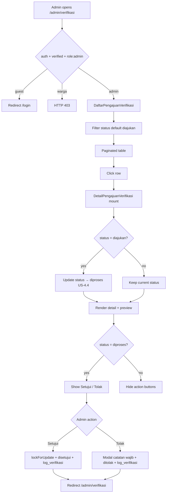
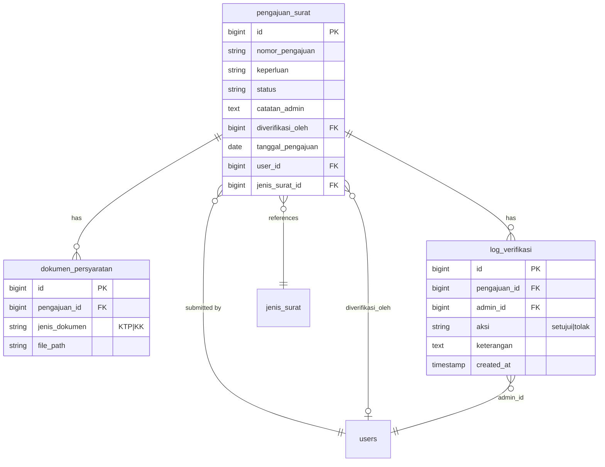

# Verifikasi Pengajuan (US-4.1 – US-4.4)

## Overview

Admin/petugas desa review submitted letter requests (`pengajuan_surat`). US-4.1 provides a filterable list (default `diajukan`). US-4.2 provides detail with KTP/KK preview. US-4.3 implements approve/reject with mandatory rejection note, audit log, and `diverifikasi_oleh`. US-4.4 auto-transitions `diajukan` → `diproses` on first detail page open (in-app notification hook deferred to Phase 05 US-5.1).

## Architecture Diagram

## Data Model

## Key Files

| Layer | File | Purpose |
|-------|------|---------|
| Livewire | `app/Livewire/Verifikasi/DaftarPengajuanVerifikasi.php` | List + status filter + row navigation |
| Blade | `resources/views/livewire/verifikasi/daftar-pengajuan-verifikasi.blade.php` | Admin list UI |
| Livewire | `app/Livewire/Verifikasi/DetailPengajuanVerifikasi.php` | Detail, auto diproses, setujui/tolak |
| Blade | `resources/views/livewire/verifikasi/detail-pengajuan-verifikasi.blade.php` | Detail UI, preview, tolak modal |
| Model | `app/Models/LogVerifikasi.php` | Audit log entity |
| Migration | `database/migrations/2026_08_06_084551_create_log_verifikasis_table.php` | `log_verifikasi` table |
| Routes | `routes/web.php` | `verifikasi.index`, `verifikasi.show`, dokumen show/download |
| Pest | `tests/Feature/VerifikasiPengajuanTest.php` | Feature coverage US-4.1–4.4 |
| Playwright | `e2e/verifikasi-pengajuan.spec.ts` | E2E AC + failure cases |

## Flow Explanation

1. **User triggers** — admin opens **Verifikasi Pengajuan** from sidebar or `/admin/verifikasi`.
2. **Request handling** — `auth` → `verified` → `role:admin`. Guests redirect to login; warga get 403.
3. **Business logic (list)** — `DaftarPengajuanVerifikasi` paginates `pengajuan_surat` filtered by `statusFilter` (URL `?status=`, default `diajukan`).
4. **Business logic (detail mount, US-4.4)** — if `status === diajukan`, update to `diproses` before render. Re-opening an already `diproses` record does not re-transition.
5. **Business logic (preview, US-4.2)** — images via ``, PDFs via `<iframe>`, both use `verifikasi.dokumen.show`. Missing files show callout + download.
6. **Business logic (setujui, US-4.3)** — only when `status === diproses`. `DB::transaction` + `lockForUpdate()` prevents concurrent double-action. Updates status to `disetujui`, sets `diverifikasi_oleh`, inserts `log_verifikasi` with `aksi = setujui`.
7. **Business logic (tolak, US-4.3)** — modal requires `catatanAdmin` (min 5 chars). Same locking pattern. Updates status to `ditolak`, saves `catatan_admin`, sets `diverifikasi_oleh`, inserts `log_verifikasi` with `aksi = tolak` and `keterangan`.
8. **Response** — after setujui/tolak, `Flux::toast` + redirect to list. Decided pengajuan no longer appears in default `diajukan` filter.

## API Endpoints (if applicable)

No JSON API. Session web routes only:

| Method | URI | Purpose | Auth |
|--------|-----|---------|------|
| GET | `/admin/verifikasi` | List pengajuan menunggu verifikasi | auth + verified + role:admin |
| GET | `/admin/verifikasi/{pengajuan}` | Detail + auto diproses + actions | auth + verified + role:admin |
| GET | `/admin/verifikasi/dokumen/{dokumen}` | Inline preview (stream) | auth + verified + role:admin |
| GET | `/admin/verifikasi/dokumen/{dokumen}/unduh` | Force download | auth + verified + role:admin |

## Decisions & Trade-offs

- **Two Livewire pages** — follows architecture convention (1 route = 1 component).
- **Secure document routes** — files on private `local` disk; admin-only middleware.
- **Preview fallback** — callout + download when file missing or unsupported.
- **Pessimistic locking** — `lockForUpdate()` inside transaction mitigates two admins acting on the same pengajuan (Phase 04 risk).
- **Notification deferred** — US-4.4 AC references Phase 05 US-5.1 for in-app notification on `diproses`; not implemented here.
- **Optional note on approve** — `keterangan` in `log_verifikasi` is nullable for `setujui`; only `tolak` requires `catatan_admin`.

## Related

- User guide: [../../user-docs/guides/verifikasi-pengajuan.md](../../user-docs/guides/verifikasi-pengajuan.md)
- Phase 03 pengajuan: [pengajuan-surat-form.md](pengajuan-surat-form.md), [pengajuan-surat-dokumen.md](pengajuan-surat-dokumen.md)
- ADR: [011-verifikasi-dokumen-secure-route.md](../decisions/011-verifikasi-dokumen-secure-route.md)
- ADR: [012-verifikasi-log-and-concurrent-lock.md](../decisions/012-verifikasi-log-and-concurrent-lock.md)
