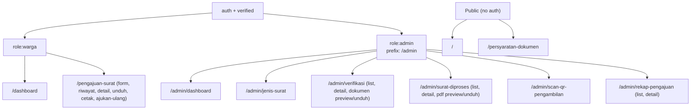

# Route Map

Complete route reference for Sistem Informasi Pelayanan Surat Keterangan.

All Livewire routes use the `Route::livewire()` helper from Livewire v4.
Non-Livewire routes (file downloads/previews) are plain `Route::get()` closures.

---

## Public Routes (no auth)

| Method | URI | Route Name | Component / Handler | Notes |
|--------|-----|------------|---------------------|-------|
| GET | `/` | `home` | `welcome` (Blade view) | Landing page |
| GET | `/persyaratan-dokumen` | `persyaratan-dokumen.index` | `PersyaratanDokumen` | US-2.2 + US-2.3; accessible by guests, warga, and admin |

---

## Auth Routes — Warga (`auth` + `verified` + `role:warga`)

| Method | URI | Route Name | Component / Handler | Story |
|--------|-----|------------|---------------------|-------|
| GET | `/dashboard` | `dashboard` | `WargaDashboard` | US-1.2 + US-8.2 |
| GET | `/pengajuan-surat` | `pengajuan-surat.create` | `FormPengajuanSurat` | US-3.1 |
| GET | `/riwayat-pengajuan` | `pengajuan-surat.riwayat` | `RiwayatPengajuan` | US-3.4 + US-5.3 |
| GET | `/pengajuan-surat/detail/{pengajuan}` | `pengajuan-surat.show` | `DetailPengajuanWarga` | US-5.3; `{pengajuan}` = integer |
| GET | `/pengajuan-surat/{pengajuan}/unduh-surat` | `pengajuan-surat.unduh-surat` | Closure | US-7.6; serves PDF as download |
| GET | `/pengajuan-surat/{pengajuan}/cetak-surat` | `pengajuan-surat.cetak-surat` | Closure | US-7.6; serves PDF inline for printing |
| GET | `/pengajuan-surat/ajukan-ulang/{pengajuan}` | `pengajuan-surat.resubmit` | `FormPengajuanSurat` | US-3.4; re-uses form component |

### Warga File Route Notes

- Both `unduh-surat` and `cetak-surat` enforce:
  - `$pengajuan->user_id === auth()->id()` (ownership)
  - `$pengajuan->dapatUnduhSurat()` (status: `diproses`, `siap_diambil`, or `selesai`)
  - PDF file must exist on `local` disk
- `unduh-surat` → `Storage::download()` (forces browser download)
- `cetak-surat` → `Storage::response()` with `Content-Type: application/pdf` (opens in browser/PDF viewer)

---

## Auth Routes — Admin (`auth` + `verified` + `role:admin`, prefix `/admin`)

| Method | URI | Route Name | Component / Handler | Story |
|--------|-----|------------|---------------------|-------|
| GET | `/admin/dashboard` | `dashboard.admin` | `AdminDashboard` | US-1.2 + US-8.1 |
| GET | `/admin/jenis-surat` | `jenis-surat.index` | `DataJenisSurat` | US-2.1 |
| GET | `/admin/verifikasi` | `verifikasi.index` | `DaftarPengajuanVerifikasi` | US-4.1 + US-8.3 |
| GET | `/admin/verifikasi/dokumen/{dokumen}` | `verifikasi.dokumen.show` | Closure | US-4.x; inline preview of private KTP/KK file |
| GET | `/admin/verifikasi/dokumen/{dokumen}/unduh` | `verifikasi.dokumen.download` | Closure | US-4.x; force download of private KTP/KK file |
| GET | `/admin/verifikasi/{pengajuan}` | `verifikasi.show` | `DetailPengajuanVerifikasi` | US-4.2 |
| GET | `/admin/surat-diproses` | `surat-diproses.index` | `DaftarSuratDiproses` | US-8.5 |
| GET | `/admin/surat-diproses/{pengajuan}/pdf` | `surat-diproses.pdf.show` | Closure | Inline PDF preview of issued surat |
| GET | `/admin/surat-diproses/{pengajuan}/pdf/unduh` | `surat-diproses.pdf.download` | Closure | Force download of issued surat PDF |
| GET | `/admin/surat-diproses/{pengajuan}` | `surat-diproses.show` | `DetailSuratDiproses` | US-8.6 |
| GET | `/admin/scan-qr-pengambilan` | `scan-qr-pengambilan.index` | `ScanQrPengambilan` | US-7.4 |
| GET | `/admin/rekap-pengajuan` | `rekap-pengajuan.index` | `RekapPengajuan` | US-6.1 + US-6.2 |
| GET | `/admin/rekap-pengajuan/{pengajuan}` | `rekap-pengajuan.show` | `DetailRekapPengajuan` | US-8.7 |

### Admin File Route Notes

- Dokumen routes (`verifikasi/dokumen/*`) serve private files from `local` disk without additional ownership check — the `role:admin` middleware is the guard.
- PDF routes (`surat-diproses/*/pdf*`) serve from `local` disk; the `PengajuanSurat` model is route-model-bound automatically.
- Static file routes for dokumen and PDF are registered **before** their Livewire counterparts to avoid the `{dokumen}` / `{pengajuan}` wildcard capturing them first.

---

## Framework / Fortify Routes

| Method | URI | Route Name | Notes |
|--------|-----|------------|-------|
| GET | `/.well-known/passkey-endpoints` | `well-known.passkeys` | WebAuthn passkey endpoints discovery |
| ANY | `/settings` | — | Redirects to Fortify settings; provided by `settings.php` |
| POST | `/login` | — | Fortify session login |
| POST | `/logout` | `logout` | `Logout` Livewire action |
| POST | `/register` | — | Fortify registration via `CreateNewUser` |
| GET/POST | `/forgot-password` | — | Fortify password reset request |
| GET/POST | `/reset-password/{token}` | — | Fortify password reset |
| GET | `/email/verify` | — | Fortify email verification notice |
| GET | `/email/verify/{id}/{hash}` | — | Fortify email verification |

---

## Route Groups Summary

---

## Related

- [System Architecture](../architecture.md)
- [Livewire Components](livewire-components.md)
- [ADR-002: Role-based login redirect](decisions/002-role-based-login-redirect.md)
- [ADR-003: Role middleware 403](decisions/003-role-middleware-403.md)
- [ADR-011: Verifikasi dokumen secure route](decisions/011-verifikasi-dokumen-secure-route.md)
- [ADR-019: Warga unduh/cetak existing PDF](decisions/019-warga-unduh-cetak-existing-pdf.md)
