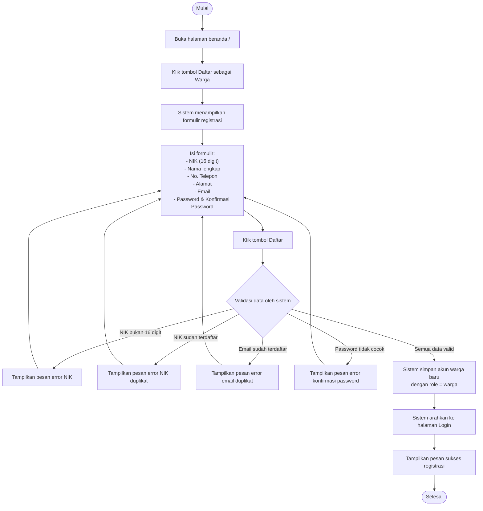

# AD-01: Registrasi Akun Warga

## Informasi Diagram

| Atribut | Nilai |
|---------|-------|
| **Kode** | AD-01 |
| **Nama Proses** | Registrasi Akun Warga |
| **Aktor** | Publik / Tamu |
| **Use Case Terkait** | UC-03 |
| **Panduan Pengguna** | [Registrasi Akun Warga](../../guides/publik/03-citizen-registration.md) |

## Deskripsi

Proses ini menggambarkan alur aktivitas saat seorang pengunjung (publik/tamu) mendaftarkan diri sebagai warga desa pada sistem. Proses dimulai dari membuka halaman beranda, mengisi formulir registrasi, hingga akun berhasil dibuat dan pengguna diarahkan ke halaman login.

**Prasyarat:** Pengguna belum memiliki akun dan mengakses sistem untuk pertama kali.

**Hasil:** Akun warga baru tersimpan di sistem dan siap digunakan untuk login.

## Diagram Aktivitas

## Penjelasan Alur

| Langkah | Aktivitas | Keterangan |
|---------|-----------|------------|
| 1 | Buka beranda | Pengguna mengakses halaman utama sistem |
| 2 | Klik Daftar | Pengguna memilih opsi membuat akun baru |
| 3 | Isi formulir | Pengguna memasukkan data identitas lengkap sesuai KTP |
| 4 | Validasi | Sistem memeriksa keunikan NIK, email, dan kesesuaian password |
| 5 | Simpan akun | Jika valid, sistem menyimpan akun dengan role warga |
| 6 | Redirect login | Pengguna diarahkan ke halaman login dengan pesan sukses |

## Kondisi Alternatif (Error)

| Kondisi | Penyebab | Tindakan Sistem |
|---------|----------|-----------------|
| NIK tidak valid | Bukan 16 digit angka | Tampilkan pesan error pada field NIK |
| NIK duplikat | NIK sudah dipakai akun lain | Tampilkan pesan error duplikat |
| Email duplikat | Email sudah dipakai akun lain | Tampilkan pesan error duplikat |
| Password tidak cocok | Konfirmasi password berbeda | Tampilkan pesan error pada field konfirmasi |
