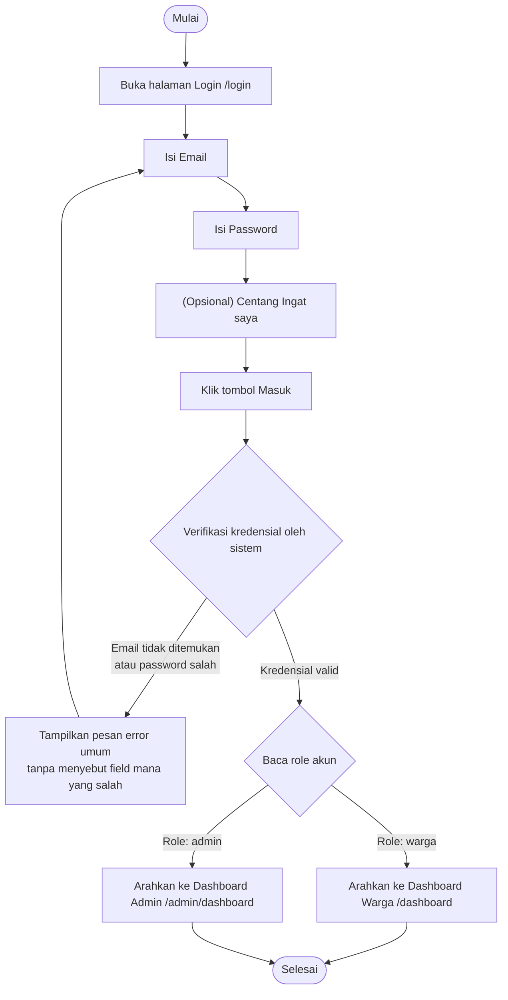

# AD-02: Login dan Redirect Dashboard

## Informasi Diagram

| Atribut | Nilai |
|---------|-------|
| **Kode** | AD-02 |
| **Nama Proses** | Login dan Redirect Dashboard |
| **Aktor** | Warga / Admin / Petugas Desa |
| **Use Case Terkait** | UC-04 |
| **Panduan Pengguna** | [Login Warga](../../guides/warga/01-role-based-login.md) · [Login Admin](../../guides/admin/01-role-based-login.md) |

## Deskripsi

Proses ini menggambarkan alur aktivitas saat pengguna (warga atau admin) melakukan login ke dalam sistem. Sistem membaca role akun dan secara otomatis mengarahkan pengguna ke dashboard yang sesuai: **Dashboard Warga** untuk role warga, **Dashboard Admin** untuk role admin/petugas desa.

**Prasyarat:** Pengguna sudah memiliki akun yang terdaftar di sistem.

**Hasil:** Pengguna masuk ke dashboard sesuai role akun.

## Diagram Aktivitas

## Penjelasan Alur

| Langkah | Aktivitas | Keterangan |
|---------|-----------|------------|
| 1 | Buka halaman login | Pengguna mengakses `/login` langsung atau dari beranda |
| 2 | Isi kredensial | Email dan password dimasukkan pengguna |
| 3 | Verifikasi | Sistem mencocokkan email dan password dengan database |
| 4 | Baca role | Sistem memeriksa kolom `role` pada tabel `users` |
| 5 | Redirect | Sistem mengarahkan ke dashboard yang sesuai role |

## Kondisi Alternatif (Error)

| Kondisi | Penyebab | Tindakan Sistem |
|---------|----------|-----------------|
| Kredensial salah | Email tidak terdaftar atau password tidak cocok | Tampilkan pesan error umum (tidak spesifik field) |
| Terlalu banyak percobaan | Melebihi batas percobaan login | Sistem membatasi login sementara (throttle) |
